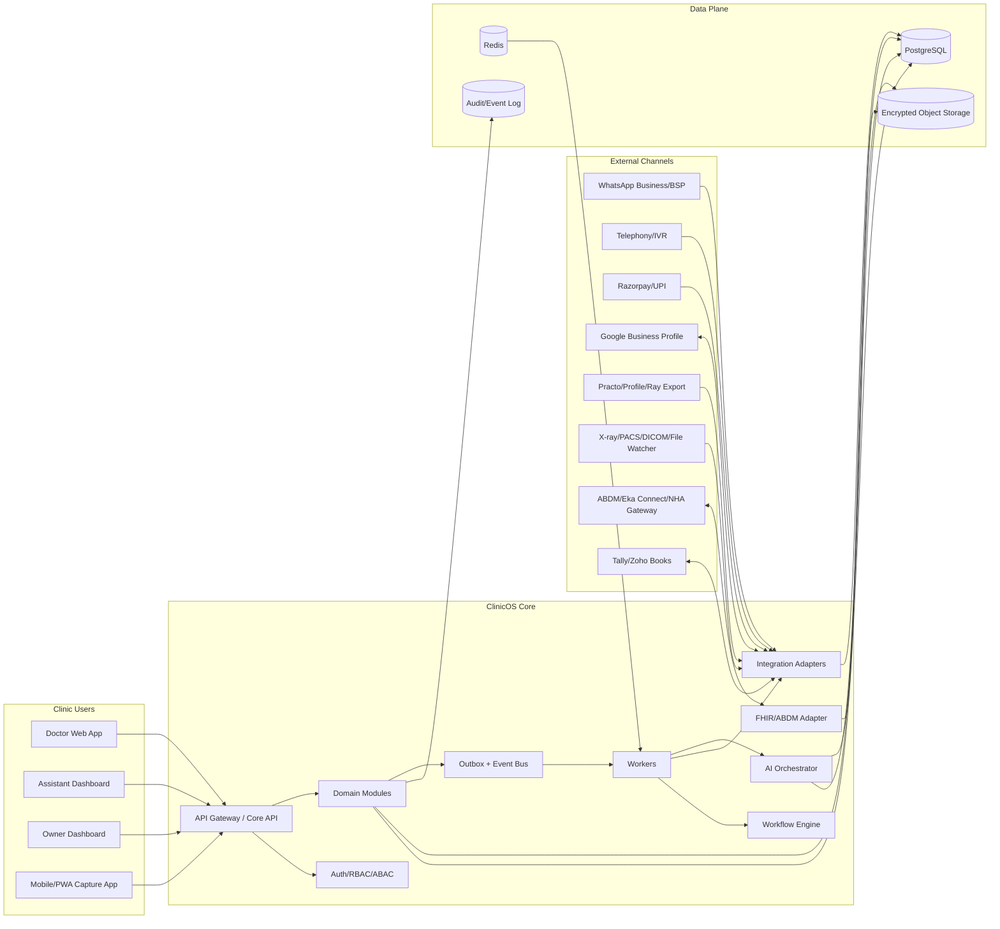
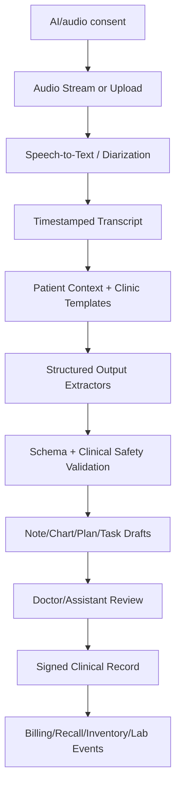
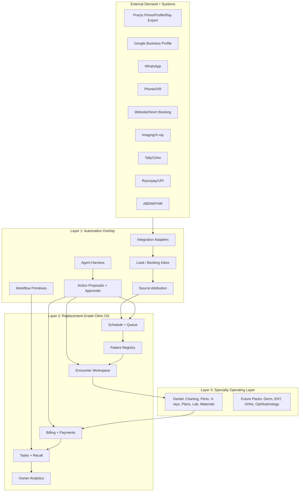

# 02 - System Architecture

**Date:** 2026-07-06

## 1. Architectural objective

Build a secure, multi-tenant, AI-native clinic operating system that can support daily workflows in Indian private clinics while remaining extensible to ABDM/FHIR interoperability and specialty-specific modules.

The architecture must optimize for:

- Fast delivery of production-grade vertical slices.
- High reliability during clinic hours.
- Low operational burden for small clinics.
- Strong privacy/security posture for health data.
- Easy integration with WhatsApp, payments, telephony, imaging, accounting, and ABDM.
- Human-in-the-loop AI workflows.
- Future split into services if scale demands it.

## 2. Recommended architecture style

### Decision: modular monolith + event-driven workers

Use a modular monolith for the core application, with internal domain modules and an asynchronous event system.

Why:

- Faster to build than microservices.
- Easier to reason about data consistency in an early healthcare product.
- Lower DevOps burden.
- Can still isolate domain boundaries through package/module structure.
- Outbox/event bus lets integration workers and AI jobs run asynchronously.
- Services can be extracted later when scale or team size demands it.

### Avoid in the first production release

- Full microservices from day one.
- Full event sourcing for all domain entities.
- Uncontrolled NoSQL-first data model for clinical records.
- AI agents directly mutating production records without approval.
- Placeholder product behavior, fake production integrations, or partial workflows that cannot be sold and safely operated.

## 3. Recommended tech stack

| Layer | Recommendation | Rationale |
|---|---|---|
| Web app | Next.js + React + TypeScript | Fast admin/doctor/assistant UI; strong ecosystem. |
| Mobile capture app | Expo/React Native from the start; web/PWA as fallback | Reliable chairside camera, audio capture, secure local cache, offline upload queue, notifications, and device permissions require a real mobile app for production workflows. |
| Backend API | NestJS + TypeScript | Good modular architecture, OpenAPI, queues, validation, auth guards. Fast for full-stack TS teams. |
| AI service | Python FastAPI or isolated TypeScript worker | Python useful for document/image/audio pipelines; keep behind internal API. |
| Database | PostgreSQL | Strong relational fit, transactions, JSONB for clinical extensions, FHIR bundles, reporting. |
| ORM | Prisma or Drizzle | Type safety and migrations. Prisma is faster for many teams; Drizzle gives more SQL control. |
| Cache/session/queues | Redis | Job queue, rate limiting, ephemeral locks, websocket presence. |
| Job orchestration | Temporal for durable workflows; Redis/BullMQ only for short background jobs if needed | Human approvals, reminders, recalls, payment reconciliation, lab cases, migration reviews, and integration retries are long-running workflows. Use durable execution from the first production release rather than upgrading after workflow state becomes critical. |
| Event bus | Transactional outbox + durable worker; external broker when scale demands | Outbox remains the consistency boundary. Events and side effects must be idempotent, replayable, observable, and dead-lettered from the beginning. |
| Object storage | S3-compatible storage in India region where possible | Photos, X-rays, PDFs, audio, generated docs. Use encryption and signed URLs. |
| Search | PostgreSQL full-text first, with explicit migration criteria for OpenSearch | Patient/message/document search can start in Postgres if relevance, auditability, latency, and tenant isolation are production-grade. Define the scale/relevance threshold for OpenSearch before launch. |
| Vector search | pgvector first | Clinic SOP/template retrieval, document embeddings, patient timeline semantic search where allowed. |
| Auth | OIDC/OAuth2 + MFA; Keycloak/Auth0/Clerk depending data-residency posture | RBAC/ABAC and enterprise readiness. |
| Realtime | WebSocket or Server-Sent Events | Queue board, WhatsApp inbox, AI transcript streaming. |
| Observability | OpenTelemetry + Sentry + Prometheus/Grafana | Trace integrations and AI jobs. |
| Infrastructure | Docker + Terraform + managed container runtime; Kubernetes only when justified | Infrastructure must be reproducible, monitored, secure, backed up, and disaster-recoverable from the first production environment. Avoid platform complexity, not production discipline. |
| CI/CD | GitHub Actions | Tests, migrations, deploys, security scanning. |

## 4. High-level component diagram



## 5. Domain modules

### Core modules

- `identity-access`: tenants, clinics, users, roles, permissions, sessions, MFA.
- `patients`: patient registry, demographics, identifiers, duplicate resolution, timeline.
- `appointments`: calendars, slots, chairs/rooms, queue, confirmations, no-shows.
- `communication`: WhatsApp/SMS/call/email inbox, templates, opt-ins, campaigns.
- `forms-consent`: forms, questionnaires, treatment consents, AI/audio/photo consent.
- `encounters`: visit lifecycle, notes, observations, diagnosis, procedures, prescriptions.
- `billing-payments`: pricebook, invoices, payments, dues, refunds, receipts.
- `tasks-workflows`: tasks, recurring SOPs, workflow rules, reminders, escalations.
- `media-documents`: photos, X-rays, PDFs, OCR, metadata, tagging, thumbnails.
- `analytics`: owner dashboards, KPIs, event-derived metrics.
- `integrations`: provider accounts, webhook events, adapters, retries, dead letters.
- `audit-compliance`: audit log, provenance, data export, retention, privacy notices.

### Specialty modules

- `dental`: odontogram, tooth/surface findings, perio charting, treatment plans, lab cases, dental-specific recall rules, material usage.
- `dermatology` later: lesion/body-area timeline, before/after photos, consent, packages, device settings.
- `ent` later: endoscopy media, laterality-aware templates, audiology attachments.
- `ortho-msk` later: imaging, rehab plans, outcome scores, home exercise tracking.

## 6. Logical data architecture

### Storage strategy

Use structured relational tables for operational and clinical workflow state; use JSONB for flexible specialty extensions and FHIR resource snapshots; use encrypted object storage for binary assets.

| Data type | Storage |
|---|---|
| Patients, appointments, encounters, invoices | PostgreSQL relational tables |
| Dental chart, treatment plans | PostgreSQL structured tables + JSONB for chart state snapshots |
| FHIR resources | Generated JSONB snapshots and/or FHIR adapter mapping layer |
| Photos, X-rays, PDFs, audio | Object storage with metadata in PostgreSQL |
| AI transcripts/drafts | PostgreSQL + optional object storage for long artifacts |
| Audit logs | Append-only PostgreSQL table; later immutable log storage |
| Search index | Postgres FTS initially; OpenSearch later |
| Embeddings | pgvector initially |

### Multi-tenancy

- Every primary table includes `tenant_id` and, where relevant, `clinic_id`.
- Enforce tenant isolation in application guards and ideally database row-level security for sensitive tables.
- Object storage paths include `tenant_id/clinic_id/...` and never expose raw bucket paths to clients.
- Signed URLs must be short-lived and permission checked.
- Integration credentials are tenant-scoped and encrypted.

## 7. Event-driven workflow

### Core pattern

1. User or integration creates/updates domain record.
2. Domain transaction writes business data and `outbox_events` in same database transaction.
3. Worker reads outbox event, publishes internally, and marks processed.
4. Workflow engine creates tasks, messages, AI jobs, or integration calls.
5. Side effects are idempotent and logged.

### Example events

- `message.received`
- `appointment.created`
- `appointment.confirmation_due`
- `patient.checked_in`
- `encounter.started`
- `ai.transcript.chunk_created`
- `ai.clinical_note_draft.created`
- `doctor.clinical_note.signed`
- `treatment_plan.created`
- `procedure.completed`
- `invoice.created`
- `payment_link.created`
- `payment.succeeded`
- `lab_case.created`
- `inventory.low_stock_detected`
- `recall.due`
- `incident.created`

## 8. Integration gateway

Build all external integrations through an integration gateway module with provider adapters:

```text
external webhook -> raw_webhook_events -> signature verification -> normalized event -> domain command -> outbox event
```

Principles:

- Store raw webhook payloads with headers for debugging and audit.
- Verify signatures before trust.
- Use idempotency keys for every external event.
- Retry transient failures with exponential backoff.
- Dead-letter permanent failures for admin review.
- Avoid letting provider-specific fields leak into core domains.

## 9. AI architecture



### AI principles

- AI writes drafts, not final clinical records.
- All clinical outputs store provenance: source transcript/document/media references.
- No autonomous diagnosis or prescription finalization.
- Low-risk operational messages can be automated only under explicit tenant-configured rules.
- Audio retention is configurable and conservative; default should delete raw audio after processing/sign-off unless clinic/patient consents to retention.

## 10. Deployment environments

| Environment | Purpose |
|---|---|
| local | Developer workflow, seed data, contract-tested provider simulators. |
| dev | Shared development server, fake PHI only. |
| staging | Production-like integration testing, sandbox provider accounts. |
| pilot-prod | Isolated early clinic production environment, tight monitoring. |
| prod | Full production with backups, DR, alerting, security controls. |

## 11. Infrastructure baseline

### First production slice / pilot

- Cloud region in India where possible.
- Managed PostgreSQL with encrypted storage and daily backups.
- Redis managed service.
- Object storage with server-side encryption.
- Containerized API and workers.
- WAF/reverse proxy.
- Separate secrets manager.
- Centralized logs with PHI redaction.
- Daily backup verification.

### Production hardening

- Multi-AZ database.
- Point-in-time recovery.
- Immutable audit log export.
- Security monitoring and anomaly alerts.
- Vendor security review.
- Disaster recovery runbooks.
- Penetration testing before larger rollout.

## 12. Offline and clinic-hours resilience

Indian clinics may have unstable internet. Build:

- PWA caching for today’s schedule and selected patient summaries.
- Local draft mode for notes/charting if connection drops.
- Upload queue for photos/documents.
- Clear sync-conflict resolution.
- Graceful degradation: clinic can still see schedule and enter notes if WhatsApp/payment providers are down.
- Status page/admin alert for integration downtime.

## 13. Observability

Track:

- API latency/error rate.
- Webhook ingestion success and latency.
- Queue depth and worker failures.
- WhatsApp send failure rate.
- Payment webhook reconciliation mismatches.
- AI job latency, cost, failure rate, validation errors.
- Tenant-specific performance during clinic hours.
- Audit log volume and suspicious access.

## 14. Testing strategy

- Unit tests for domain modules and validators.
- Integration tests for provider adapters with simulated provider webhooks.
- Contract tests for webhooks and payment callbacks.
- End-to-end tests for appointment -> encounter -> bill -> recall.
- AI evaluation harness with golden transcripts and expected structured outputs.
- Security tests for tenant isolation and permission boundaries.
- Load tests for clinic-hours concurrency.

## 15. Initial repository structure

```text
clinic-os/
  apps/
    web/                    # Next.js app
    api/                    # NestJS API
    worker/                 # background workers
    mobile/                 # Expo/React Native capture app
  packages/
    domain/                 # shared domain types and policies
    db/                     # schema, migrations, seed data
    ui/                     # design system components
    integrations/           # provider adapters
    ai/                     # prompts, schemas, eval harness
    fhir/                   # FHIR mappers
    security/               # authz policies, audit helpers
  infra/
    terraform/
    docker/
  docs/
  tests/
```


## 14. v0.2 architecture revision: three-layer operating architecture

The system architecture is updated from “clinic OS with integrations” to a three-layer operating architecture.



### 14.1 Layer 1: Automation Overlay

This is the Plena-inspired layer. It allows ClinicOS to create value before total migration.

Responsibilities:

- Aggregate external demand from WhatsApp, calls, Google, Practo, direct links, referrals, and walk-ins.
- Normalize inbound events into leads, tasks, appointments, documents, messages, and payment events.
- Run workflow rules and AI agents through approved tool interfaces.
- Provide shadow mode, source attribution, deduplication, and migration support.
- Avoid forcing a clinic to abandon existing channels on day one.

### 14.2 Layer 2: Replacement-Grade Clinic OS

This is the system of record/action for internal clinic operations.

Responsibilities:

- Patient registry.
- Appointment calendar and queue.
- Intake and consent.
- Clinical encounters.
- Prescriptions and instructions.
- Billing, payments, dues.
- Recalls, tasks, SOPs.
- Owner analytics.

This layer should be complete enough to replace Practo Ray-like PMS functions for new operations.

### 14.3 Layer 3: Specialty Operating Layer

This is the deep workflow moat.

For the dental first production slice:

- Odontogram and tooth-level findings.
- Periodontal charting.
- Media/X-ray/photo timeline.
- Treatment plans and estimates.
- Lab case tracking.
- Material/instrument inventory.
- Preventive recall logic.

### 14.4 Adapter architecture

Every external system is accessed through an adapter implementing a common interface.

```ts
interface ExternalAdapter {
  providerKey: string;
  capabilities(): AdapterCapability[];
  healthCheck(): Promise<AdapterHealth>;
  importBatch(request: ImportRequest): Promise<ImportBatchResult>;
  handleWebhook(event: RawWebhookEvent): Promise<NormalizedExternalEvent[]>;
  pushAction?(action: ApprovedExternalAction): Promise<ExternalActionResult>;
}
```

Adapter capability examples:

- `READ_PATIENTS`
- `READ_APPOINTMENTS`
- `WRITE_APPOINTMENTS`
- `RECEIVE_WEBHOOKS`
- `SEND_MESSAGES`
- `CREATE_PAYMENT_LINKS`
- `FETCH_PAYMENT_STATUS`
- `FETCH_CALL_RECORDING`
- `IMPORT_DOCUMENTS`
- `EXPORT_ACCOUNTING_LEDGER`

### 14.5 Source-of-truth policy

During migration, source of truth can vary by domain.

```ts
type SourceOfTruthMode =
  | 'clinic_os_primary'
  | 'external_primary_readonly'
  | 'dual_run'
  | 'archive_only';
```

Example configuration:

| Domain | Mode during week 1 | Mode after migration |
|---|---|---|
| Appointments | dual_run | clinic_os_primary |
| New encounters | clinic_os_primary | clinic_os_primary |
| Historical records | archive_only | archive_only / verified import |
| Billing | clinic_os_primary | clinic_os_primary + accounting export |
| Practo leads | external_primary_readonly | external acquisition channel |

### 14.6 Agent harness

AI agents never directly mutate sensitive production state. They create action proposals.

```text
Agent observes event/context -> proposes action -> policy engine checks permission -> required human approval -> tool executes -> audit/provenance recorded
```

Action proposal examples:

- Draft WhatsApp appointment reply.
- Suggest appointment slots.
- Create recall campaign draft.
- Draft clinical note.
- Draft dental chart patch.
- Create lab case draft.
- Generate payment reminder draft.
- Suggest inventory reorder.

### 14.7 Integration reliability levels

| Level | Description | Product behavior |
|---|---|---|
| L4 Official read/write API | Stable API/webhooks | Full adapter and automation |
| L3 Official export/import | CSV/API export but no write | Migration and periodic sync |
| L2 Notifications parsing | Email/SMS/calendar notifications, if allowed | Lead capture and source attribution |
| L1 Manual assisted | Human enters/validates | Shadow mode and migration templates |
| L0 Unsupported | No legal/reliable path | Treat as external channel only |

Practo should be treated as L1-L3 until official API/partner access is verified.

### 14.8 Engineering implications

Add or prioritize these modules:

- `external-sources`
- `lead-inbox`
- `attribution`
- `migration`
- `workflow-primitives`
- `action-proposals`
- `agent-harness`
- `source-of-truth-policy`

These modules are architectural requirements, not optional nice-to-haves.
