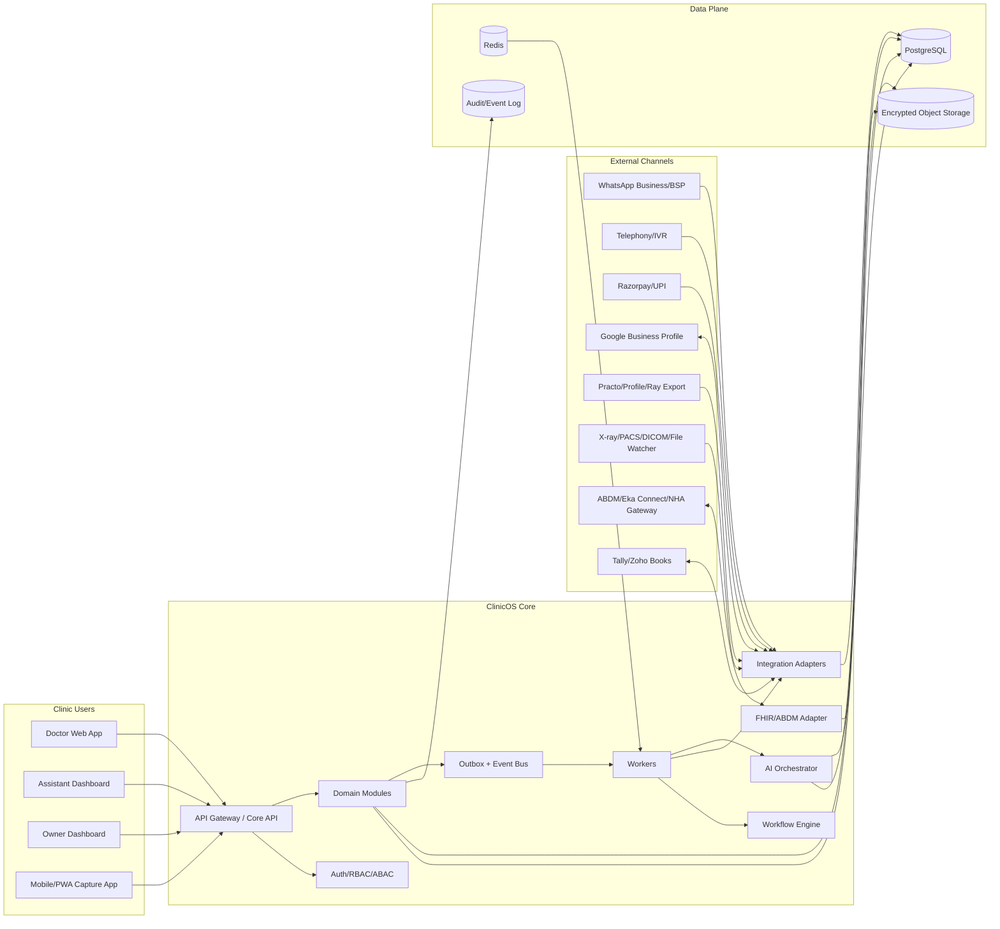
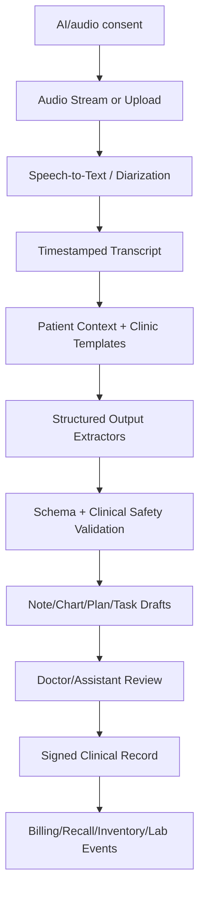
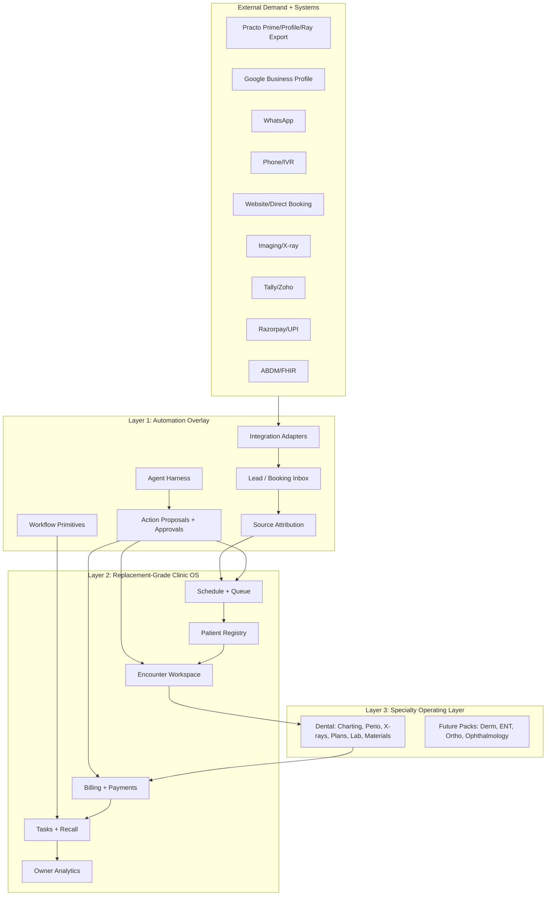

# ClinicOS India v0.2 Combined Build Pack

> Review note, 2026-07-06: this file is a concatenated packaging artifact generated from the individual source documents. Treat the individual Markdown files in this directory as canonical if there is any conflict.


---

<!-- FILE: README.md -->

# ClinicOS India: AI-Native Private Clinic Operating System Build Pack v0.2

**Date:** 2026-07-06  
**Primary wedge:** Dental clinics in India  
**Product stance:** replacement-grade clinic OS, deployed initially as an automation overlay  
**Intended reader:** product/engineering team, Claude Code, Codex, or another implementation agent

## What changed in v0.2

This version incorporates the Practo/Plena architecture revision:

- Build **Ray-like clinic-management functionality as a replacement from day one**: scheduling, queue, records, notes, dental charting, prescriptions, billing, reminders, recalls, lab, inventory, and analytics.
- Do **not** try to replace Practo Prime/Profile/marketplace demand on day one. Treat Practo, Google, website, WhatsApp, calls, Instagram, and referrals as **external acquisition sources**.
- Deploy initially as an **automation overlay** across existing tools so clinics do not need a risky rip-and-replace migration.
- Architect the system in three layers: **Automation Overlay -> Replacement-Grade Clinic OS -> Specialty Operating Layers**.
- Make integration adapters, source attribution, migration batches, workflow primitives, action proposals, approval rules, and agent tools first-class product/engineering objects.

## What this build pack is

This is a handoff-quality product and technical specification for building an AI-native clinic operating system for Indian private clinics. It is designed to be concrete enough for an AI coding agent to turn into an implementation plan and begin execution.

The product is not an appointment app, not a Practo marketplace clone, and not a standalone AI scribe. The target is a **clinic operating loop**:

```text
External demand -> lead/booking inbox -> appointment/queue -> intake -> consultation -> structured record -> treatment plan -> billing/payment -> follow-up/recall -> lab/inventory/quality tasks -> owner analytics
```

## Recommended reading order

1. `12_V0_2_ARCHITECTURE_DECISION_RECORD.md` - summary of the Practo/Plena revision and what changed.
2. `01_PRD.md` - product vision, personas, workflows, replacement/coexistence strategy.
3. `02_SYSTEM_ARCHITECTURE.md` - three-layer architecture, tech stack, integration and event-driven design.
4. `03_DOMAIN_MODEL_AND_FHIR_MAPPING.md` - canonical entities, source attribution, workflow primitives, FHIR R4 mapping.
5. `04_INTEGRATIONS_SPEC.md` - WhatsApp, payments, calls, ABDM, imaging, Google, Practo, accounting, vendors.
6. `05_AI_AGENTS_AND_CLINICAL_SAFETY.md` - AI scribe, agent harness, approval rules, clinical safety.
7. `06_SECURITY_PRIVACY_COMPLIANCE_INDIA.md` - DPDP, consent, audit, integration/legal guardrails.
8. `07_IMPLEMENTATION_ROADMAP.md` - staged build plan and rollout strategy.
9. `08_USER_STORIES_AND_ACCEPTANCE_CRITERIA.md` - implementation-ready stories.
10. `09_API_CONTRACTS_AND_EVENTS.md` - initial API, event, and agent action contracts.
11. `10_AGENT_HANDOFF_PROMPT.md` - prompt to give to Claude Code/Codex.
12. `11_INITIAL_BACKLOG.md` - initial build backlog.
13. `13_CRITICAL_ARCHITECTURE_REVIEW.md` - critical review pass, production-grade corrections, and open decisions.
14. `14_STACK_AND_VENDOR_DECISIONS.md` - recommended defaults for workflow runtime, cloud region, WhatsApp, payments, ABDM, capture app, and AI/mobile architecture.
15. `15_PILOT_FIELD_NOTE_DENTAL_WORKFLOW.md` - founder-provided dental doctor workflow conversation converted into pilot evidence.
16. `00_SOURCE_REGISTER.md` - research sources and evidence notes.

## Core architecture decision

Build a **modular monolith first**, but with explicit domain modules, adapter interfaces, an outbox/event bus, and an agent action framework. This gives the speed of a monolith while preserving the ability to split services later.

## Core product decision

Start with **dental** because dental has structured, monetisable workflow objects: teeth, surfaces, findings, X-rays, intraoral photos, procedures, treatment phases, lab work, consumables, recalls, and estimates.

## Non-negotiable principles

- Build replacement-grade clinic-management functionality from the beginning.
- Build production-grade vertical slices only. A feature may be deferred, but any feature that is built must be fully functional, saleable, secure, observable, tested, documented, and integration-correct for its intended scope.
- Scope is reduced by shipping fewer complete workflows, not by using mock, placeholder, partial, or make-shift product behavior.
- Deploy as an overlay first to reduce adoption friction.
- Human-in-the-loop for clinical output: AI drafts; doctor signs.
- WhatsApp-first operations for India, with SMS and calls as fallback.
- FHIR-ready data model and ABDM-ready interoperability, without making ABDM a day-one adoption blocker.
- Tenant isolation, audit logs, consent, privacy, and action provenance from day one.
- Do not build a marketplace in v1. Use Practo/Google as acquisition sources while owning conversion, retention, records, and operations.
- Build the assistant workflow, not just the doctor workflow.

## Pilot success definition

Within 4-8 weeks, a pilot clinic should feel that ClinicOS has replaced scattered WhatsApp lists, paper cards, lab diaries, recall diaries, inventory diaries, and end-of-day note writing for a meaningful portion of daily operations, while still allowing Practo/Google/phone/WhatsApp to bring patients into the top of funnel.


---

<!-- FILE: CHANGELOG.md -->

# CHANGELOG

## v0.2 - Practo/Plena architecture revision

Changed:

- Reframed product as **automation overlay + replacement-grade clinic OS + specialty operating layer**.
- Clarified Practo strategy: replace Ray-like workflows; coexist with Prime/Profile/marketplace.
- Added lead/booking inbox and source attribution as P0.
- Added migration/source-of-truth policy as P0.
- Added workflow primitives, action proposals, approval decisions, and agent harness.
- Updated roadmap so overlay foundation is built earlier.
- Updated integration spec so Practo API is capability-driven and not assumed.
- Added v0.2 architecture decision record.
- Added critical architecture review and blue-sky production-grade implementation guidance.
- Added stack and vendor decision defaults for workflow runtime, cloud region, WhatsApp, payments, ABDM, mobile capture, and AI/scribe architecture.
- Added pilot field note from a dental doctor workflow conversation, covering WhatsApp/missed calls, appointment confirmations, six-month recall, new/returning patient flow, charting, phone photos, X-ray software coexistence, UPI billing, prescriptions/instructions, lab work, inventory, event management, and recurring protocols.
- Tightened roadmap/backlog/handoff language so MVP means a production-grade vertical slice, not a mock/stub/placeholder implementation.
- Moved durable workflow execution earlier as a production recommendation for long-running clinic workflows.

Unchanged:

- Dental remains the first wedge.
- Modular monolith remains the recommended initial architecture.
- Human-in-the-loop clinical safety remains non-negotiable.
- ABDM/FHIR readiness remains important but not a day-one adoption blocker.


---

<!-- FILE: 12_V0_2_ARCHITECTURE_DECISION_RECORD.md -->

# 12 - v0.2 Architecture Decision Record: Practo, Plena, and Overlay-to-OS Strategy

**Date:** 2026-07-06  
**Status:** Accepted for next build pack revision

## 1. Decision summary

The architecture changes materially after the Practo/Plena analysis.

The product should be built as:

```text
Layer 1: Automation Overlay
  Connects to existing tools, captures external demand, performs admin work, and routes tasks.

Layer 2: Replacement-Grade Clinic OS
  Replaces Ray-like software workflows: schedule, queue, records, notes, prescriptions, billing, payments, reminders, recalls, tasks, analytics.

Layer 3: Specialty Operating Layer
  Starts with dental: odontogram, perio, X-rays/photos, treatment plans, lab cases, materials, preventive recall.
```

The product should be **built like a replacement, sold like an overlay, migrated like a partner**.

## 2. Why this changed

The original plan already avoided a marketplace clone and mentioned coexistence. That was directionally correct but underspecified. The revised architecture makes coexistence/replacement an explicit technical design:

- Practo Ray-like functionality should be rebuilt and replaced.
- Practo Prime/Profile/marketplace demand should coexist initially.
- Practo API access should be treated as uncertain, not assumed.
- Practo-originated patients should flow into ClinicOS as source-attributed leads/bookings.
- Over time, ClinicOS should reduce Practo dependence through direct booking, Google reviews, recall campaigns, referrals, and source ROI analytics.

## 3. Plena-derived product/architecture lessons

Plena's public YC materials describe an AI operating layer for specialty practices that automates administrative workflows across existing systems rather than forcing a rip-and-replace. The useful architectural lessons are:

- The real target is not “better software screens”; it is taking work off staff.
- Start with one painful workflow and expand.
- Use reusable workflow primitives, integration adapters, and agent harnesses.
- Avoid forcing staff into another portal before value is proven.
- Over time, the operating layer can cannibalize the stitched-together vendor stack.

For India, this means the early wedge should automate the assistant's day: WhatsApp, missed calls, confirmations, recalls, lab cases, dues, treatment-plan follow-ups, inventory tasks, and doctor prep.

## 4. Practo strategy

### Replace from day one

| Practo/Ray-like workflow | ClinicOS stance |
|---|---|
| Appointment calendar | Replace as operational source of truth |
| Queue/walk-ins | Replace |
| Patient profile | Replace for new records; import history where possible |
| Clinical notes/templates | Replace |
| Dental charting | Replace and go deeper |
| Prescriptions | Replace with doctor-signed drafts/templates |
| Billing/payments/dues | Replace |
| Reminders/post-consult communication | Replace with WhatsApp-first workflow |
| Records/doc sharing | Replace with richer media/document timeline |
| Reports/analytics | Replace and deepen around owner leakage |

### Coexist initially

| Practo/Growth layer | ClinicOS stance |
|---|---|
| Practo Prime/Profile | Keep if it generates patients |
| Practo marketplace/search | Treat as acquisition source |
| Practo reviews/patient stories | Track as channel asset; do not rebuild initially |
| Practo Consult | Optional coexistence if clinic actively uses it |

## 5. Technical consequences

The following objects become first-class:

- `ExternalSystem`
- `ExternalAccount`
- `ExternalPatientLink`
- `ExternalAppointmentLink`
- `LeadSource`
- `AttributionTouch`
- `MigrationBatch`
- `IntegrationWebhookEvent`
- `WorkflowPrimitive`
- `WorkflowRun`
- `ActionProposal`
- `ApprovalDecision`
- `AgentToolInvocation`
- `SourceOfTruthPolicy`

The system must support:

- Read/import adapters.
- Webhook adapters.
- Manual assisted import.
- Source attribution.
- Dual-running/shadow mode.
- Idempotency and deduplication.
- Agent-generated proposals requiring approval for sensitive actions.
- Clinic-level configuration for whether ClinicOS or an external tool is the source of truth per domain during migration.

## 6. Implementation rule

Do not build brittle or unauthorized scraping as a core dependency. If Practo or another vendor lacks a public API, use legitimate export/import, notifications parsing where contractually allowed, manual entry, or a partner integration path.

## 7. New MVP principle

The MVP is no longer merely:

```text
appointment -> intake -> encounter -> billing -> recall
```

It is:

```text
external demand -> lead inbox -> source attribution -> appointment/queue -> intake -> encounter -> dental chart -> treatment plan -> invoice/payment -> instructions -> recall/lab/inventory/tasks -> owner ROI dashboard
```

This is the version Codex/Claude Code should implement against.


---

<!-- FILE: 00_SOURCE_REGISTER.md -->

# 00 - Source Register and Evidence Notes

**Date compiled:** 2026-07-06

This file lists the main sources used to shape the product and technical architecture. It is intentionally explicit so future research or implementation agents can verify assumptions instead of treating this as unsupported brainstorming.

## Founder-provided field evidence

### Dental doctor daily workflow conversation
Source file: `/Users/abhinavgupta/.codex/attachments/f6430538-4acb-4d08-8569-7439091bd112/pasted-text.txt`  
Canonical summary: `15_PILOT_FIELD_NOTE_DENTAL_WORKFLOW.md`

Key evidence:
- Assistant begins the day by checking clinic phone WhatsApp messages and missed calls.
- Existing practice software sends reminders, but the assistant still sends personal WhatsApp confirmations and recall messages.
- Returning patients need fast record/X-ray prep; new patients still use a history-card flow.
- Doctor performs tooth-by-tooth charting while the assistant records findings.
- Intraoral photos currently remain on the phone; attaching them to the patient profile is a clear pain point.
- X-rays live in separate X-ray software, so coexistence/import matters more than immediate replacement.
- Post-visit notes, diagnosis, treatment plan, treatment performed, invoice, UPI payment, prescription, and instructions are separate handoffs today.
- Lab cards, month-end lab reconciliation, monthly inventory, event-management diary, and recurring protocol checks are real operational workflows.

Implementation relevance:
- Confirms ClinicOS must be a daily clinic operating loop, not a scribe-only or appointment-only product.
- Confirms WhatsApp, recall, mobile capture, X-ray coexistence, payment reconciliation, lab workflow, inventory, event management, and SOP tasks as high-priority product surfaces.
- Confirms the production slice should improve the full assistant/doctor/reception handoff while coexisting with existing software.

## Uploaded baseline research reports

### `deep-research-report2.md`
Key evidence:
- The right product mental model is **clinic operating system, not appointment app**.
- India is moving toward ABDM-style federated, consent-based, standards-driven records.
- A safe AI pattern is **ambient capture -> structured draft -> clinician review/sign-off**, not fully autonomous prescribing.
- Indian private clinics often operate as **front desk/assistant + doctor**, not hospital departments.
- Strong first wedge: dental, because workflow objects are structured and monetisable.
- The moat is owning the consultation-to-follow-up loop in an ABDM-native, multilingual, assistant-friendly workflow.

### `deep-research-report 1.md`
Key evidence:
- Build a **shared operational core plus specialty workflow layers**.
- Ambient documentation alone is not the business; it must connect to front-desk work, recall, patient messaging, dues, record retrieval, inventory, and owner analytics.
- Checkout and post-visit continuity are underestimated but high-value workflow stages.
- Dental must be chart-first/procedure-first, not merely note-first.
- Regulatory variability and DPDP/data governance require product-level privacy and configurability.

## Regulatory and interoperability sources

### ABDM / ABHA / HPR / HFR / consent architecture
- Official ABDM home: `https://abdm.gov.in/`
- Eka ABDM Connect documentation: `https://developer.eka.care/api-reference/user-app/abdm-connect/overview`

Implementation relevance:
- ABDM is the national digital health infrastructure direction for India.
- Important building blocks: ABHA for patient identity, HPR for provider registry, HFR for facility registry, consent manager, HIP/HIU roles.
- A clinic HMS/PMS is most likely a HIP first; later it may act as HIU or connect through a health locker/PHR app.
- Product should be FHIR-ready, but day-one pilots can optionally use ABDM integration through a third-party connector or sandbox.

### HL7 FHIR R4
- FHIR overview: `https://www.hl7.org/fhir/R4/overview.html`
- FHIR resource index: `https://www.hl7.org/fhir/R4/resourcelist.html`
- FHIR security: `https://www.hl7.org/fhir/R4/security.html`
- FHIR AuditEvent: `https://www.hl7.org/fhir/R4/auditevent.html`

Implementation relevance:
- FHIR is a standard for healthcare information exchange based on resources.
- Useful mappings: Patient, Practitioner, Organization, Location, Appointment, Schedule, Slot, Encounter, Observation, Condition, Procedure, MedicationRequest, CarePlan, ServiceRequest, DocumentReference, Media, ImagingStudy, DiagnosticReport, Consent, AuditEvent, Invoice, PaymentNotice, ChargeItem.
- FHIR itself does not provide complete security; implementation must provide TLS, authentication, authorization, audit, provenance, privacy controls, and jurisdiction-specific compliance.

### DICOM / DICOMweb
- DICOM PS3.18 2026c Web Services: `https://dicom.nema.org/medical/dicom/current/output/html/part18.html`

Implementation relevance:
- DICOMweb Studies Service supports store, retrieve, update, and search for DICOM studies/series/instances.
- WADO-RS = retrieve, STOW-RS = store, QIDO-RS = search.
- MVP dental clinics may not expose DICOMweb APIs; support manual upload/folder sync first, DICOMweb/PACS later.

## Communications and workflow integrations

### WhatsApp Business Platform
- Official product page: `https://business.whatsapp.com/products/business-platform`

Implementation relevance:
- Supports enterprise APIs, two-way conversations, media, interactive messages, appointment reminders, automation, routing, and backend CRM integrations.
- WhatsApp is the operational centre of many Indian clinics; build it as a first-class inbox/task/workflow surface, not just outbound reminders.

### Gupshup / BSP option
- Gupshup product page: `https://www.gupshup.io/`

Implementation relevance:
- BSPs can accelerate WhatsApp rollout, message templates, campaign management, human handoff, and multi-channel messaging.
- Direct Meta Cloud API may be cheaper/control-oriented later, but BSPs are pragmatic for pilots.

### Exotel telephony
- Developer docs: `https://developer.exotel.com/api/voice/`

Implementation relevance:
- Useful for virtual numbers, call automation, IVR, missed call tracking, call metadata, status callbacks, and dynamic call routing.
- Build call/missed-call events into the same lead/task engine as WhatsApp.

## Payments and revenue

### Razorpay Payment Links
- API docs: `https://razorpay.com/docs/api/payments/payment-links/`

Implementation relevance:
- Supports create/update/cancel/fetch/resend payment links, UPI links, callbacks, and signature verification.
- Use idempotent payment webhook processing and signature verification before marking invoices paid.

## Growth/acquisition

### Google Business Profile APIs
- Official overview: `https://developers.google.com/my-business`

Implementation relevance:
- Google Search/Maps presence, locations, reviews, posts, questions, calls/booking insights.
- Use Google as a growth surface, but avoid becoming a marketplace in v1.

### Practo / Practo Ray / Prime
- Ray page: `https://www.practo.com/providers/clinics/ray`
- Prime page: `https://www.practo.com/providers/prime`

Implementation relevance:
- Ray-like clinic management functions overlap with our long-term product.
- Prime/Profile are acquisition/visibility channels. Do not force replacement immediately.
- Public API availability is uncertain; plan for CSV/manual imports, lead-source tracking, and coexistence.

## AI integration sources

### OpenAI APIs
- Structured Outputs: `https://platform.openai.com/docs/guides/structured-outputs`
- Realtime API: `https://platform.openai.com/docs/guides/realtime`
- Speech-to-text: `https://platform.openai.com/docs/guides/speech-to-text`
- Function/tool calling: `https://platform.openai.com/docs/guides/function-calling`

Implementation relevance:
- Use structured outputs for schema-bound clinical drafts and action drafts.
- Use realtime or speech-to-text models for ambient consultation transcription and diarization.
- Use tool/function calling only through a permissions layer; AI cannot directly send clinical messages, prescriptions, or bills without approval rules.

## Indian privacy and clinical regulation sources

### DPDP / privacy
- Reuters report on strengthened privacy rules: `https://www.reuters.com/world/india/india-strengthens-privacy-law-with-new-data-collection-rules-2025-11-14/`
- Recent press coverage on enforcement timelines and penalties should be re-verified before production decisions.

Implementation relevance:
- Build data minimization, purpose limitation, privacy notices, opt-out/withdrawal, breach procedures, retention, vendor controls, and cross-border processing controls into the product.
- Health data is sensitive in practice even if the DPDP structure uses broad “personal data” terminology.

### Clinical establishment / patient rights / records
- Times of India coverage of Kerala Clinical Establishment Act order, Jan 2026.
- Other state-specific rules vary; legal review is required before production launch in each state.

Implementation relevance:
- Product should support state-specific configuration for displayed services/prices, itemized billing, emergency policies, patient rights, grievance officer details, confidentiality, and record export/handover.

## Evidence caveats

- Product pages reveal what vendors market, not necessarily what clinics use daily.
- ABDM technical details require official sandbox/certification work before implementation commitments.
- WhatsApp, payment, and telephony APIs change; re-check provider docs during implementation.
- Practo integration is uncertain; do not design the MVP around guaranteed Practo APIs.
- DPDP and state health regulations are current as of this research pass but require legal counsel and periodic review.
- Specialty assumptions beyond dental and dermatology need field validation with real clinics.


## v0.2 strategic sources added

### Plena Health / YC Launch
- Company page: `https://www.ycombinator.com/companies/plena-health`
- Launch post: `https://www.ycombinator.com/launches/QdQ-plena-health-the-ai-operating-system-for-specialty-medical-practices`

Implementation relevance:
- Plena positions itself as an AI operating system for specialty practices that automates administrative workflows across systems already used by a practice.
- Public materials emphasize referrals, fax intake, scheduling, procedure compliance, records, collections, EHR integrations, agent harnesses, workflow primitives, and avoiding rip-and-replace.
- The relevant lesson for India is not to blindly copy US reimbursement workflows; it is to build an automation overlay that takes over staff labor across disconnected systems before becoming the full source of truth.
- Limit: Plena's public materials are marketing/launch materials, not detailed internal architecture docs. Treat architectural inferences as product strategy, not verified implementation facts.

### Practo revised interpretation
- Ray page: `https://www.practo.com/providers/clinics/ray`
- Prime page: `https://www.practo.com/providers/prime`

Implementation relevance:
- Ray overlaps directly with ClinicOS software functionality and should be replaced by our schedule, queue, patient records, note, prescription, billing, reminder, payment, record-sharing, and analytics modules.
- Prime/Profile/marketplace are acquisition/distribution assets and should be treated as external channels rather than day-one replacement targets.
- Public API availability remains unverified; build adapter interfaces but do not depend on Practo API access.

### WhatsApp Business Platform official source
- Product page: `https://business.whatsapp.com/products/business-platform`

Implementation relevance:
- Supports enterprise messaging APIs, two-way conversations, appointment reminders, interactive flows, rich media, automation, smart routing, and backend integrations.
- This validates WhatsApp as the primary operational channel for Indian clinics.

### Razorpay Payment Links official source
- Payment links documentation: `https://razorpay.com/docs/payments/payment-links/`

Implementation relevance:
- Payment links can be created from dashboard or APIs, sent via SMS/email/social channels, support expiry, partial payment, reminders, and webhooks.
- Payment state must be updated from verified webhook/server-side reconciliation, not just frontend redirects.


---

<!-- FILE: 01_PRD.md -->

# 01 - Product Requirements Document

**Product name placeholder:** ClinicOS India  
**Date:** 2026-07-06  
**Primary wedge:** Dental clinics in India  
**Product type:** AI-native clinic operating system  
**Version:** PRD v0.1 for MVP planning

## 1. Executive summary

ClinicOS India is an AI-native operating system for Indian private clinics, starting with dental. It is designed around the actual daily clinic loop: assistant opens WhatsApp and missed calls, confirms appointments, checks the schedule, handles new/old patient intake, supports doctor charting and note capture, creates treatment plans, sends prescriptions/instructions, handles invoicing/payment, tracks lab work, performs recall follow-up, manages inventory, and logs operational events.

The product should feel like a **clinic autopilot** with human approval, not a passive database. The system drafts, routes, reminds, reconciles, and surfaces exceptions. The doctor remains responsible for clinical sign-off.

## 2. First-principles problem statement

A private clinic is not primarily a form-filling environment. It is a repeated operational workflow with many small handoffs:

1. Patient contacts clinic through WhatsApp, call, Google, Practo, referral, or walk-in.
2. Assistant/reception confirms the appointment and prepares the day.
3. Patient arrives; staff determines whether they are new or returning.
4. New patient provides history and consent; returning patient requires record retrieval.
5. Doctor consults, examines, speaks findings, reviews images, and decides treatment.
6. Assistant records charting and intra-visit details.
7. Clinic converts consultation into treatment plan, bill, prescription, instructions, follow-up, lab case, inventory consumption, and recall.
8. Owner needs to know where revenue, time, follow-ups, lab work, materials, and quality control are leaking.

Most clinics already have fragments: WhatsApp, paper cards, photos on phones, X-ray software, Practo/Eka/Ray/other PMS, Excel, payment QR, lab slips, inventory diaries. The opportunity is to connect these into one operating loop.

## 3. Product thesis

The winning product is a **shared clinic core plus specialty operating layers**:

- Shared core: patients, appointments, queue, forms, consents, records, notes, prescriptions, billing, payments, communication, recalls, tasks, analytics, integrations, compliance.
- Dental layer: odontogram, tooth/surface findings, periodontal charting, X-ray/photo workspace, phased treatment plan, estimates, lab cases, consumables, six-month recalls.
- Future specialty layers: dermatology/aesthetics, ENT, orthopaedics/MSK, ophthalmology, general OPD.

## 4. Goals

### Product goals

- Reduce assistant coordination load.
- Reduce doctor documentation burden.
- Ensure no appointment request, missed call, recall, lab case, payment due, or inventory item falls through the cracks.
- Turn patient conversations and findings into structured, reviewable clinical records.
- Improve treatment-plan conversion and recall completion.
- Provide owner-grade visibility into clinic operations and revenue leakage.
- Prepare the product for ABDM/FHIR interoperability without making it a day-one adoption blocker.

### Business goals

- MVP must be valuable enough for a single-chair/small multi-chair dental clinic without needing a marketplace.
- ROI must be demonstrable through recovered missed calls, reduced no-shows, faster documentation, higher recall conversion, better treatment-plan follow-up, faster dues collection, and lower inventory/lab leakage.
- Product should support migration/coexistence with existing tools to reduce switching friction.

## 5. Non-goals for v1

- Do not build a Practo-style patient marketplace in v1.
- Do not build autonomous diagnosis or autonomous prescribing.
- Do not claim AI diagnostic accuracy for dental X-rays in MVP.
- Do not attempt full hospital HIS complexity: IPD, insurance claims, OT, blood bank, large lab/pharmacy, NABH-grade enterprise workflows.
- Do not build every specialty at launch.
- Do not assume Practo or existing PMS systems expose reliable public APIs.

## 6. Personas

### Doctor-owner

Needs: clinical context, fast charting, good notes, treatment-plan conversion, trusted records, owner analytics, fewer operational leaks.  
Fear: software slows them down, AI creates medico-legal risk, staff cannot use it, migration pain.

### Dental assistant / receptionist

Needs: clear task list, WhatsApp inbox, appointments, recalls, patient forms, lab cases, inventory checks, daily/weekly/monthly protocol reminders.  
Fear: too many screens, complicated workflows, duplicate work.

### Patient

Needs: easy booking, reminders, understandable instructions, digital prescription, payment convenience, privacy, continuity of records.  
Fear: spam, confusing portals, data misuse, extra app downloads.

### Clinic manager / multi-branch owner

Needs: utilization, no-shows, revenue, conversion, dues, recall performance, inventory/lab reconciliation, staff accountability.

## 7. User experience overview

### 7.1 Assistant morning dashboard

At 9-10 AM, the assistant opens ClinicOS and sees:

- Today's appointments by status: confirmed, unconfirmed, reschedule requested, cancelled, no-show risk.
- WhatsApp inbox: new appointment requests, patient replies, documents received, lab/vendor messages.
- Missed calls and callback tasks.
- Follow-ups due: six-month recall, post-op day 1/day 7, abandoned treatment plans, pending payment reminders.
- Lab cases due or pending pickup.
- Inventory tasks: low stock, expiry, monthly instrument count, material reorder list.
- SOP tasks: curing light charge, switch check, sterilisation log, event diary review.
- Doctor prep summary: patient type, reason for visit, previous history, images/X-rays available.

### 7.2 Doctor encounter workspace

When a patient enters, the doctor sees:

- Patient timeline: prior visits, chief complaints, dental chart history, X-rays, photos, prescriptions, bills, medical history changes.
- Today's context: reason for visit, follow-up status, prior treatment plan stage, pending lab/payment.
- Live AI scribe panel: transcript chunks, draft note, source anchors.
- Dental chart: odontogram, tooth findings, procedures, perio chart if required.
- Media panel: intraoral photos, X-rays, PDFs, old records.
- Treatment plan builder: phases, prices, patient explanation, consent required.
- Prescription/instruction templates.
- Final sign-off checklist: note, chart, diagnosis, treatment, billing handoff, recall, instructions.

### 7.3 Checkout workspace

Reception/assistant sees:

- Doctor-approved procedures and billable items.
- Invoice draft and payment options.
- UPI/payment link status.
- Prescription/instructions ready to print or send by WhatsApp.
- Next appointment/recall suggestions.
- Pending lab/vendor tasks.

### 7.4 Owner control room

Owner sees:

- New leads by source: WhatsApp, Google, Practo, referral, walk-in, Instagram.
- Missed calls recovered or lost.
- Appointment confirmation/no-show rate.
- New vs returning patients.
- Treatment plans created, accepted, pending, abandoned.
- Revenue, dues, payment aging.
- Recall due/completed/revenue generated.
- Chair utilization, provider utilization, wait times.
- Inventory consumption, stockouts, expiry losses.
- Lab case turnaround, pending reconciliation.
- Events/near misses and corrective actions.

## 8. Functional modules and priority

| Module | Priority | Description |
|---|---:|---|
| Tenant/clinic setup | P0 | Organization, clinics, users, roles, working hours, appointment types, pricebook, templates. |
| Patient registry | P0 | Demographics, identifiers, ABHA fields, contacts, duplicate management, timeline. |
| Appointments/queue | P0 | Appointment booking, confirmations, walk-ins, chairs/rooms, queue status. |
| WhatsApp inbox | P0 | Inbound/outbound messages, appointment confirmations, recalls, document sharing. |
| Intake/forms/consent | P0 | New patient forms, medical/dental history, treatment consent, AI/audio/photo consent. |
| Clinical encounter | P0 | Notes, diagnosis, observations, treatment performed, prescriptions, sign-off. |
| Dental charting | P0 | Odontogram, tooth/surface findings, procedure history, basic perio. |
| Media/documents | P0 | Intraoral photos, X-rays, PDFs, tagging, timeline attachment. |
| Billing/payments | P0 | Invoices, dues, Razorpay/UPI links, receipts, payment status. |
| Recall/follow-up | P0 | Six-month recall, post-op reminders, treatment plan follow-up. |
| AI scribe | P1 | Transcription, structured draft note, dental chart patch, treatment-plan draft. |
| Lab case management | P1 | Lab case, pickup, due date, slip, reconciliation. |
| Inventory | P1 | Materials, instruments, stock ledger, reorder, expiry, checklists. |
| Quality/events/SOP | P1 | Incident/event diary, learnings, corrective actions, recurring protocol tasks. |
| Owner analytics | P1 | KPI dashboards, leakage analysis, source attribution. |
| Google/Practo growth | P1/P2 | Google review requests/profile link, Practo source tracking/coexistence. |
| ABDM/FHIR | P1/P2 | FHIR mapping day one; ABDM integration after pilot/sandbox readiness. |
| Multi-specialty packs | P2 | Dermatology/aesthetics, ENT, ortho, ophthalmology. |

## 9. MVP scope

MVP means the first saleable, production-grade vertical slice. It does not mean throwaway implementation, partial workflow behavior, fake integrations, weak auditability, or reduced clinical/compliance safety.

### Must-have MVP

- Multi-tenant clinic account.
- Staff roles: owner/admin, doctor, assistant, receptionist.
- Patient registry and timeline.
- Appointment calendar and queue.
- WhatsApp-compatible messaging abstraction; manual send + provider adapter.
- Digital intake form and consent capture.
- Dental chart production vertical slice: odontogram, tooth-level findings, edit history, source/provenance, and review states.
- Encounter notes and prescription templates.
- Photo/PDF/X-ray upload and patient attachment.
- Treatment plan and estimate.
- Invoice, payment status, payment link adapter.
- Follow-up/recall tasks and reminders.
- Basic owner dashboard.
- Audit log for clinical and PHI access events.

### Strong MVP plus

- AI scribe in consented pilot mode.
- Voice-to-dental-chart extraction.
- Lab case tracking.
- Inventory checklist and reorder list.
- Missed-call integration.
- Google review request automation.

## 10. Key workflows

### 10.1 Appointment request from WhatsApp

1. Patient sends message: “Do you have an appointment tomorrow?”
2. Webhook stores inbound message.
3. Classification service marks it as appointment intent.
4. Assistant sees suggested slots.
5. Assistant confirms slot or AI drafts reply.
6. Appointment is created.
7. Confirmation template is sent with date/time, location, pre-visit form if new.
8. Task/event is logged.

### 10.2 Returning patient six-month recall

1. Recall engine finds patient due for preventive visit.
2. System checks last treatment, doctor-specific template, opt-in status.
3. Recall message is drafted.
4. Assistant approves or bulk campaign is approved by owner.
5. Patient replies; appointment is booked.
6. Doctor receives pre-visit context.
7. After visit, next recall is scheduled.

### 10.3 Dental encounter

1. Doctor opens patient chart.
2. AI scribe starts only after consent.
3. Doctor reviews prior history and X-rays.
4. Doctor speaks findings: “46 distal caries, 47 cervical abrasion...”
5. AI creates a `DentalChartPatch` draft.
6. Assistant verifies/edits on chart.
7. Doctor adds diagnosis/treatment plan.
8. System drafts estimate, consent, billing items, recall, and instructions.
9. Doctor signs clinical note and prescription.
10. Checkout receives billing handoff.

### 10.4 Lab workflow

1. Doctor marks impression/lab work required.
2. Lab case is created with patient, tooth/procedure, due date, shade/material, attachments.
3. Printable/WhatsApp lab slip is generated.
4. Pickup task is assigned.
5. Lab status updates: sent -> received by lab -> due -> returned -> fitted/completed.
6. Month-end lab reconciliation lists all cases and expected payments.

### 10.5 Inventory workflow

1. Procedure completion emits inventory consumption suggestion.
2. Assistant confirms material consumption or system applies configured defaults.
3. Stock ledger updates.
4. Low-stock or expiry event creates reorder task.
5. Monthly instrument count checklist must be completed.
6. Missing instrument/material is logged as inventory incident if needed.

## 11. Success metrics

### Operational

- Appointment confirmation rate.
- No-show rate.
- Missed call recovery rate.
- Average time from consult end to note completion.
- Percentage of visits with complete signed note.
- Percentage of patient photos/X-rays correctly attached.
- Recall due-to-booked conversion.
- Pending lab cases overdue.
- Inventory stockout count.

### Financial

- Treatment plan acceptance rate.
- Abandoned treatment recovery revenue.
- Recall-generated revenue.
- Dues aging and collection rate.
- Revenue per chair/day.
- Revenue by lead source.

### AI quality

- AI note acceptance rate.
- Edit distance between AI draft and signed note.
- Dental chart extraction precision/recall on validation set.
- Unsupported/hallucinated clinical assertion rate.
- Percentage of AI actions needing correction.

## 12. Risks and mitigations

| Risk | Mitigation |
|---|---|
| Clinic adoption friction | Start as overlay, not rip-and-replace. Keep WhatsApp and existing channels. |
| AI medico-legal risk | Human review/sign-off, source anchors, no autonomous prescription/diagnosis. |
| Practo API not available | Treat Practo as source/channel; use CSV/manual import and source tracking. |
| WhatsApp template/pricing changes | Abstract provider layer; use approved BSP/direct API based on clinic. |
| ABDM complexity | FHIR-ready model day one; integrate ABDM after sandbox/certification path. |
| Data privacy breach | Tenant isolation, RBAC, audit, encryption, consent, incident response. |
| Overbuilding too broad | Dental-first MVP; specialty pack architecture but no all-specialty v1. |
| Poor data migration | Offer assisted onboarding, CSV importers, duplicate resolution, shadow mode. |

## 13. Open questions for customer validation

1. How much are dental clinics currently paying for Ray/Eka/other PMS, WhatsApp tools, accounting, and reminders?
2. Would assistants use a dashboard if WhatsApp remains the front channel?
3. What percentage of clinics use formal X-ray software APIs vs file folders/manual exports?
4. What prescription formats and digital signatures are acceptable to doctors in target states?
5. Which recall/treatment-plan workflows create the highest ROI in dental?
6. Are dentists willing to record consultations if consent is captured and audio is deleted quickly?
7. What migration pain is most likely to block switching: appointments, old notes, photos, X-rays, billing, or staff training?


## 14. v0.2 revision: replacement-grade product deployed as overlay

This revision changes the product requirement from “coexist with existing systems” to a more precise strategy:

> Build replacement-grade clinic-management functionality from the beginning, but deploy it initially as an automation overlay so clinics can adopt without operational shock.

### 14.1 Replace vs coexist matrix

| Area | v0.2 product stance | Rationale |
|---|---|---|
| Practo Ray-like PMS | Replace from MVP for new activity | This is software workflow, not network effects. We should be better at dental-specific operations. |
| Practo Prime/Profile | Coexist initially | These are acquisition/visibility channels. They have marketplace/network effects. |
| Google Business Profile | Coexist and amplify | Use review automation, direct booking link, local search attribution. |
| WhatsApp number | Coexist as front channel, replace chaos behind it | Patients should continue using WhatsApp; ClinicOS becomes the structured backend. |
| X-ray/imaging software | Coexist/integrate first | Many systems lack APIs; attach/link images before attempting replacement. |
| Accounting software | Coexist/export | Tally/Zoho remain finance systems; ClinicOS owns clinic invoice/payment state. |
| Paper diaries/Excel | Replace quickly | These are high-friction, low-defensibility workflows. |

### 14.2 New product object: external demand and attribution

ClinicOS must treat external demand as a first-class input. Every patient/booking/lead should carry one or more attribution touches:

- Practo.
- Google Business Profile.
- WhatsApp direct.
- Phone/missed call.
- Website/direct booking link.
- Instagram/Facebook.
- Referral.
- Walk-in.
- Recall campaign.
- Abandoned treatment follow-up.

Owner dashboards must report not only revenue, but **revenue by source, conversion by source, no-show by source, treatment acceptance by source, and repeat/recalled revenue by source**.

### 14.3 New module: lead and booking inbox

Add a P0 lead/booking inbox before the appointment calendar.

Responsibilities:

- Capture inbound WhatsApp appointment requests.
- Capture missed calls and call outcomes.
- Capture Practo-originated bookings manually/imported/parsed where allowed.
- Capture Google/direct booking links with UTM/source parameters.
- Match leads to existing patients or create new patient shells.
- Convert leads into appointments.
- Track SLA: responded, booked, lost, pending, duplicate, spam.
- Attribute resulting revenue to the original source.

### 14.4 New module: migration and source-of-truth control

Clinics may run ClinicOS alongside Practo/Ray/Eka/Excel for a transition period. The product must support per-domain source-of-truth policy:

| Domain | Possible source of truth during migration |
|---|---|
| Appointment calendar | ClinicOS, imported external calendar, dual-run |
| Patient demographics | ClinicOS after dedupe/import |
| Historical clinical notes | Read-only imported archive until verified |
| New encounters | ClinicOS only |
| Billing | ClinicOS for clinic operations; accounting export later |
| Acquisition channel | External source remains upstream; ClinicOS tracks source and conversion |

### 14.5 New module: workflow primitives

To support Plena-style customization without rewriting the product per clinic, the workflow engine should expose reusable primitives:

- Trigger: event, schedule, webhook, manual action, patient reply.
- Condition: clinic, doctor, appointment type, patient segment, treatment status, consent, source.
- Action: create task, draft message, send approved message, create appointment, generate payment link, draft note, attach document, create lab case.
- Approval: none, assistant approval, doctor approval, owner approval.
- SLA/escalation: due time, overdue task, notify owner.
- Evidence: source event, transcript anchor, document, user action.

### 14.6 Revised MVP scope

MVP must include the operational loop **plus** source attribution:

```text
lead/source capture -> appointment -> intake -> encounter -> dental chart -> treatment plan -> invoice/payment -> instructions -> recall/lab/inventory/tasks -> source-attributed owner dashboard
```

MVP should be replacement-grade for:

- Scheduling.
- Queue.
- Patient record.
- Encounter notes.
- Dental charting.
- Prescriptions/instructions.
- Billing/payments.
- Recalls/follow-ups.
- Lab tracking vertical slice.
- Inventory checklist vertical slice.
- Owner dashboard vertical slice.

MVP should be coexistence/integration-grade for:

- Practo Prime/Profile/marketplace.
- Google Business Profile.
- Imaging software.
- Accounting.
- ABDM.

### 14.7 New risks

| Risk | Mitigation |
|---|---|
| Clinic expects Practo marketplace replacement | Be explicit: we replace internal operations first; we track and optimize external acquisition. |
| Practo API unavailable | Design adapter interface but support export/import/manual entry/email/calendar parsing only when allowed. |
| Overlay creates duplicate work | Run shadow mode briefly; then move source-of-truth domain by domain to ClinicOS. |
| Too much customization slows product | Use workflow primitives and config templates, not one-off code per clinic. |
| Agents act too freely | Every agent action becomes an `ActionProposal`; sensitive actions require configured approval. |

### 14.8 New product tagline

> Keep the channels that bring patients. Replace the manual work that loses them.


---

<!-- FILE: 02_SYSTEM_ARCHITECTURE.md -->

# 02 - System Architecture

**Date:** 2026-07-06

## 1. Architectural objective

Build a secure, multi-tenant, AI-native clinic operating system that can support daily workflows in Indian private clinics while remaining extensible to ABDM/FHIR interoperability and specialty-specific modules.

The architecture must optimize for:

- Fast delivery of production-grade vertical slices.
- High reliability during clinic hours.
- Low operational burden for small clinics.
- Strong privacy/security posture for health data.
- Easy integration with WhatsApp, payments, telephony, imaging, accounting, and ABDM.
- Human-in-the-loop AI workflows.
- Future split into services if scale demands it.

## 2. Recommended architecture style

### Decision: modular monolith + event-driven workers

Use a modular monolith for the core application, with internal domain modules and an asynchronous event system.

Why:

- Faster to build than microservices.
- Easier to reason about data consistency in an early healthcare product.
- Lower DevOps burden.
- Can still isolate domain boundaries through package/module structure.
- Outbox/event bus lets integration workers and AI jobs run asynchronously.
- Services can be extracted later when scale or team size demands it.

### Avoid at MVP

- Full microservices from day one.
- Full event sourcing for all domain entities.
- Uncontrolled NoSQL-first data model for clinical records.
- AI agents directly mutating production records without approval.
- Placeholder product behavior, fake production integrations, or partial workflows that cannot be sold and safely operated.

## 3. Recommended tech stack

| Layer | Recommendation | Rationale |
|---|---|---|
| Web app | Next.js + React + TypeScript | Fast admin/doctor/assistant UI; strong ecosystem. |
| Mobile capture app | PWA first; React Native/Expo later | Camera/photo capture and offline support; avoid early app-store friction if possible. |
| Backend API | NestJS + TypeScript | Good modular architecture, OpenAPI, queues, validation, auth guards. Fast for full-stack TS teams. |
| AI service | Python FastAPI or isolated TypeScript worker | Python useful for document/image/audio pipelines; keep behind internal API. |
| Database | PostgreSQL | Strong relational fit, transactions, JSONB for clinical extensions, FHIR bundles, reporting. |
| ORM | Prisma or Drizzle | Type safety and migrations. Prisma is faster for many teams; Drizzle gives more SQL control. |
| Cache/session/queues | Redis | Job queue, rate limiting, ephemeral locks, websocket presence. |
| Job orchestration | Temporal for durable workflows; Redis/BullMQ only for short background jobs if needed | Human approvals, reminders, recalls, payment reconciliation, lab cases, migration reviews, and integration retries are long-running workflows. Use durable execution from the first production release rather than upgrading after workflow state becomes critical. |
| Event bus | Transactional outbox + durable worker; external broker when scale demands | Outbox remains the consistency boundary. Events and side effects must be idempotent, replayable, observable, and dead-lettered from the beginning. |
| Object storage | S3-compatible storage in India region where possible | Photos, X-rays, PDFs, audio, generated docs. Use encryption and signed URLs. |
| Search | PostgreSQL full-text first, with explicit migration criteria for OpenSearch | Patient/message/document search can start in Postgres if relevance, auditability, latency, and tenant isolation are production-grade. Define the scale/relevance threshold for OpenSearch before launch. |
| Vector search | pgvector first | Clinic SOP/template retrieval, document embeddings, patient timeline semantic search where allowed. |
| Auth | OIDC/OAuth2 + MFA; Keycloak/Auth0/Clerk depending data-residency posture | RBAC/ABAC and enterprise readiness. |
| Realtime | WebSocket or Server-Sent Events | Queue board, WhatsApp inbox, AI transcript streaming. |
| Observability | OpenTelemetry + Sentry + Prometheus/Grafana | Trace integrations and AI jobs. |
| Infrastructure | Docker + Terraform + managed container runtime; Kubernetes only when justified | Infrastructure must be reproducible, monitored, secure, backed up, and disaster-recoverable from the first production environment. Avoid platform complexity, not production discipline. |
| CI/CD | GitHub Actions | Tests, migrations, deploys, security scanning. |

## 4. High-level component diagram



## 5. Domain modules

### Core modules

- `identity-access`: tenants, clinics, users, roles, permissions, sessions, MFA.
- `patients`: patient registry, demographics, identifiers, duplicate resolution, timeline.
- `appointments`: calendars, slots, chairs/rooms, queue, confirmations, no-shows.
- `communication`: WhatsApp/SMS/call/email inbox, templates, opt-ins, campaigns.
- `forms-consent`: forms, questionnaires, treatment consents, AI/audio/photo consent.
- `encounters`: visit lifecycle, notes, observations, diagnosis, procedures, prescriptions.
- `billing-payments`: pricebook, invoices, payments, dues, refunds, receipts.
- `tasks-workflows`: tasks, recurring SOPs, workflow rules, reminders, escalations.
- `media-documents`: photos, X-rays, PDFs, OCR, metadata, tagging, thumbnails.
- `analytics`: owner dashboards, KPIs, event-derived metrics.
- `integrations`: provider accounts, webhook events, adapters, retries, dead letters.
- `audit-compliance`: audit log, provenance, data export, retention, privacy notices.

### Specialty modules

- `dental`: odontogram, tooth/surface findings, perio charting, treatment plans, lab cases, dental-specific recall rules, material usage.
- `dermatology` later: lesion/body-area timeline, before/after photos, consent, packages, device settings.
- `ent` later: endoscopy media, laterality-aware templates, audiology attachments.
- `ortho-msk` later: imaging, rehab plans, outcome scores, home exercise tracking.

## 6. Logical data architecture

### Storage strategy

Use structured relational tables for operational and clinical workflow state; use JSONB for flexible specialty extensions and FHIR resource snapshots; use encrypted object storage for binary assets.

| Data type | Storage |
|---|---|
| Patients, appointments, encounters, invoices | PostgreSQL relational tables |
| Dental chart, treatment plans | PostgreSQL structured tables + JSONB for chart state snapshots |
| FHIR resources | Generated JSONB snapshots and/or FHIR adapter mapping layer |
| Photos, X-rays, PDFs, audio | Object storage with metadata in PostgreSQL |
| AI transcripts/drafts | PostgreSQL + optional object storage for long artifacts |
| Audit logs | Append-only PostgreSQL table; later immutable log storage |
| Search index | Postgres FTS initially; OpenSearch later |
| Embeddings | pgvector initially |

### Multi-tenancy

- Every primary table includes `tenant_id` and, where relevant, `clinic_id`.
- Enforce tenant isolation in application guards and ideally database row-level security for sensitive tables.
- Object storage paths include `tenant_id/clinic_id/...` and never expose raw bucket paths to clients.
- Signed URLs must be short-lived and permission checked.
- Integration credentials are tenant-scoped and encrypted.

## 7. Event-driven workflow

### Core pattern

1. User or integration creates/updates domain record.
2. Domain transaction writes business data and `outbox_events` in same database transaction.
3. Worker reads outbox event, publishes internally, and marks processed.
4. Workflow engine creates tasks, messages, AI jobs, or integration calls.
5. Side effects are idempotent and logged.

### Example events

- `message.received`
- `appointment.created`
- `appointment.confirmation_due`
- `patient.checked_in`
- `encounter.started`
- `ai.transcript.chunk_created`
- `ai.clinical_note_draft.created`
- `doctor.clinical_note.signed`
- `treatment_plan.created`
- `procedure.completed`
- `invoice.created`
- `payment_link.created`
- `payment.succeeded`
- `lab_case.created`
- `inventory.low_stock_detected`
- `recall.due`
- `incident.created`

## 8. Integration gateway

Build all external integrations through an integration gateway module with provider adapters:

```text
external webhook -> raw_webhook_events -> signature verification -> normalized event -> domain command -> outbox event
```

Principles:

- Store raw webhook payloads with headers for debugging and audit.
- Verify signatures before trust.
- Use idempotency keys for every external event.
- Retry transient failures with exponential backoff.
- Dead-letter permanent failures for admin review.
- Avoid letting provider-specific fields leak into core domains.

## 9. AI architecture



### AI principles

- AI writes drafts, not final clinical records.
- All clinical outputs store provenance: source transcript/document/media references.
- No autonomous diagnosis or prescription finalization.
- Low-risk operational messages can be automated only under explicit tenant-configured rules.
- Audio retention is configurable and conservative; default should delete raw audio after processing/sign-off unless clinic/patient consents to retention.

## 10. Deployment environments

| Environment | Purpose |
|---|---|
| local | Developer workflow, seed data, mocked integrations. |
| dev | Shared development server, fake PHI only. |
| staging | Production-like integration testing, sandbox provider accounts. |
| pilot-prod | Isolated early clinic production environment, tight monitoring. |
| prod | Full production with backups, DR, alerting, security controls. |

## 11. Infrastructure baseline

### MVP/pilot

- Cloud region in India where possible.
- Managed PostgreSQL with encrypted storage and daily backups.
- Redis managed service.
- Object storage with server-side encryption.
- Containerized API and workers.
- WAF/reverse proxy.
- Separate secrets manager.
- Centralized logs with PHI redaction.
- Daily backup verification.

### Production hardening

- Multi-AZ database.
- Point-in-time recovery.
- Immutable audit log export.
- Security monitoring and anomaly alerts.
- Vendor security review.
- Disaster recovery runbooks.
- Penetration testing before larger rollout.

## 12. Offline and clinic-hours resilience

Indian clinics may have unstable internet. Build:

- PWA caching for today’s schedule and selected patient summaries.
- Local draft mode for notes/charting if connection drops.
- Upload queue for photos/documents.
- Clear sync-conflict resolution.
- Graceful degradation: clinic can still see schedule and enter notes if WhatsApp/payment providers are down.
- Status page/admin alert for integration downtime.

## 13. Observability

Track:

- API latency/error rate.
- Webhook ingestion success and latency.
- Queue depth and worker failures.
- WhatsApp send failure rate.
- Payment webhook reconciliation mismatches.
- AI job latency, cost, failure rate, validation errors.
- Tenant-specific performance during clinic hours.
- Audit log volume and suspicious access.

## 14. Testing strategy

- Unit tests for domain modules and validators.
- Integration tests for provider adapters with mocked webhooks.
- Contract tests for webhooks and payment callbacks.
- End-to-end tests for appointment -> encounter -> bill -> recall.
- AI evaluation harness with golden transcripts and expected structured outputs.
- Security tests for tenant isolation and permission boundaries.
- Load tests for clinic-hours concurrency.

## 15. Initial repository structure

```text
clinic-os/
  apps/
    web/                    # Next.js app
    api/                    # NestJS API
    worker/                 # background workers
    capture-pwa/            # optional separate PWA/mobile capture app
  packages/
    domain/                 # shared domain types and policies
    db/                     # schema, migrations, seed data
    ui/                     # design system components
    integrations/           # provider adapters
    ai/                     # prompts, schemas, eval harness
    fhir/                   # FHIR mappers
    security/               # authz policies, audit helpers
  infra/
    terraform/
    docker/
  docs/
  tests/
```


## 14. v0.2 architecture revision: three-layer operating architecture

The system architecture is updated from “clinic OS with integrations” to a three-layer operating architecture.



### 14.1 Layer 1: Automation Overlay

This is the Plena-inspired layer. It allows ClinicOS to create value before total migration.

Responsibilities:

- Aggregate external demand from WhatsApp, calls, Google, Practo, direct links, referrals, and walk-ins.
- Normalize inbound events into leads, tasks, appointments, documents, messages, and payment events.
- Run workflow rules and AI agents through approved tool interfaces.
- Provide shadow mode, source attribution, deduplication, and migration support.
- Avoid forcing a clinic to abandon existing channels on day one.

### 14.2 Layer 2: Replacement-Grade Clinic OS

This is the system of record/action for internal clinic operations.

Responsibilities:

- Patient registry.
- Appointment calendar and queue.
- Intake and consent.
- Clinical encounters.
- Prescriptions and instructions.
- Billing, payments, dues.
- Recalls, tasks, SOPs.
- Owner analytics.

This layer should be complete enough to replace Practo Ray-like PMS functions for new operations.

### 14.3 Layer 3: Specialty Operating Layer

This is the deep workflow moat.

For dental MVP:

- Odontogram and tooth-level findings.
- Periodontal charting.
- Media/X-ray/photo timeline.
- Treatment plans and estimates.
- Lab case tracking.
- Material/instrument inventory.
- Preventive recall logic.

### 14.4 Adapter architecture

Every external system is accessed through an adapter implementing a common interface.

```ts
interface ExternalAdapter {
  providerKey: string;
  capabilities(): AdapterCapability[];
  healthCheck(): Promise<AdapterHealth>;
  importBatch(request: ImportRequest): Promise<ImportBatchResult>;
  handleWebhook(event: RawWebhookEvent): Promise<NormalizedExternalEvent[]>;
  pushAction?(action: ApprovedExternalAction): Promise<ExternalActionResult>;
}
```

Adapter capability examples:

- `READ_PATIENTS`
- `READ_APPOINTMENTS`
- `WRITE_APPOINTMENTS`
- `RECEIVE_WEBHOOKS`
- `SEND_MESSAGES`
- `CREATE_PAYMENT_LINKS`
- `FETCH_PAYMENT_STATUS`
- `FETCH_CALL_RECORDING`
- `IMPORT_DOCUMENTS`
- `EXPORT_ACCOUNTING_LEDGER`

### 14.5 Source-of-truth policy

During migration, source of truth can vary by domain.

```ts
type SourceOfTruthMode =
  | 'clinic_os_primary'
  | 'external_primary_readonly'
  | 'dual_run'
  | 'archive_only';
```

Example configuration:

| Domain | Mode during week 1 | Mode after migration |
|---|---|---|
| Appointments | dual_run | clinic_os_primary |
| New encounters | clinic_os_primary | clinic_os_primary |
| Historical records | archive_only | archive_only / verified import |
| Billing | clinic_os_primary | clinic_os_primary + accounting export |
| Practo leads | external_primary_readonly | external acquisition channel |

### 14.6 Agent harness

AI agents never directly mutate sensitive production state. They create action proposals.

```text
Agent observes event/context -> proposes action -> policy engine checks permission -> required human approval -> tool executes -> audit/provenance recorded
```

Action proposal examples:

- Draft WhatsApp appointment reply.
- Suggest appointment slots.
- Create recall campaign draft.
- Draft clinical note.
- Draft dental chart patch.
- Create lab case draft.
- Generate payment reminder draft.
- Suggest inventory reorder.

### 14.7 Integration reliability levels

| Level | Description | Product behavior |
|---|---|---|
| L4 Official read/write API | Stable API/webhooks | Full adapter and automation |
| L3 Official export/import | CSV/API export but no write | Migration and periodic sync |
| L2 Notifications parsing | Email/SMS/calendar notifications, if allowed | Lead capture and source attribution |
| L1 Manual assisted | Human enters/validates | Shadow mode and migration templates |
| L0 Unsupported | No legal/reliable path | Treat as external channel only |

Practo should be treated as L1-L3 until official API/partner access is verified.

### 14.8 Engineering implications

Add or prioritize these modules:

- `external-sources`
- `lead-inbox`
- `attribution`
- `migration`
- `workflow-primitives`
- `action-proposals`
- `agent-harness`
- `source-of-truth-policy`

These modules are architectural requirements, not optional nice-to-haves.


---

<!-- FILE: 03_DOMAIN_MODEL_AND_FHIR_MAPPING.md -->

# 03 - Domain Model and FHIR Mapping

**Date:** 2026-07-06

## 1. Data model philosophy

Build a canonical clinic data model optimized for day-to-day workflow, and map to FHIR R4 for interoperability. Do not force every internal operation into pure FHIR tables. The product needs fast operational queries, specialty-specific workflow objects, and human-friendly UI state. FHIR should be a standards-aligned exchange layer and a design constraint.

## 2. Core identifiers

| Identifier | Scope | Notes |
|---|---|---|
| `tenant_id` | Organization/customer | Required on all tenant-owned data. |
| `clinic_id` | Branch/location | A tenant may have multiple clinics. |
| `user_id` | Staff/user account | Doctor, assistant, receptionist, owner. |
| `patient_id` | Internal patient | Stable internal ID. |
| `abha_address` / `abha_number` | ABDM patient identity | Optional in MVP; store only with consent and verification. |
| `hpr_id` | Provider identity | Doctor/provider registry reference where used. |
| `hfr_id` | Facility identity | Facility registry reference where used. |
| `external_source_id` | Integration-specific | Practo/Razorpay/WhatsApp/Google/etc. |

## 3. Core relational entities

### Tenancy and access

- `organizations`
- `clinics`
- `users`
- `roles`
- `permissions`
- `user_clinic_memberships`
- `auth_sessions`
- `mfa_factors`
- `api_keys`
- `integration_accounts`

### Patient registry

- `patients`
- `patient_contacts`
- `patient_identifiers`
- `patient_addresses`
- `patient_merge_candidates`
- `patient_consents`
- `patient_privacy_preferences`
- `patient_timeline_items`

### Scheduling and queue

- `appointment_types`
- `provider_schedules`
- `chairs_or_rooms`
- `appointments`
- `appointment_status_history`
- `queue_entries`
- `waitlist_entries`
- `no_show_risk_scores`

### Communication

- `communication_channels`
- `conversation_threads`
- `messages`
- `message_templates`
- `message_template_approvals`
- `message_delivery_attempts`
- `call_logs`
- `campaigns`
- `opt_in_records`
- `unsubscribes`

### Forms and consent

- `form_templates`
- `form_questions`
- `form_responses`
- `consent_templates`
- `signed_consents`
- `consent_revocations`

### Clinical encounter

- `encounters`
- `clinical_notes`
- `note_sections`
- `medical_history_items`
- `allergies`
- `conditions`
- `observations`
- `diagnoses`
- `procedures`
- `prescriptions`
- `prescription_items`
- `care_plans`
- `service_requests`
- `clinical_signatures`
- `clinical_amendments`

### Dental specialty

- `dental_charts`
- `dental_teeth`
- `dental_surfaces`
- `dental_findings`
- `dental_procedures`
- `perio_charts`
- `perio_measurements`
- `treatment_plans`
- `treatment_plan_items`
- `treatment_plan_versions`
- `estimate_items`
- `lab_cases`
- `lab_case_status_history`
- `dental_material_usage_defaults`

### Media and documents

- `media_assets`
- `media_asset_versions`
- `media_tags`
- `document_assets`
- `document_ocr_results`
- `dicom_studies`
- `imaging_links`
- `generated_documents`

### Billing and payments

- `pricebook_items`
- `invoices`
- `invoice_items`
- `payments`
- `payment_links`
- `refunds`
- `dues_followups`
- `accounting_exports`

### Inventory and vendors

- `inventory_items`
- `inventory_batches`
- `stock_movements`
- `instrument_register`
- `instrument_count_sessions`
- `vendors`
- `purchase_orders`
- `purchase_order_items`
- `vendor_invoices`

### Tasks, workflows, quality

- `tasks`
- `task_status_history`
- `workflow_rules`
- `workflow_runs`
- `recalls`
- `recall_attempts`
- `sop_templates`
- `sop_checklist_runs`
- `incidents`
- `incident_corrective_actions`

### AI

- `ai_jobs`
- `ai_job_inputs`
- `ai_outputs`
- `ai_output_reviews`
- `transcripts`
- `transcript_segments`
- `ai_prompt_versions`
- `ai_eval_results`

### Audit and compliance

- `audit_events`
- `access_logs`
- `data_exports`
- `retention_policies`
- `deletion_requests`
- `breach_incidents`

## 4. Patient timeline model

The patient timeline is a materialized view or query abstraction that aggregates:

- Appointments.
- Encounters.
- Clinical notes.
- Diagnoses/procedures.
- Prescriptions.
- Dental chart changes.
- Media/documents.
- Invoices/payments.
- Lab cases.
- Recalls/follow-ups.
- Communication milestones.

Use a `patient_timeline_items` projection for fast loading, backed by source domain tables.

## 5. Dental chart model

### Tooth numbering

Support FDI notation by default because it is common internationally and in Indian dental usage:

- Permanent teeth: 11-18, 21-28, 31-38, 41-48.
- Primary teeth: 51-55, 61-65, 71-75, 81-85.
- System must allow clinic setting for notation if needed.

### Dental finding fields

| Field | Example |
|---|---|
| `tooth_number` | `46` |
| `surface` | `distal`, `occlusal`, `buccal`, `lingual`, `mesial`, `cervical` |
| `finding_type` | `caries`, `cervical_erosion`, `restoration`, `crown`, `missing`, `mobility` |
| `severity` | mild/moderate/severe/custom |
| `status` | active, watch, treated, historical |
| `source` | manual, AI draft, imported, historical |
| `confidence` | numeric for AI drafts |
| `encounter_id` | visit link |
| `created_by` | user or AI job |
| `approved_by` | doctor/assistant where applicable |

### Treatment plan item fields

- Tooth/tooth range.
- Procedure code/name.
- Phase/stage.
- Estimated price.
- Priority.
- Consent required.
- Expected visits.
- Lab required.
- Inventory defaults.
- Status: proposed, accepted, scheduled, in-progress, completed, declined, deferred.

## 6. FHIR R4 mapping

| ClinicOS domain | FHIR R4 resource | Notes |
|---|---|---|
| Patient | `Patient` | Include identifiers, telecom, address, birth date, gender. |
| Doctor/user | `Practitioner`, `PractitionerRole` | Map HPR if available. |
| Clinic/tenant | `Organization`, `Location`, `HealthcareService` | Map HFR if available. |
| Appointment slots | `Schedule`, `Slot` | Provider/chair availability. |
| Appointment | `Appointment` | Patient, provider, status, reason. |
| Queue/walk-in | `Appointment` + extension or internal `queue_entry` | FHIR does not cover all queue nuances. |
| Encounter | `Encounter` | Visit context, participants, period, reason. |
| Intake form | `Questionnaire`, `QuestionnaireResponse` | Digital forms/history. |
| Consent | `Consent` | AI/audio/photo/treatment/data-sharing consent. |
| Medical history/allergy | `AllergyIntolerance`, `Condition` | Use structured codes where available. |
| Dental finding | `Observation` with dental extensions | Tooth/surface metadata likely needs extension. |
| Procedure | `Procedure` | Dental procedure performed. |
| Treatment plan | `CarePlan` | Use activities linked to procedures/service requests. |
| Prescription | `MedicationRequest` | Doctor-signed prescriptions. |
| Investigation/order | `ServiceRequest` | X-ray/lab request. |
| X-ray/report | `ImagingStudy`, `DiagnosticReport` | Imaging metadata and reports. |
| Photo/media | `Media` + `DocumentReference` | Intraoral photo, consented before/after images. |
| Uploaded document | `DocumentReference` | PDFs, old records, reports. |
| Invoice | `Invoice`, `ChargeItem` | Billing line items. |
| Payment notice | `PaymentNotice` | Payment event; internal payments remain richer. |
| Audit | `AuditEvent`, `Provenance` | Access/change trail and source of clinical data. |
| Task | `Task` | Follow-ups, lab case actions, staff tasks. |
| Communication | `Communication` | Patient messages, instructions, reminders. |
| Inventory request | `SupplyRequest`, `DeviceRequest` | Later-stage mapping for consumables/equipment. |

## 7. FHIR boundary design

### Internal write path

Users and integrations write to domain APIs, not directly to FHIR resources.

```text
UI/API command -> domain validation -> relational tables -> outbox -> FHIR projection/adapter
```

### External exchange path

```text
external FHIR/ABDM request -> FHIR adapter -> authorization/consent check -> domain query -> FHIR resource/bundle response
```

## 8. Audit and provenance model

Every important clinical and privacy action must create an audit event:

- User login/logout.
- Patient record viewed.
- Clinical note created/edited/signed/amended.
- Prescription signed/downloaded/shared.
- Media viewed/downloaded/shared.
- Consent created/revoked.
- Data export requested/completed.
- AI job run against patient data.
- Integration webhook changed patient/appointment/payment state.
- Admin changed role/permissions/security settings.

Audit event fields:

- `tenant_id`, `clinic_id`.
- `actor_type`: user, system, integration, ai.
- `actor_id`.
- `action`.
- `resource_type`, `resource_id`.
- `patient_id` if applicable.
- `timestamp`.
- `ip_address`, `user_agent`.
- `before_hash`, `after_hash` or metadata for sensitive changes.
- `reason_code` where available.

## 9. Data retention defaults

These are product defaults, not legal advice:

| Data | Suggested default |
|---|---|
| Clinical notes/prescriptions/invoices | Retain per clinic/legal policy; do not delete casually. |
| Raw audio | Delete after note sign-off or within short configurable window unless explicit retention consent. |
| Transcript | Retain as part of clinical provenance if clinic opts in; otherwise retain minimal source anchors. |
| WhatsApp messages | Retain operationally with privacy notice; allow export/deletion where legally appropriate. |
| Media/photos/X-rays | Retain as clinical record with consent and access controls. |
| Audit logs | Retain long enough for security/legal accountability; protect as sensitive. |
| AI prompts/outputs | Retain version and output for audit/evaluation; avoid storing unnecessary raw PHI in prompt logs. |

## 10. Data migration model

Importers should normalize data into staging tables first:

- `import_batches`
- `import_rows`
- `import_errors`
- `staged_patients`
- `staged_appointments`
- `staged_documents`
- `staged_invoices`

Workflow:

1. Upload CSV/export/images.
2. Parse and map columns.
3. Detect duplicates.
4. Show preview to clinic/admin.
5. Import into canonical tables.
6. Keep source provenance and rollback metadata.

## 11. Minimal schema outline

```sql
-- Illustrative only; final schema should be generated through migrations.
CREATE TABLE patients (
  id uuid PRIMARY KEY,
  tenant_id uuid NOT NULL,
  clinic_id uuid,
  full_name text NOT NULL,
  phone text,
  email text,
  date_of_birth date,
  gender text,
  abha_address text,
  created_at timestamptz NOT NULL,
  updated_at timestamptz NOT NULL
);

CREATE TABLE encounters (
  id uuid PRIMARY KEY,
  tenant_id uuid NOT NULL,
  clinic_id uuid NOT NULL,
  patient_id uuid NOT NULL REFERENCES patients(id),
  appointment_id uuid,
  provider_user_id uuid NOT NULL,
  status text NOT NULL,
  started_at timestamptz,
  ended_at timestamptz,
  signed_at timestamptz,
  created_at timestamptz NOT NULL
);

CREATE TABLE dental_findings (
  id uuid PRIMARY KEY,
  tenant_id uuid NOT NULL,
  patient_id uuid NOT NULL REFERENCES patients(id),
  encounter_id uuid REFERENCES encounters(id),
  tooth_number text NOT NULL,
  surface text,
  finding_type text NOT NULL,
  severity text,
  status text NOT NULL DEFAULT 'active',
  source text NOT NULL DEFAULT 'manual',
  confidence numeric,
  approved_by uuid,
  created_at timestamptz NOT NULL
);
```


## 12. v0.2 domain additions: overlay, attribution, migration, and agent actions

The Plena/Practo revision requires several non-clinical domains to become first-class. These are necessary for overlay deployment, Practo coexistence, migration, source attribution, and safe AI automation.

### 12.1 External system and account model

```sql
external_systems (
  id uuid primary key,
  provider_key text not null, -- practo, google_business, whatsapp_meta, gupshup, razorpay, exotel, tally, imaging_vendor
  display_name text not null,
  category text not null, -- acquisition, messaging, payment, telephony, accounting, imaging, abd_m, pms
  capability_json jsonb not null default '{}',
  status text not null default 'configured',
  created_at timestamptz not null default now()
);

external_accounts (
  id uuid primary key,
  clinic_id uuid not null references clinics(id),
  external_system_id uuid not null references external_systems(id),
  external_account_ref text,
  auth_type text not null, -- oauth, api_key, webhook_only, manual, csv_import
  encrypted_credentials_ref text,
  source_of_truth_policy jsonb not null default '{}',
  status text not null default 'active',
  created_at timestamptz not null default now()
);
```

### 12.2 External entity links

These tables allow ClinicOS records to be linked to Practo, Google, WhatsApp, payment providers, telephony providers, imaging systems, and imported historical data.

```sql
external_entity_links (
  id uuid primary key,
  clinic_id uuid not null references clinics(id),
  entity_type text not null, -- patient, appointment, encounter, invoice, payment, document, lead, message
  entity_id uuid not null,
  external_system_id uuid not null references external_systems(id),
  external_ref text not null,
  external_url text,
  sync_status text not null default 'linked',
  last_synced_at timestamptz,
  metadata jsonb not null default '{}',
  unique (clinic_id, external_system_id, external_ref, entity_type)
);
```

### 12.3 Lead source and attribution model

```sql
leads (
  id uuid primary key,
  clinic_id uuid not null references clinics(id),
  patient_id uuid references patients(id),
  primary_contact text,
  status text not null, -- new, contacted, booked, lost, duplicate, spam
  intent text, -- appointment_request, pricing_query, followup, emergency, lab_vendor, unknown
  source text not null, -- practo, google, whatsapp, phone, website, instagram, referral, walkin, recall_campaign
  source_detail jsonb not null default '{}',
  first_seen_at timestamptz not null default now(),
  last_activity_at timestamptz not null default now()
);

attribution_touches (
  id uuid primary key,
  clinic_id uuid not null references clinics(id),
  patient_id uuid references patients(id),
  lead_id uuid references leads(id),
  appointment_id uuid references appointments(id),
  invoice_id uuid references invoices(id),
  source text not null,
  medium text,
  campaign text,
  external_ref text,
  touch_type text not null, -- first_touch, booking_touch, revenue_touch, recall_touch
  occurred_at timestamptz not null,
  metadata jsonb not null default '{}'
);
```

### 12.4 Migration model

```sql
migration_batches (
  id uuid primary key,
  clinic_id uuid not null references clinics(id),
  source_system text not null,
  import_type text not null, -- patients, appointments, notes, invoices, media, mixed
  status text not null, -- uploaded, parsing, review_required, imported, failed, rolled_back
  uploaded_by uuid references users(id),
  source_file_ref text,
  summary jsonb not null default '{}',
  created_at timestamptz not null default now(),
  completed_at timestamptz
);

migration_rows (
  id uuid primary key,
  batch_id uuid not null references migration_batches(id),
  row_number int not null,
  raw_payload jsonb not null,
  normalized_payload jsonb,
  match_status text not null, -- unmatched, matched, duplicate, conflict, imported, rejected
  target_entity_type text,
  target_entity_id uuid,
  errors jsonb not null default '[]',
  created_at timestamptz not null default now()
);
```

### 12.5 Workflow primitives

```sql
workflow_definitions (
  id uuid primary key,
  clinic_id uuid references clinics(id),
  name text not null,
  trigger_type text not null, -- event, schedule, webhook, manual
  trigger_config jsonb not null,
  condition_config jsonb not null default '{}',
  action_config jsonb not null,
  approval_policy jsonb not null default '{}',
  enabled boolean not null default true,
  version int not null default 1
);

workflow_runs (
  id uuid primary key,
  workflow_definition_id uuid references workflow_definitions(id),
  clinic_id uuid not null references clinics(id),
  triggering_event_id uuid,
  status text not null, -- pending, running, waiting_approval, completed, failed, cancelled
  context jsonb not null default '{}',
  started_at timestamptz not null default now(),
  completed_at timestamptz
);
```

### 12.6 Action proposals and approvals

```sql
action_proposals (
  id uuid primary key,
  clinic_id uuid not null references clinics(id),
  proposed_by_type text not null, -- ai_agent, workflow, user
  proposed_by_ref text,
  action_type text not null, -- send_message, create_appointment, update_chart, create_invoice, create_payment_link, create_lab_case
  target_entity_type text,
  target_entity_id uuid,
  payload jsonb not null,
  risk_level text not null, -- low, medium, high, clinical
  status text not null, -- proposed, approved, rejected, executed, failed, expired
  evidence jsonb not null default '{}',
  created_at timestamptz not null default now()
);

approval_decisions (
  id uuid primary key,
  action_proposal_id uuid not null references action_proposals(id),
  approver_user_id uuid not null references users(id),
  decision text not null, -- approved, rejected, edited_then_approved
  edited_payload jsonb,
  reason text,
  decided_at timestamptz not null default now()
);
```

### 12.7 FHIR mapping implication

Most v0.2 objects are not FHIR-native because they describe operational workflow and acquisition attribution. Map only clinically relevant outputs to FHIR:

| ClinicOS object | FHIR posture |
|---|---|
| Patient | Patient |
| Appointment | Appointment |
| Encounter | Encounter |
| Clinical note/document | DocumentReference / Composition |
| Dental finding | Observation / Condition / Procedure extension/profile |
| Prescription | MedicationRequest |
| Consent | Consent |
| Media/X-ray | Media / ImagingStudy / DocumentReference |
| Audit event | AuditEvent |
| Invoice/payment | Invoice / PaymentNotice where useful |
| Lead/source attribution | Internal only, no FHIR mapping unless needed for audit/provenance |
| Workflow run/action proposal | Internal only; may create AuditEvent for sensitive actions |


---

<!-- FILE: 04_INTEGRATIONS_SPEC.md -->

# 04 - Integrations Specification

**Date:** 2026-07-06

## 1. Integration design principles

- Integrations are adapters; core domain logic must not depend on vendor-specific payloads.
- Every webhook is stored raw before normalization.
- Every inbound event must be idempotent.
- Every outbound API call must have retry, timeout, and dead-letter handling.
- PHI must not be sent to external providers unless necessary, consented/contracted, and configured.
- Integration credentials must be encrypted and tenant-scoped.
- Use feature flags per tenant because different clinics will adopt integrations at different speeds.

## 2. Integration gateway data model

- `integration_providers`: provider metadata, type, capability.
- `integration_accounts`: tenant/clinic-specific credentials and status.
- `webhook_endpoints`: configured provider endpoints.
- `raw_webhook_events`: raw payload, headers, received time, verification status.
- `normalized_events`: provider-neutral event records.
- `external_references`: maps internal records to provider IDs.
- `integration_jobs`: outbound sync jobs.
- `integration_job_attempts`: retries, errors, response metadata.

## 3. WhatsApp Business / BSP

### Use cases

- Appointment requests.
- Appointment confirmations.
- Reminder messages.
- New patient intake form links.
- Prescription and post-op instruction sharing.
- Six-month recall campaigns.
- Payment links.
- Lab/vendor messages if clinic chooses.
- Human handoff from AI/front desk automation.

### MVP approach

Use a provider abstraction with one BSP implementation first, such as Gupshup, Interakt, WATI, or direct Meta Cloud API. The business logic should call `CommunicationProvider.sendMessage(...)`, not provider-specific SDKs directly.

### Inbound flow

```text
WhatsApp/BSP webhook -> raw_webhook_events -> verify signature -> normalize to message.received -> conversation thread -> AI classifier/task suggestion -> assistant inbox
```

### Outbound flow

```text
workflow event -> message draft -> approval policy -> provider send -> delivery status webhook -> message_delivery_attempt update
```

### Required features

- Template message support.
- Free-form service conversation support where allowed by provider rules.
- Media upload/download.
- Delivery/read status handling.
- Opt-in/opt-out tracking.
- Message source attribution.
- Human takeover.
- Rate limits and campaign throttling.

### Approval policy

| Message type | Approval |
|---|---|
| Appointment confirmation | Assistant or auto after configured rule. |
| Pre-visit form link | Auto if patient booked and opted in. |
| Prescription | Doctor signed first. |
| Clinical instructions | Doctor/clinic-approved template; assistant can send after encounter. |
| Recall campaign | Owner/assistant approval depending volume. |
| Payment reminder | Assistant approval or configured auto rule. |

## 4. SMS fallback

Use SMS only as fallback or for OTP/critical reminders. Keep SMS provider behind same messaging abstraction.

Use cases:

- Patient not on WhatsApp.
- Failed WhatsApp delivery.
- OTP/e-signature flow.
- Critical reminder fallback.

## 5. Telephony / Exotel-like integration

### Use cases

- Virtual clinic number.
- Missed-call recovery.
- IVR routing.
- Call logs.
- Optional call recording with explicit notice/consent.
- Appointment conversion attribution.

### Flow

```text
Incoming call -> Exotel webhook/status callback -> call_log -> patient/lead match -> task or appointment workflow
```

### Required normalized events

- `call.incoming`
- `call.missed`
- `call.answered`
- `call.completed`
- `call.recording.available`
- `call.status.updated`

### Required fields

- Caller number.
- Called clinic number.
- Start/end time.
- Duration.
- Status.
- Recording URL if enabled.
- Provider call ID.
- Matched patient/lead ID.

## 6. Razorpay / payment gateway

### Use cases

- Generate payment link for invoice.
- UPI payment link.
- Partial payment where allowed.
- Payment reminders.
- Payment status reconciliation.
- Refund tracking.

### Flow

```text
invoice.created -> create payment link -> send via WhatsApp/SMS -> payment webhook/callback -> verify signature -> mark payment succeeded -> receipt -> analytics
```

### Requirements

- Store provider payment link ID.
- Verify callback signature before marking paid.
- Idempotent webhook processing.
- Reconcile daily with provider API.
- Handle partial payments, expiry, cancelled links.
- Do not rely only on client redirect/callback.

### Payment state machine

```text
draft -> link_created -> sent -> partially_paid -> paid -> refunded/voided
```

## 7. Google Business Profile

### Use cases

- Sync clinic location data and appointment URL.
- Track Google-originated calls/bookings if available.
- Request and manage reviews.
- Surface review tasks after successful visits.
- Manage posts/updates later.

### MVP approach

Do not overbuild Google API on day one. Start with:

- Store Google profile link.
- Generate post-visit review request link.
- Track source as Google when patient uses booking link/UTM.
- Later integrate Business Profile API for reviews/location insights.

## 8. Practo integration/coexistence

### Strategic stance

Practo can remain an acquisition source. ClinicOS should replace Ray-like internal workflows over time, not force clinics to abandon Practo Prime/Profile immediately.

### MVP approach

- Import exported patients/appointments if clinic can export.
- Track lead source = Practo.
- Allow manual appointment entry from Practo bookings.
- Provide migration tooling for Ray-like data if exports available.
- Do not assume public write API.

### Later options

- Browser-assisted import/export tools if legally acceptable.
- Email parsing for appointment notifications.
- Calendar sync if Practo exposes calendar feeds or clinic uses Google Calendar.
- Marketplace-source ROI dashboard.

## 9. ABDM / ABHA / FHIR

### Implementation posture

- Build FHIR-ready canonical model from day one.
- Add ABDM integration as P1/P2 after core workflow works in pilot.
- Decide whether to integrate directly with NHA sandbox or through a third-party connector.

### ABDM roles

- **HIP**: Health Information Provider. A clinic PMS/HMS can expose care contexts and records with consent.
- **HIU**: Health Information User. A clinic can request records from other providers with consent.
- **PHR/health locker**: patient-facing record management.

### Milestones to plan for

- M1: ABHA creation/linking.
- M2: Care context linking and data sharing.
- M3: Consent-based data fetching.
- M4: HPR/HFR registration.

### MVP tables

- `abdm_links`
- `care_contexts`
- `abdm_consents`
- `fhir_resources`
- `abdm_exchange_logs`

### Safety

Do not make ABDM mandatory in v1 clinic flow. It can add friction. Make it a progressive readiness layer.

## 10. Imaging, X-rays, DICOM, and photos

### Reality of dental MVP

Many clinics will not have clean DICOMweb/PACS APIs. X-rays may exist in vendor software and intraoral photos may be on phones. MVP should support:

- Direct upload of JPEG/PNG/PDF/DICOM.
- Mobile/PWA camera capture directly into patient profile.
- Desktop folder watcher for exported X-rays where feasible.
- Patient/tooth/encounter tagging.
- Side-by-side comparison.
- Consent and audit for photo access/sharing.

### Later DICOM/DICOMweb

Support:

- QIDO-RS for searching studies.
- WADO-RS for retrieving objects/rendered images.
- STOW-RS for storing studies.
- DICOM metadata mapping to `ImagingStudy` and internal media records.

### Do not in MVP

- Do not claim AI diagnosis on X-rays.
- Do not require clinics to replace their imaging software.
- Do not store images without patient/clinic consent policy and access controls.

## 11. Accounting integration

### MVP

- Export invoices/payments to CSV/Excel suitable for Tally/Zoho/accountant.
- Configurable tax/GST fields.
- Daily/monthly collections report.

### Later

- Zoho Books API.
- Tally connector/import utility.
- GST-compliant invoice templates if required by clinic/accountant.

## 12. Lab/vendor integration

Most dental labs will operate by WhatsApp, phone, email, or pickup. Build a workflow first, API later.

### MVP

- Digital lab case card.
- Printable lab slip.
- WhatsApp/shareable lab case details.
- Pickup/due tasks.
- Status tracking.
- Month-end reconciliation.

### Later

- Lab portal.
- Vendor invoice upload/OCR.
- Vendor pricebook.
- Automated pickup scheduling.

## 13. Drug database / prescription support

### MVP

- Clinic-defined medication templates.
- Dosage/frequency/duration fields.
- Allergy warning if patient allergy matches medication name/class where configured.
- Doctor sign-off.

### Later

- Licensed Indian drug database.
- Interaction checks.
- Generic-name suggestions.
- Formulary/preferences.

## 14. Email/document ingestion

Use cases:

- Patient sends old reports by email.
- Lab sends PDF invoice.
- Referral letter arrives.

MVP:

- Secure upload link.
- Clinic inbox email alias later.
- OCR/document parser as AI-assisted draft metadata, not final record.

## 15. Integration priority matrix

| Integration | MVP | P1 | P2 |
|---|---:|---:|---:|
| WhatsApp/BSP | Yes | Hardening | Multi-provider |
| SMS | Basic fallback | OTP | Advanced campaigns |
| Razorpay/payment links | Yes | Reconciliation | Refund automation |
| Exotel/calls | Optional MVP+ | Yes | IVR optimization |
| Google reviews/profile | Basic links | API | Insights automation |
| Practo | Source tracking/import | Migration utilities | Deeper sync if available |
| ABDM | Data model ready | Sandbox/HIP | HIU/PHR flows |
| Imaging upload | Yes | Folder watcher | DICOMweb/PACS |
| Accounting export | Yes | Zoho/Tally connectors | Tax automation |
| Lab/vendor | Workflow | Vendor portal | API/OCR reconciliation |
| Drug database | Templates | Licensed DB | Interaction checks |


## 15. v0.2 Practo and acquisition-channel integration strategy

### 15.1 Strategic stance

ClinicOS should replace Practo Ray-like software functionality but coexist with Practo Prime/Profile as an acquisition channel if it is bringing patients.

The implementation should therefore separate:

- **Operational replacement:** scheduling, queue, records, clinical notes, dental charting, prescriptions, billing, reminders, payments, record sharing, recalls, analytics.
- **Acquisition coexistence:** Practo Prime/Profile/marketplace, Google Business Profile, website, WhatsApp, calls, referrals.

### 15.2 Practo integration capability levels

Do not assume a reliable public Practo API. Implement a `PractoAdapter` interface, but make it capability-driven.

| Level | Capability | Implementation |
|---|---|---|
| L4 | Official read/write API | Use only if verified partner/API access exists. |
| L3 | Official exports/imports | CSV/XLS import of patients, appointments, history, invoices where available. |
| L2 | Notification/calendar parsing | Parse appointment notifications/email/calendar only if terms and clinic permissions allow it. |
| L1 | Manual-assisted | Assistant enters Practo-originated bookings; system tracks source. |
| L0 | No reliable path | Practo remains an external channel; no automation. |

### 15.3 Practo-originated booking flow

```text
Patient discovers clinic on Practo Prime/Profile
  -> booking/call/notification occurs in Practo
  -> ClinicOS captures via API/export/manual entry/notification parsing if allowed
  -> lead source = Practo
  -> ClinicOS creates/matches patient
  -> ClinicOS appointment becomes operational source of truth
  -> WhatsApp confirmation from ClinicOS
  -> clinic visit runs inside ClinicOS
  -> invoice/payment/recall handled by ClinicOS
  -> owner dashboard reports Practo-sourced revenue and ROI
```

### 15.4 Data migration from Practo/Ray or other PMS

Support import templates for:

- Patients.
- Appointments.
- Basic notes.
- Prescriptions.
- Invoices/payment history.
- Attachments/documents if exportable.

Every import must create a `MigrationBatch`, preserve raw rows, show conflicts/duplicates, and require review before merging into production records.

### 15.5 Source attribution requirements

Every lead/appointment must track:

- First source.
- Booking source.
- Campaign/referral where known.
- Original external reference.
- Revenue attached to source.
- No-show/cancellation attached to source.
- Recall/treatment-plan follow-up source.

### 15.6 Google as dependency-reduction channel

ClinicOS should reduce marketplace dependency by improving direct channels:

- Direct booking link with UTM/source tracking.
- Google review request after successful visits.
- Google profile link storage and later API integration.
- Missed-call recovery.
- Recall campaigns.
- Referral campaigns.
- Abandoned treatment recovery.

### 15.7 Compliance guardrail

Do not build unauthorized scraping or brittle browser automation as a core integration. Any integration that reads/writes external systems must be based on official APIs, user-authorized exports, allowed notifications, manual clinic entry, or explicit partner permissions.

## 16. v0.2 integration abstraction requirements

Each adapter must expose:

- Capabilities.
- Health status.
- Authentication status.
- Webhook verification if applicable.
- Idempotency keys.
- Rate-limit metadata.
- Raw event retention.
- Normalized event output.
- Error/dead-letter handling.
- Reconciliation jobs.

Normalized events should flow into the same event bus, regardless of provider:

```text
external.lead.received
external.appointment.received
external.message.received
external.call.missed
external.payment.succeeded
external.document.received
external.review.received
external.import.completed
```

This is what enables the product to start as an overlay and later become the clinic's system of record.


---

<!-- FILE: 05_AI_AGENTS_AND_CLINICAL_SAFETY.md -->

# 05 - AI Agents and Clinical Safety

**Date:** 2026-07-06

## 1. AI product philosophy

AI should remove clerical burden, not replace clinical judgment. The core pattern is:

```text
capture -> transcribe -> structure -> validate -> draft -> human review -> signed record -> workflow triggers
```

No AI-generated diagnosis, prescription, or treatment plan is final until reviewed and signed by the doctor.

## 2. AI capabilities by phase

| Capability | Phase | Notes |
|---|---:|---|
| Message classification | MVP | Appointment intent, report upload, payment query, recall reply. |
| Appointment reply drafts | MVP/P1 | Assistant approves or uses configured auto-rule. |
| Clinical scribe | P1 | Consent-gated; doctor signs note. |
| Dental chart extraction | P1 | Voice-to-tooth findings; assistant/doctor verify. |
| Prescription draft | P1 | Template-based; doctor signs. |
| Post-op instruction draft | P1 | From approved clinic templates. |
| Report/document parser | P1 | Extract metadata/summary; doctor verifies. |
| Recall agent | P1 | Finds due patients; staff approves campaigns. |
| Payment follow-up agent | P1 | Low-risk reminders with approval policy. |
| Inventory/lab assistant | P1/P2 | Suggests reorder and lab reconciliation. |
| Owner analyst | P2 | Explains operational leakage and trends. |
| Image diagnostic AI | Not MVP | Requires clinical validation/regulatory review. |

## 3. Consent model for AI

Before recording or ambient scribing:

- Patient must be informed that conversation may be recorded/transcribed to assist documentation.
- Clinic must configure audio retention policy.
- Patient can decline AI/audio recording without being denied care.
- UI must show consent status clearly before recording starts.
- If consent is revoked, stop capture and follow retention/deletion rules.

Consent records should include:

- Patient ID.
- Consent type: audio transcription, AI documentation, photo capture, photo sharing, ABDM sharing, marketing/recall communication.
- Version of consent text.
- Timestamp.
- Captured by.
- Method: digital form, OTP, staff attestation, written upload.
- Revocation status.

## 4. Scribe pipeline

### Step 1: Capture

- Audio stream from browser/mobile app.
- Low-latency realtime transcription if available.
- Fallback uploaded recording for non-realtime processing.
- Diarization where possible: doctor, patient, assistant.

### Step 2: Transcript processing

- Chunk transcript with timestamps.
- Redact or mark sensitive non-clinical content where feasible.
- Attach encounter and patient context.
- Store transcript segments with provenance.

### Step 3: Structured extraction

Run structured extraction into schemas:

- `ClinicalNoteDraft`
- `MedicalHistoryUpdateDraft`
- `DentalChartPatch`
- `TreatmentPlanDraft`
- `PrescriptionDraft`
- `PostOpInstructionDraft`
- `TaskDrafts`
- `BillingSuggestionDraft`
- `RecallRuleDraft`

### Step 4: Validation

- JSON schema validation.
- Tooth number validation.
- Required clinical section validation.
- Medication/allergy checks where configured.
- Source-anchor check: important assertions must point to transcript/document/source.
- Confidence scoring.
- Flag low-confidence items.

### Step 5: Review UI

- Doctor/assistant sees suggested changes.
- User can accept, edit, reject, or request regeneration.
- Signed clinical note stores final text and source references.
- AI output remains linked for audit/evaluation.

## 5. Agent catalogue

| Agent | Role | Inputs | Outputs | Approval needed |
|---|---|---|---|---|
| Front-desk agent | Classifies inbound messages/calls and drafts replies | WhatsApp/call text, schedule | Appointment tasks/replies | Assistant except configured confirmations |
| Recall agent | Finds due patients and drafts recall campaigns | Last visit, recall rules, opt-in | Recall tasks/messages | Assistant/owner for bulk |
| Scribe agent | Creates clinical note draft | Transcript, templates, history | Structured note | Doctor |
| Dental chart agent | Converts spoken findings to chart patch | Transcript, current chart | Tooth findings | Assistant/doctor |
| Treatment-plan agent | Drafts treatment phases/estimate | Chart, diagnosis, pricebook | Plan/estimate | Doctor/assistant |
| Prescription agent | Drafts prescription from templates/context | Diagnosis, templates, allergies | MedicationRequest draft | Doctor |
| Instruction agent | Sends approved post-op instructions | Procedure, templates | Message/PDF draft | Doctor/template + assistant |
| Payment agent | Creates payment reminder suggestions | Invoice/payment status | Message/task | Assistant or auto-rule |
| Lab agent | Tracks lab cases and reconciliation | Treatment plan, lab case status | Tasks/reports | Assistant |
| Inventory agent | Suggests stock movement/reorders | Procedures, stock ledger | Reorder/task | Assistant/owner |
| Quality agent | Detects missed SOPs/events | Tasks, incidents, logs | Event/CAPA suggestions | Owner/manager |
| Owner analyst | Explains trends/leakage | KPI tables, events | Narrative insights | Owner reads; no direct mutation |

## 6. Tool permission matrix

| Tool/action | AI can suggest | AI can execute automatically | Required approval |
|---|---:|---:|---|
| Create appointment draft | Yes | Sometimes | Assistant/configured rule |
| Send appointment confirmation | Yes | Yes if configured | Assistant/configured rule |
| Send recall campaign | Yes | No by default | Assistant/owner |
| Create clinical note draft | Yes | Draft only | Doctor signs |
| Modify dental chart | Yes | Draft only | Assistant/doctor approves |
| Add diagnosis | Yes | No | Doctor |
| Create prescription | Yes | Draft only | Doctor signs |
| Send prescription | No until signed | After signed if configured | Doctor sign-off |
| Generate invoice draft | Yes | No by default | Assistant/doctor workflow |
| Create payment link | Yes | Yes after invoice approved | Assistant/configured rule |
| Mark payment paid | No | Only from verified payment webhook | System after verification |
| Decrement inventory | Suggest/default | Auto only after configured procedure rule | Assistant review for MVP |
| Create lab case | Yes | No by default | Assistant/doctor |
| Export patient record | No | No | Authorized user + audit |
| Delete patient data | No | No | Admin/legal workflow |

## 7. Example structured output schemas

### `DentalChartPatch`

```json
{
  "type": "object",
  "required": ["encounter_id", "findings", "source_segments"],
  "properties": {
    "encounter_id": { "type": "string" },
    "findings": {
      "type": "array",
      "items": {
        "type": "object",
        "required": ["tooth_number", "finding_type", "status", "confidence"],
        "properties": {
          "tooth_number": { "type": "string", "pattern": "^[1-8][1-8]$" },
          "surface": { "type": ["string", "null"] },
          "finding_type": { "type": "string" },
          "description": { "type": "string" },
          "severity": { "type": ["string", "null"] },
          "status": { "type": "string", "enum": ["active", "watch", "treated", "historical"] },
          "confidence": { "type": "number", "minimum": 0, "maximum": 1 },
          "source_segment_ids": { "type": "array", "items": { "type": "string" } }
        }
      }
    },
    "warnings": { "type": "array", "items": { "type": "string" } },
    "source_segments": { "type": "array", "items": { "type": "string" } }
  }
}
```

### `ClinicalNoteDraft`

```json
{
  "type": "object",
  "required": ["chief_complaint", "history", "examination", "assessment", "plan", "confidence"],
  "properties": {
    "chief_complaint": { "type": "string" },
    "history": { "type": "string" },
    "medical_history_changes": { "type": "array", "items": { "type": "string" } },
    "examination": { "type": "string" },
    "investigations": { "type": "array", "items": { "type": "string" } },
    "assessment": { "type": "string" },
    "plan": { "type": "string" },
    "procedures_performed": { "type": "array", "items": { "type": "string" } },
    "follow_up": { "type": ["string", "null"] },
    "requires_doctor_attention": { "type": "array", "items": { "type": "string" } },
    "confidence": { "type": "number", "minimum": 0, "maximum": 1 }
  }
}
```

## 8. Prompting principles

- Use clinic-approved note templates.
- Use structured outputs with strict JSON schemas.
- Provide patient context only as needed for the task.
- Require source anchors for clinical claims.
- Ask the model to explicitly return uncertainty/warnings.
- Separate extraction from recommendation.
- Keep diagnosis/treatment suggestion features conservative and optional.

## 9. AI evaluation plan

### Datasets

- 50-100 de-identified dental encounter transcripts from pilots, with consent.
- Synthetic transcripts for early testing.
- Manually labelled tooth findings.
- Gold-standard clinical note sections.
- Gold-standard task/billing/lab/recall outputs.

### Metrics

| Metric | Target direction |
|---|---|
| Note acceptance rate | Higher |
| Average doctor edit time | Lower |
| Tooth extraction precision | High priority |
| Tooth extraction recall | High priority but false positives dangerous |
| Unsupported assertion rate | Near zero |
| Prescription draft correction rate | Low before wider rollout |
| Average scribe latency | Low enough for clinic use |
| Cost per encounter | Within pricing model |
| Patient consent opt-in rate | Monitor |

### Safety tests

- Hallucinated diagnosis injection.
- Wrong tooth number extraction.
- Misheard medication/allergy.
- Mixed Hindi/English dental conversation.
- Patient asks unrelated question.
- Background staff conversation.
- Noisy clinic audio.
- Assistant/doctor correction mid-visit.
- Multiple patients accidentally captured.

## 10. PHI and AI vendor controls

- Do not log raw PHI in general application logs.
- Encrypt audio/transcripts/AI outputs.
- Configure AI vendors for no-training/no-retention where available and contractually appropriate.
- Prefer regional processing/data-residency options if available and required.
- Maintain AI vendor register and data processing terms.
- Allow tenant-level AI disablement.
- Make raw audio retention configurable and conservative.

## 11. Clinical safety UI requirements

- AI output must be visibly marked as draft.
- Show confidence and warnings.
- Show “source transcript” snippets for important claims.
- Require explicit sign button for clinical note and prescription.
- Keep audit of original draft, edits, and final signed version.
- Allow amendment with reason, not silent overwrite after sign-off.
- Never send prescription/instructions before doctor sign-off.

## 12. AI failure modes and mitigations

| Failure mode | Mitigation |
|---|---|
| Hallucinated clinical fact | Source anchors, unsupported assertion detector, doctor review. |
| Wrong tooth number | FDI validation, UI confirmation, assistant review. |
| Misheard medication/allergy | Medication/allergy confirmation prompts and doctor sign-off. |
| Patient did not consent | Capture disabled until consent recorded. |
| Raw audio retained too long | Default deletion policy and retention jobs. |
| AI sends wrong message | Approval policies and template restrictions. |
| Cost spikes | Usage budgets, per-tenant limits, model routing. |
| Vendor outage | Fallback manual mode and queued processing. |


## 11. v0.2 AI architecture: agent harness and action proposals

The AI layer is updated from “scribe plus agents” to a governed agent harness. Agents may observe context and propose actions, but sensitive actions require approval and all actions are executed by typed tools with audit logs.

### 11.1 Agent categories

| Agent | Primary role | Output type |
|---|---|---|
| Lead triage agent | Classifies WhatsApp/call/Practo/Google inbound demand | Lead intent + suggested action |
| Scheduling agent | Suggests slots and drafts confirmation/reschedule messages | ActionProposal: create appointment / send message |
| Recall agent | Finds due recalls and drafts campaigns | ActionProposal: send recall messages |
| Scribe agent | Converts consultation into structured note draft | ClinicalDraft |
| Dental chart agent | Converts spoken findings into tooth-level chart patch | DentalChartPatch draft |
| Treatment plan agent | Drafts staged plan, estimate, consent checklist | TreatmentPlanDraft |
| Payment agent | Drafts payment reminders and links | ActionProposal: create payment link / send reminder |
| Lab agent | Creates/checks lab cases from encounter context | ActionProposal: create/update lab case |
| Inventory agent | Suggests stock decrement/reorder/checklist tasks | ActionProposal: adjust stock / create task |
| Owner analyst agent | Explains leakage and source ROI | Analytics narrative, no direct mutation |

### 11.2 Tool execution model

```text
Event/context -> Agent -> ActionProposal -> Policy Engine -> Approval UI -> Tool Executor -> Audit/Event Log
```

Agents cannot directly call external providers such as WhatsApp, payment gateways, ABDM, or Practo. They call internal tools that enforce permissions and approval policies.

### 11.3 Approval policy examples

| Proposed action | Required approval |
|---|---|
| Classify lead intent | None; reversible metadata |
| Draft appointment reply | Assistant approval unless configured auto-reply for low-risk template |
| Send appointment confirmation | Auto if patient booked and template is approved |
| Create appointment | Assistant approval unless initiated by patient self-booking rule |
| Draft clinical note | Doctor approval |
| Apply dental chart patch | Doctor/assistant edit, doctor final sign-off |
| Send prescription | Doctor signature required |
| Send post-op instruction | Doctor-approved template; assistant can send after encounter |
| Create invoice | Assistant/doctor/owner approval depending clinic config |
| Create payment link | Assistant approval or auto after invoice approval |
| Send bulk recall campaign | Owner/assistant approval |
| Adjust inventory | Assistant confirmation unless default material rule is configured |

### 11.4 Evidence and provenance

Every AI draft/action must store evidence:

- Source message/call/transcript/document ID.
- Transcript time range where applicable.
- Patient and encounter context used.
- Prompt/template version.
- Model/provider/version.
- Structured output schema version.
- User edits and final signed content.

### 11.5 Safety posture

AI is allowed to automate clerical work and generate drafts. It is not allowed to autonomously diagnose, prescribe, finalize treatment, or represent that a doctor approved something before sign-off.

### 11.6 Plena-style customization without unsafe autonomy

The product should support rapid clinic-specific workflows through configuration:

- Workflow definitions.
- Clinic templates.
- Approval policies.
- Agent tools.
- Specialty schema extensions.

Do not create unreviewed free-form autonomous agents. Use bounded tools and schemas.


---

<!-- FILE: 06_SECURITY_PRIVACY_COMPLIANCE_INDIA.md -->

# 06 - Security, Privacy, and India Compliance Plan

**Date:** 2026-07-06

## 1. Disclaimer

This is a technical compliance design, not legal advice. Before production launch, obtain Indian healthcare/privacy legal review, especially for DPDP implementation, state clinical establishment requirements, telemedicine/e-prescription rules, data retention, cross-border AI processing, and patient record handover obligations.

## 2. Core compliance stance

Build the product as if it handles highly sensitive health information even where legal terminology is broader. The system should be privacy-first by design:

- Purpose limitation.
- Data minimization.
- Clear notices and consent flows.
- Role-based and attribute-based access.
- Audit logs and provenance.
- Encryption in transit and at rest.
- Data export and correction workflows.
- Configurable retention.
- Breach response capability.
- Human sign-off for clinical outputs.

## 3. DPDP product implications

Based on the direction of India’s DPDP framework and current public reporting, design for:

| DPDP principle/obligation | Product implication |
|---|---|
| Clear notice | Show concise patient privacy notice for data collection, communication, AI/audio, photos, ABDM sharing. |
| Purpose limitation | Store processing purpose per consent/data category. |
| Consent/withdrawal | Patient can revoke communication/AI/photo/ABDM consent; system enforces future use restrictions. |
| Data minimization | Collect only needed information; avoid raw audio retention by default. |
| Security safeguards | Encryption, access control, audit, backups, vulnerability management. |
| Breach notification | Incident workflow, affected user list, evidence logs, response runbook. |
| Children’s data | Guardian consent for minors; role/access safeguards. |
| Cross-border processing | Vendor register and patient/clinic notice for external AI/cloud processing. |
| Data principal rights | Export, correction, grievance/contact workflows. |

## 4. Consent architecture

### Consent categories

- General treatment registration consent.
- Privacy notice acknowledgement.
- WhatsApp/SMS communication consent.
- Marketing/recall communication consent.
- AI documentation/audio transcription consent.
- Raw audio retention consent.
- Photo capture consent.
- Photo sharing consent.
- ABDM/ABHA linking and data-sharing consent.
- Procedure/treatment consent.

### Consent enforcement

Every workflow checks consent where required:

- AI scribe cannot start without AI/audio consent.
- Bulk recall/marketing messages require communication consent/opt-in.
- Prescription sharing requires patient contact verification and doctor sign-off.
- Photo sharing/export requires consent and audit.
- ABDM data sharing requires ABDM consent flow.

## 5. Role-based access control

### Default roles

| Role | Access |
|---|---|
| Owner/admin | Full clinic admin, analytics, billing, staff, templates, exports. Sensitive clinical access configurable. |
| Doctor | Patient records for assigned/clinic patients, clinical notes, prescriptions, sign-off. |
| Assistant | Schedule, intake, charting draft, media upload, tasks, lab, inventory, messages. No final diagnosis/prescription sign-off. |
| Receptionist | Appointments, demographics, billing/payment, basic messages. Limited clinical record access. |
| Accountant | Invoices/payments/exports only. No clinical notes/media by default. |
| Lab/vendor portal | Only lab case details explicitly shared. No full patient record. |
| Auditor/compliance | Audit logs and configured reports. |

### ABAC attributes

- Clinic/branch membership.
- Patient assignment.
- Encounter assignment.
- Emergency/break-glass reason.
- Business hours/session risk.
- Media sensitivity flag.
- Consent status.

## 6. Break-glass access

For urgent clinical access outside normal permissions:

1. User requests break-glass.
2. Must enter reason.
3. Access is time-limited.
4. Owner/admin gets notification.
5. Audit event is prominently recorded.

## 7. Audit requirements

Audit all:

- Login/logout and failed login attempts.
- Patient record views.
- Clinical note edits/signatures/amendments.
- Prescription downloads/shares.
- Photo/X-ray/media views/downloads/shares.
- Consent creation/revocation.
- AI processing of patient data.
- Data export/deletion requests.
- Billing/payment changes.
- Role/permission changes.
- Integration credential changes.
- Webhook events changing record state.

Audit logs should be protected from normal deletion and accessible only to authorized roles.

## 8. Security controls

### Application security

- TLS everywhere.
- Secure cookies and CSRF protection where applicable.
- OIDC/OAuth2 sessions.
- MFA for owners/admins/doctors.
- Strong password policy if local auth is used.
- Fine-grained authorization middleware on every endpoint.
- Tenant isolation tests.
- Input validation with schemas.
- Rate limiting for auth and public webhooks.
- File upload validation and malware scanning.
- Signed URLs for private files.

### Data security

- Encrypt database storage.
- Encrypt object storage.
- Encrypt secrets/credentials separately.
- Use envelope encryption/KMS where feasible.
- Hash or tokenize sensitive identifiers where possible.
- Backups encrypted and access-limited.
- Separate dev/staging/prod data; no production PHI in dev.

### Infrastructure security

- Private network for database/cache.
- Least-privilege IAM.
- Secrets manager.
- Container image scanning.
- Dependency scanning.
- WAF/reverse proxy.
- Centralized logs with PHI redaction.
- Security alerting.
- Pen testing before broader rollout.

## 9. Clinical safety controls

- Doctor sign-off required for clinical note, diagnosis, prescription, treatment plan.
- Assistant can draft/chart but cannot finalize doctor-only actions.
- Signed clinical records are immutable except through amendment workflow.
- AI output marked as draft.
- Medication and allergy warning before prescription sign-off.
- Templates versioned.
- Procedure consent linked to treatment plan/procedure.
- Post-op instructions use approved templates.

## 10. Patient records and exports

Product should support:

- Patient record export by authorized user.
- Visit summary PDF.
- Prescription PDF.
- Invoice/receipt PDF.
- Media export where allowed.
- Audit trail for exports.
- State-specific record handover time targets configurable.
- Correction/amendment request workflow.

## 11. Audio and media policy

### Audio

- Default: process for note generation, delete raw audio after sign-off/short retention window.
- Store transcript only if clinic policy and consent permit.
- Do not expose raw audio to all staff.
- Allow doctor/admin to disable audio scribe at tenant level.

### Photos/X-rays

- Capture through clinic-controlled app or upload process, not staff personal gallery where possible.
- Tag to patient/encounter/tooth/body area.
- Audit views/downloads/shares.
- Require consent for non-treatment sharing/marketing/before-after use.
- Keep original and derived thumbnails separate.

## 12. Incident and breach response

Build an internal incident module for:

- Security incident detection.
- Affected tenants/patients estimate.
- Timeline of events.
- Containment actions.
- Legal/compliance review checklist.
- Notifications required.
- Corrective action tracking.

## 13. Vendor risk

Maintain vendor register:

- WhatsApp/BSP.
- SMS provider.
- Telephony provider.
- Payment gateway.
- Cloud provider.
- AI provider.
- Email provider.
- Analytics/logging provider.

For each vendor:

- Data sent.
- Purpose.
- Region/storage.
- Retention.
- Security terms.
- Breach process.
- Contract/DPA status.

## 14. Compliance configuration by state/clinic

Because clinical establishment and patient-rights enforcement varies by state, product should support configurable:

- Clinic registration details.
- Display of services/fees.
- Grievance officer/contact.
- Patient rights notice.
- Emergency handling notice.
- Record export deadline.
- Itemized billing fields.
- Prescription formatting.
- Local language display templates.

## 15. Production readiness checklist

- [ ] Legal review completed.
- [ ] Privacy notice approved.
- [ ] Consent templates approved.
- [ ] DPDP gap assessment completed.
- [ ] Vendor DPAs/contracts reviewed.
- [ ] Data retention policy configured.
- [ ] Security controls implemented.
- [ ] Audit log tested.
- [ ] Backup restore tested.
- [ ] Incident response drill completed.
- [ ] AI safety eval passed.
- [ ] Tenant isolation tests passed.
- [ ] Payment webhook signature verification tested.
- [ ] WhatsApp opt-in/opt-out tested.
- [ ] Clinical sign-off workflow tested.


## 13. v0.2 security/compliance additions for overlay integrations

The overlay strategy introduces extra compliance obligations because ClinicOS may read from or act across external systems.

### 13.1 External-system legal guardrails

- Do not rely on unauthorized scraping, credential sharing, or terms-violating browser automation.
- Prefer official APIs, OAuth, webhooks, exports, clinic-authorized CSV uploads, and partner agreements.
- Store external credentials only in encrypted secret storage.
- Record which user connected each external account and what scopes/capabilities were granted.
- Provide disconnect/revoke workflows.

### 13.2 Dual-running and source-of-truth risk

When ClinicOS and an external PMS/calendar both exist, the product must prevent unsafe inconsistency.

Required controls:

- Clinic-level source-of-truth policy per domain.
- Sync status on external links.
- Conflict detection.
- Idempotency keys for imports/webhooks.
- Clear UI warnings when data is stale/imported/read-only.
- Audit trail for all migration and merge decisions.

### 13.3 Acquisition-channel privacy

Lead/source attribution must not become an excuse to over-collect. Store only what is operationally useful:

- Source.
- Timestamp.
- External reference.
- Campaign/referral metadata where known.
- Patient contact and booking status.

Avoid storing unnecessary ad-platform identifiers or sensitive clinical information in marketing systems.

### 13.4 Agent action security

Every AI/tool action must be logged with:

- Actor: user, workflow, AI agent.
- Proposed payload.
- Approval decision.
- Executed payload.
- External provider response.
- Patient/clinic entity affected.
- Timestamp and IP/device where relevant.

Sensitive action categories require stricter rules:

- Clinical note/prescription/treatment plan: doctor sign-off.
- Payment/billing: clinic-configured staff permission.
- External communication: consent/opt-in and template policy.
- ABDM/FHIR data exchange: patient consent and data-sharing audit.

### 13.5 Imported data disclaimer

Historical imported data should be clearly marked as imported/unverified until reviewed. Clinical decisions should not rely on unverified imported notes/images without doctor review.


---

<!-- FILE: 07_IMPLEMENTATION_ROADMAP.md -->

# 07 - Implementation Roadmap

**Date:** 2026-07-06

## 1. Build strategy

Do not try to build the full blue-sky system in one push. Build the smallest workflow-complete dental OS that runs the clinic day end to end, but build every shipped feature to production-grade quality for its intended scope.

The right MVP is not “all modules partially.” It is one coherent loop:

```text
appointment -> intake -> encounter -> dental chart -> treatment plan -> invoice/payment -> instructions -> recall/task -> analytics
```

Production-grade scope rule:

- A feature can be deferred, but a shipped feature cannot be fake, partial, or make-shift.
- Test doubles and simulators are allowed for development and automated tests only; they must use the same provider contracts as production integrations.
- Reduce scope by shipping fewer complete vertical slices, not by weakening security, audit, consent, tenant isolation, workflow durability, integration correctness, or UX completeness.

## 2. Suggested phases

### Phase 0 - Discovery and technical spike

Duration: 2-4 weeks.

Goals:

- Validate 10-15 dental clinic workflows.
- Confirm current software stack: Practo/Ray/Eka/other, WhatsApp, X-ray software, accounting, payments.
- Obtain sample forms, prescriptions, invoices, treatment plans, recall messages, lab slips, inventory lists.
- Test WhatsApp/BSP, Razorpay, Exotel, and X-ray/photo upload feasibility.
- Define dental chart UX with real dentist feedback.
- Decide MVP cloud, auth, and stack.

Deliverables:

- Final MVP scope.
- Wireframes.
- Data migration template.
- Integration provider selection.
- Legal/privacy review plan.
- Pilot clinic LOIs.

### Phase 1 - Foundation platform

Duration: 6-8 weeks.

Build:

- Monorepo setup.
- Auth, tenants, clinics, roles.
- Patient registry.
- Appointment calendar.
- Queue.
- Production task foundation.
- Audit log foundation with immutable append-only semantics at the application level.
- Object storage upload.
- Production UI shell with responsive layouts, empty/error/loading states, and role-aware navigation.
- Seed/demo data.

Exit criteria:

- Staff can create patients, appointments, check-ins, and upload documents/photos.
- Owner/admin can manage users/roles.
- Audit log records key views/changes.

### Phase 2 - Dental workflow MVP

Duration: 8-10 weeks.

Build:

- Dental chart/odontogram.
- Encounter workflow.
- Clinical note templates.
- Prescription templates.
- Treatment plan and estimate.
- Invoice and payment status.
- Post-op instruction templates.
- Recall tasks.
- Lab case vertical slice.
- Inventory checklist vertical slice.
- Owner dashboard vertical slice.

Exit criteria:

- A real dental visit can be documented from check-in to checkout.
- Clinic can generate treatment plan, invoice, instructions, and recall without leaving the system.

### Phase 3 - Communications and payments hardening

Duration: 6-8 weeks.

Build:

- WhatsApp/BSP inbound and outbound integration.
- Message templates and delivery status.
- Conversation inbox.
- Payment link creation and webhook reconciliation.
- SMS fallback.
- Missed-call integration optional.
- Google review link workflow.

Exit criteria:

- Assistant can run appointment confirmations, recalls, payment links, and instructions through one inbox.
- Payment state is reconciled from verified webhooks.

### Phase 4 - AI pilot

Duration: 8-10 weeks.

Build:

- AI/audio consent flow.
- Audio capture/transcription.
- Clinical note draft.
- Dental chart patch draft.
- Treatment plan/task suggestions.
- Review UI.
- AI audit/provenance.
- Evaluation harness.

Exit criteria:

- AI drafts are useful in controlled pilot.
- Doctor can sign/edit quickly.
- No clinical output is finalized without approval.
- Raw audio retention policy works.

### Phase 5 - ABDM/FHIR readiness

Duration: 8-12 weeks; can overlap after core is stable.

Build:

- FHIR resource projections.
- Patient/encounter/document export as FHIR bundles.
- ABDM sandbox integration path.
- ABHA linking if chosen.
- Care context mapping.
- Consent/data exchange logs.

Exit criteria:

- System can produce standards-aligned patient/encounter/prescription/document records.
- ABDM integration path validated with sandbox/connector.

### Phase 6 - Scale and specialty expansion

Build after pilot success:

- Dermatology/aesthetics pack.
- ENT pack.
- Ortho/MSK pack.
- Multi-branch controls.
- Advanced analytics.
- Accounting integrations.
- Vendor/lab portal.

## 3. Pilot rollout plan

### Pilot clinic criteria

- 1-3 chair dental clinic.
- Willing assistant and doctor-owner.
- Uses WhatsApp heavily.
- Has regular six-month recalls or treatment plan follow-ups.
- Has photos/X-rays/lab cases/inventory workflows.
- Willing to run software in shadow mode first.

### Rollout steps

1. Configure tenant and clinic.
2. Import initial patient list and next 2-4 weeks of appointments.
3. Configure appointment types, pricebook, templates, recall rules.
4. Connect WhatsApp/payment provider in limited mode.
5. Train assistant and doctor.
6. Run shadow mode for 1-2 weeks.
7. Switch appointment/encounter/billing workflows gradually.
8. Start AI scribe only after clinical workflow is trusted.

## 4. Engineering milestones

| Milestone | Core acceptance |
|---|---|
| M0 repo created | Apps, packages, lint/test/CI, envs. |
| M1 auth/tenant | Users can login; role-based clinic access. |
| M2 patient/schedule | Patient registry, appointment, queue. |
| M3 encounter | Encounter notes, forms, media upload. |
| M4 dental | Odontogram, dental findings, treatment plan. |
| M5 billing | Pricebook, invoice, payment status. |
| M6 comms | WhatsApp abstraction, templates, inbox. |
| M7 recall/tasks | Recall rules, task automation, SOP tasks. |
| M8 AI | Consent, transcript, note/chart drafts, review UI. |
| M9 analytics | Owner dashboard and source attribution. |
| M10 hardening | Security, audit, backups, monitoring, pilot readiness. |

## 5. Team requirements

Minimum high-quality team:

- Product lead with clinic workflow ownership.
- Tech lead/full-stack architect.
- Backend engineer.
- Frontend engineer.
- AI engineer.
- DevOps/platform engineer part-time.
- Product designer.
- QA/automation engineer.
- Clinical workflow advisor/dentist.
- Legal/privacy advisor.

## 6. Design validation milestones

Before heavy implementation:

- Validate assistant morning dashboard with 5 assistants.
- Validate dental chart UI with 5 dentists.
- Validate treatment plan/estimate UX with 5 clinics.
- Validate recall/lab/inventory flows with at least 3 real workflows.
- Validate willingness to record audio with patient consent.

## 7. Build-vs-buy decisions

| Capability | MVP recommendation |
|---|---|
| Auth | Use mature auth provider/self-hosted Keycloak; do not invent. |
| WhatsApp | Use BSP/direct API adapter; do not scrape WhatsApp Web. |
| Payments | Use Razorpay/Cashfree/PhonePe adapter; do not build payment processing. |
| Telephony | Use Exotel/Knowlarity/Twilio-like provider. |
| AI STT/LLM | Use external AI APIs first; evaluate data residency/vendor terms. |
| FHIR server | Build validated FHIR R4 projections and conformance fixtures first; add a full FHIR server only when exchange use cases require server semantics. |
| DICOM/PACS | Support production-grade upload/folder ingest with DICOM metadata parsing first; add DICOMweb/PACS adapters when a clinic exposes those capabilities. |
| Accounting | Build production export/reconciliation first; add Zoho/Tally API connectors when credentials and accounting workflow justify it. |
| OCR | Use external OCR/document AI first; validate accuracy. |

## 8. Scope aggressively if needed

If schedule is constrained, keep only:

- Patients.
- Appointments/queue.
- Dental chart.
- Encounter note.
- Treatment plan.
- Invoice/payment status.
- WhatsApp reminders.
- Recall tasks.
- Media upload.
- Production audit for the shipped flows.

Defer entire capabilities temporarily:

- AI scribe.
- ABDM live integration.
- Inventory automation.
- Lab reconciliation.
- Deep analytics.
- Multi-specialty.

The MVP must still run an end-to-end dental visit. Deferred capabilities should be absent or clearly disabled, not partially present in a way that creates user trust, safety, billing, or compliance risk.


## 8. v0.2 revised sequencing: overlay first, replacement-grade core underneath

The build sequence changes. Communications/source attribution cannot wait until late if the product is supposed to start as an automation overlay. The MVP should still be workflow-complete, but the foundation must include the external lead/booking layer earlier.

### Revised phases

#### Phase 0 - Field discovery and adapter feasibility

Add to existing discovery:

- Map how each clinic currently receives Practo bookings, Google bookings, WhatsApp messages, calls, referrals, and walk-ins.
- Check whether clinics can export Practo/Ray/Eka/other PMS data.
- Collect sample appointment notifications, exports, Google links, WhatsApp templates, and call logs.
- Determine source-of-truth transition plan per clinic.

#### Phase 1 - Core platform + overlay foundation

Build earlier than before:

- External systems/accounts.
- Lead/booking inbox.
- Source attribution.
- Basic WhatsApp/manual communication abstraction.
- Import/migration batches.
- Workflow definitions/runs.
- Action proposals/approval UI.
- Patient, appointment, queue, task foundations.

Exit criteria:

- A Practo/Google/WhatsApp/phone-originated booking can be captured manually or via adapter, source-attributed, converted to appointment, and carried into clinic workflow.

#### Phase 2 - Replacement-grade clinic operations

Build:

- Patient registry.
- Appointment/queue as source of truth.
- Intake/consent.
- Encounter notes.
- Prescriptions/instructions.
- Billing/payment status.
- Recall/tasks.
- Basic owner dashboard.

Exit criteria:

- A clinic can stop using Ray-like workflows for new appointments/visits if desired.

#### Phase 3 - Dental operating layer

Build:

- Odontogram.
- Tooth/surface findings.
- Perio basics.
- Media timeline.
- Treatment plans and estimates.
- Lab cases.
- Inventory checklist/material rules.

Exit criteria:

- Product is not just a generic PMS; it handles a full dental visit and follow-up loop.

#### Phase 4 - Communications/payments hardening

Build:

- Official WhatsApp/BSP integration.
- Message templates/delivery statuses.
- Payment links/webhooks/reconciliation.
- Telephony/missed call integration.
- Google review workflow.

#### Phase 5 - AI pilot

Build:

- Scribe.
- Dental chart extraction.
- Treatment-plan/task suggestions.
- Lead triage/scheduling assistant.
- Recall/payment/lab/inventory agents.
- Agent harness with action proposals and approval policies.

#### Phase 6 - ABDM/FHIR and data exchange

Build:

- FHIR projections.
- ABHA linking/care-context flow where feasible.
- Consent/data exchange logs.

### Practical implementation note

Although the overlay layer is built early, the product code should not become a consultancy-like collection of one-off automations. Every workflow must be expressed through reusable primitives: trigger, condition, action, approval, SLA, evidence.


---

<!-- FILE: 08_USER_STORIES_AND_ACCEPTANCE_CRITERIA.md -->

# 08 - User Stories and Acceptance Criteria

**Date:** 2026-07-06

## Epic 1 - Tenant, clinic, users, permissions

### Story 1.1 - Create clinic account
As an owner, I can create an organization and clinic profile so that the system is configured for my practice.

Acceptance criteria:
- Owner can set clinic name, address, phone, email, working hours, timezone, logo.
- Owner can add doctor/assistant/receptionist users.
- Each user has a role and clinic access.
- Audit event is recorded for user creation and role changes.

### Story 1.2 - Role-based access
As an owner, I can restrict staff access so that assistants and receptionists only see what they need.

Acceptance criteria:
- Receptionist cannot sign prescriptions.
- Assistant cannot finalize diagnosis or prescription.
- Accountant cannot view clinical notes/media by default.
- Unauthorized API calls return 403.
- Tenant isolation tests pass.

## Epic 2 - Patient registry

### Story 2.1 - Create patient
As an assistant, I can create a patient quickly from phone/WhatsApp so that appointments and records are linked.

Acceptance criteria:
- Required fields: name and phone, or configured minimum.
- Duplicate suggestions appear if phone/name matches existing patient.
- Patient timeline is created.
- Source is recorded: WhatsApp/call/walk-in/Practo/Google/referral/manual.

### Story 2.2 - Patient timeline
As a doctor, I can open a patient timeline so that I understand prior visits before the patient enters.

Acceptance criteria:
- Timeline shows visits, notes, prescriptions, images, dental findings, invoices, recalls, lab cases.
- Timeline loads within acceptable latency for typical patient history.
- Sensitive media access is audited.

## Epic 3 - Appointments and queue

### Story 3.1 - Book appointment
As an assistant, I can book an appointment with provider, type, duration, and chair/room.

Acceptance criteria:
- Conflict detection prevents double booking unless override permission.
- Appointment status: requested, booked, confirmed, checked_in, in_consult, completed, cancelled, no_show.
- Confirmation task/message is created.

### Story 3.2 - Morning dashboard
As an assistant, I can see today's appointments and pending confirmations.

Acceptance criteria:
- Dashboard lists confirmed/unconfirmed/reschedule/cancelled/no-show risk.
- One-click confirm message draft exists.
- Missed calls and WhatsApp appointment requests appear as tasks.

### Story 3.3 - Check-in and queue
As a receptionist, I can check in a patient and place them in queue.

Acceptance criteria:
- Queue updates in real time.
- Doctor sees patient waiting.
- New/returning patient status is visible.

## Epic 4 - Communication inbox

### Story 4.1 - Inbound WhatsApp message
As an assistant, I can see inbound WhatsApp messages in the clinic inbox.

Acceptance criteria:
- Raw webhook is stored.
- Message is normalized and attached to patient if matched.
- Unmatched messages create lead candidates.
- Delivery/read status is displayed where available.

### Story 4.2 - Send approved template
As an assistant, I can send appointment confirmation and recall messages.

Acceptance criteria:
- Message uses approved template.
- Opt-in status is checked.
- Send status and errors are visible.
- Message is attached to patient timeline.

## Epic 5 - Forms and consent

### Story 5.1 - New patient intake
As a new patient, I can fill medical/dental history before consultation.

Acceptance criteria:
- Form link can be sent by WhatsApp/SMS.
- Response is linked to patient.
- Doctor can review before encounter.
- Changes to medical history are highlighted.

### Story 5.2 - AI/audio consent
As staff, I can record patient consent before AI scribe starts.

Acceptance criteria:
- AI capture button disabled until consent is recorded.
- Consent text version is stored.
- Revocation stops future AI capture.
- Audit event is created.

## Epic 6 - Encounter and notes

### Story 6.1 - Start encounter
As a doctor, I can start an encounter from appointment or patient profile.

Acceptance criteria:
- Encounter status changes to in_progress.
- Prior patient summary is visible.
- Note template can be selected.

### Story 6.2 - Sign clinical note
As a doctor, I can review and sign the clinical note.

Acceptance criteria:
- Signed note is locked from silent edits.
- Amendments require reason and create version history.
- Signed note appears on patient timeline.
- Prescription and invoice handoff remain linked to encounter.

## Epic 7 - Dental charting

### Story 7.1 - Add dental finding
As a doctor/assistant, I can add tooth-level findings to the odontogram.

Acceptance criteria:
- Supports FDI tooth numbers.
- Supports surface/finding/severity/status.
- Findings are linked to encounter.
- Historical and active findings are distinguishable.

### Story 7.2 - Dental chart patch review
As a doctor/assistant, I can review AI-suggested dental chart changes.

Acceptance criteria:
- AI suggestions show confidence and source segment.
- User can accept/edit/reject each finding.
- Accepted items become chart entries with source = AI approved.
- Rejected items are retained for evaluation but not clinical chart.

## Epic 8 - Media and documents

### Story 8.1 - Upload intraoral photo/X-ray
As an assistant, I can upload or capture a patient photo/X-ray and tag it.

Acceptance criteria:
- File is stored privately.
- Metadata includes patient, encounter, tooth/body area where applicable.
- Thumbnail generated.
- Access audited.

### Story 8.2 - Compare images
As a doctor, I can compare current and previous images.

Acceptance criteria:
- Side-by-side view available.
- Images can be filtered by tooth/date/type.
- Full-resolution access is permission controlled.

## Epic 9 - Treatment plans and estimates

### Story 9.1 - Create treatment plan
As a doctor, I can create a phased treatment plan linked to dental findings.

Acceptance criteria:
- Plan contains phases, procedures, teeth, price, visits, priority.
- Estimate can be shown/printed/shared.
- Patient acceptance/decline/defer status is tracked.

### Story 9.2 - Follow up abandoned plan
As an assistant, I can follow up patients with pending treatment plans.

Acceptance criteria:
- Pending plan task is created after configured time.
- Message template references approved patient-friendly explanation.
- Conversion is tracked in analytics.

## Epic 10 - Billing and payments

### Story 10.1 - Generate invoice
As a receptionist, I can generate an invoice from approved procedures.

Acceptance criteria:
- Invoice items map to pricebook.
- Discounts require permission if configured.
- Payment due is visible.
- Invoice appears on timeline.

### Story 10.2 - Payment link
As a receptionist, I can send a payment link.

Acceptance criteria:
- Payment link is created through provider API.
- Provider callback signature is verified before marking paid.
- Payment status updates invoice.
- Receipt can be sent/printed.

## Epic 11 - Recall and follow-up

### Story 11.1 - Six-month recall
As an assistant, I can see patients due for preventive recall.

Acceptance criteria:
- Recall rule can be configured by procedure/clinic.
- Due patients appear in task list.
- Recall messages are tracked by attempt/outcome.
- Appointment booked from recall is source-attributed.

### Story 11.2 - Post-op instruction
As a doctor, I can send procedure-specific instructions after treatment.

Acceptance criteria:
- Uses approved template.
- Doctor/assistant can edit where allowed.
- Sent instructions appear on timeline.

## Epic 12 - Lab cases

### Story 12.1 - Create lab case
As an assistant, I can create a lab case from an impression/treatment plan.

Acceptance criteria:
- Lab case includes patient, procedure, tooth, shade/material, due date, lab, notes.
- Printable/shareable lab slip exists.
- Status tracking works.
- Month-end reconciliation report includes case.

## Epic 13 - Inventory and SOP

### Story 13.1 - Monthly inventory check
As an assistant, I can complete a drawer-by-drawer inventory checklist.

Acceptance criteria:
- Checklist template is configurable.
- Missing/low/expired items create tasks.
- Reorder list is generated.
- Completion is audited.

### Story 13.2 - Recurring protocol task
As an assistant, I receive recurring tasks like curing light charging or switch checks.

Acceptance criteria:
- SOP schedule supports daily/weekly/10-day/monthly intervals.
- Missed SOPs are visible to owner.
- Completion requires timestamp and user.

## Epic 14 - Quality/event diary

### Story 14.1 - Log event
As a staff member, I can log an event/near miss/mistake.

Acceptance criteria:
- Event category, description, impact, learning, corrective action captured.
- Owner can review and close.
- Recurring issues appear in analytics.

## Epic 15 - AI scribe

### Story 15.1 - Generate note draft
As a doctor, I can generate a note draft from consultation audio.

Acceptance criteria:
- Consent required.
- Transcript generated with timestamps.
- Structured note draft created.
- Doctor can accept/edit/reject.
- Final note requires sign-off.

### Story 15.2 - AI safety warnings
As a doctor, I can see AI uncertainty and warnings.

Acceptance criteria:
- Low-confidence fields are highlighted.
- Unsupported assertions are flagged.
- Medication/allergy concerns are shown before prescription sign-off.

## Epic 16 - Analytics

### Story 16.1 - Owner dashboard
As an owner, I can see clinic KPIs.

Acceptance criteria:
- Shows appointments, no-shows, revenue, dues, recalls, treatment plans, lead source, lab cases.
- Filters by date/provider/source.
- Data matches operational records.

## Epic 17 - Data export and compliance

### Story 17.1 - Export patient record
As an authorized user, I can export a patient record.

Acceptance criteria:
- Export includes configured clinical records, prescriptions, invoices, media list.
- Export is audited.
- Role/consent checks enforced.

### Story 17.2 - Audit review
As an owner/compliance user, I can review audit events.

Acceptance criteria:
- Filter by patient, user, action, date.
- Sensitive events are visible.
- Audit logs cannot be edited by normal users.


## 11. v0.2 additional user stories: Practo/source overlay and replacement migration

### 11.1 Capture a Practo-originated booking

**As an assistant**, I want to record or import a Practo-originated booking into ClinicOS so that the clinic can run the visit inside ClinicOS while still knowing Practo was the source.

Acceptance criteria:

- User can choose source = Practo when creating a lead/appointment.
- System stores external reference if available.
- Patient is matched or created.
- Appointment appears in ClinicOS queue/calendar.
- Owner dashboard attributes resulting revenue/no-show to Practo.

### 11.2 Run Ray replacement mode for new operations

**As a clinic owner**, I want ClinicOS to become the source of truth for all new appointments and visits while older records remain imported/read-only until verified.

Acceptance criteria:

- Clinic can configure source-of-truth policy by domain.
- New appointments/encounters/invoices default to ClinicOS primary.
- Historical imported records are marked imported/unverified.
- Staff can search historical imported data without mixing it into signed new records accidentally.

### 11.3 Review migration conflicts

**As an admin**, I want to review duplicate/conflicting imported patient rows before merging them.

Acceptance criteria:

- Migration batch shows total rows, matched rows, conflicts, errors.
- User can merge, reject, or create new patient.
- Raw imported row remains preserved.
- Audit log records the merge/reject decision.

### 11.4 Lead inbox source attribution

**As a clinic owner**, I want every lead and booked appointment to carry source attribution so that I can know which channels actually generate revenue.

Acceptance criteria:

- Lead source can be WhatsApp, phone, Practo, Google, website, Instagram, referral, walk-in, recall campaign.
- Source follows the patient into appointment and invoice.
- Dashboard reports revenue, booking conversion, and no-shows by source.

### 11.5 Agent action proposal approval

**As an assistant**, I want AI to draft messages and tasks but not send sensitive items without approval.

Acceptance criteria:

- AI-generated message appears as an action proposal.
- Assistant can approve, edit then approve, or reject.
- Approved action executes through the relevant adapter.
- Proposal, edit, approval, and execution are audit logged.

### 11.6 Clinic-specific workflow primitive

**As a clinic admin**, I want to configure a rule such as “after fluoride varnish, send post-op instructions and schedule six-month recall” without custom code.

Acceptance criteria:

- Admin can select trigger: procedure completed.
- Admin can select condition: procedure = fluoride varnish.
- Admin can select actions: send instruction template, create recall.
- Admin can select approval policy.
- Workflow run is visible in patient timeline.


---

<!-- FILE: 09_API_CONTRACTS_AND_EVENTS.md -->

# 09 - API Contracts and Event Taxonomy

**Date:** 2026-07-06

## 1. API style

Use REST + OpenAPI for MVP. GraphQL can be considered later for complex UI aggregation, but REST is simpler for integrations, audits, and AI coding agents.

All endpoints:

- Require authentication unless public webhook/form endpoint.
- Enforce tenant/clinic permissions.
- Return structured error codes.
- Support idempotency keys for mutating external-facing operations.
- Create audit events for sensitive operations.

## 2. URL conventions

```text
/v1/tenants/{tenantId}/clinics/{clinicId}/...
/v1/patients/{patientId}/...
/v1/webhooks/{provider}/...
```

In implementation, tenant can be inferred from authenticated session, but explicit path or header is useful for service boundaries.

## 3. Core endpoints

### Auth/users

```http
POST /v1/auth/login
POST /v1/auth/logout
GET  /v1/me
GET  /v1/users
POST /v1/users
PATCH /v1/users/{userId}
POST /v1/users/{userId}/roles
```

### Patients

```http
GET  /v1/patients?query=&phone=&source=
POST /v1/patients
GET  /v1/patients/{patientId}
PATCH /v1/patients/{patientId}
GET  /v1/patients/{patientId}/timeline
POST /v1/patients/{patientId}/merge
GET  /v1/patients/{patientId}/export
```

### Appointments and queue

```http
GET  /v1/appointments?date=&providerId=&status=
POST /v1/appointments
PATCH /v1/appointments/{appointmentId}
POST /v1/appointments/{appointmentId}/confirm
POST /v1/appointments/{appointmentId}/check-in
POST /v1/appointments/{appointmentId}/mark-no-show
GET  /v1/queue?date=
PATCH /v1/queue/{queueEntryId}
```

### Communication

```http
GET  /v1/conversations
GET  /v1/conversations/{threadId}
POST /v1/conversations/{threadId}/messages
POST /v1/messages/send-template
POST /v1/campaigns
GET  /v1/message-templates
POST /v1/message-templates
```

### Forms/consent

```http
GET  /v1/form-templates
POST /v1/form-templates
POST /v1/patients/{patientId}/form-responses
GET  /v1/patients/{patientId}/consents
POST /v1/patients/{patientId}/consents
POST /v1/patients/{patientId}/consents/{consentId}/revoke
```

### Encounters

```http
POST /v1/encounters
GET  /v1/encounters/{encounterId}
PATCH /v1/encounters/{encounterId}
POST /v1/encounters/{encounterId}/start
POST /v1/encounters/{encounterId}/sign-note
POST /v1/encounters/{encounterId}/amend-note
POST /v1/encounters/{encounterId}/prescriptions
POST /v1/prescriptions/{prescriptionId}/sign
```

### Dental

```http
GET  /v1/patients/{patientId}/dental-chart
POST /v1/patients/{patientId}/dental-findings
PATCH /v1/dental-findings/{findingId}
POST /v1/encounters/{encounterId}/dental-chart-patches/{patchId}/accept
POST /v1/treatment-plans
GET  /v1/treatment-plans/{planId}
PATCH /v1/treatment-plans/{planId}
POST /v1/treatment-plans/{planId}/accept
POST /v1/lab-cases
PATCH /v1/lab-cases/{labCaseId}
```

### Media/documents

```http
POST /v1/media/upload-url
POST /v1/media/complete-upload
GET  /v1/patients/{patientId}/media
PATCH /v1/media/{mediaId}/tags
GET  /v1/media/{mediaId}/signed-url
POST /v1/documents/{documentId}/ocr
```

### Billing/payments

```http
GET  /v1/pricebook
POST /v1/pricebook
POST /v1/invoices
GET  /v1/invoices/{invoiceId}
POST /v1/invoices/{invoiceId}/payment-link
POST /v1/payments/manual
GET  /v1/payments?invoiceId=
```

### Tasks/recalls/SOPs

```http
GET  /v1/tasks?assigneeId=&status=&dueBefore=
POST /v1/tasks
PATCH /v1/tasks/{taskId}
GET  /v1/recalls/due
POST /v1/recalls/{recallId}/send
GET  /v1/sop-runs
POST /v1/sop-runs/{runId}/complete
POST /v1/incidents
PATCH /v1/incidents/{incidentId}
```

### AI

```http
POST /v1/encounters/{encounterId}/ai-sessions
POST /v1/ai-sessions/{sessionId}/audio-chunk
POST /v1/ai-sessions/{sessionId}/complete
GET  /v1/ai-jobs/{jobId}
POST /v1/ai-outputs/{outputId}/review
```

### Webhooks

```http
POST /v1/webhooks/whatsapp/{accountId}
POST /v1/webhooks/razorpay/{accountId}
POST /v1/webhooks/exotel/{accountId}
POST /v1/webhooks/google/{accountId}
```

## 4. Event envelope

All domain events should use a common envelope:

```json
{
  "event_id": "evt_uuid",
  "event_type": "appointment.created",
  "schema_version": "1.0",
  "tenant_id": "uuid",
  "clinic_id": "uuid",
  "actor": {
    "type": "user|system|integration|ai",
    "id": "uuid-or-external"
  },
  "occurred_at": "2026-07-06T10:00:00+05:30",
  "idempotency_key": "optional-key",
  "correlation_id": "trace-or-workflow-id",
  "payload": {}
}
```

## 5. Core event taxonomy

### Patient and appointment

- `patient.created`
- `patient.updated`
- `patient.duplicate_detected`
- `appointment.requested`
- `appointment.created`
- `appointment.confirmed`
- `appointment.rescheduled`
- `appointment.cancelled`
- `appointment.no_show`
- `patient.checked_in`
- `queue.entry_created`
- `queue.entry_called`

### Communication

- `message.received`
- `message.classified`
- `message.draft_created`
- `message.sent`
- `message.delivery_failed`
- `call.incoming`
- `call.missed`
- `call.completed`

### Clinical

- `encounter.created`
- `encounter.started`
- `encounter.completed`
- `clinical_note.draft_created`
- `clinical_note.signed`
- `clinical_note.amended`
- `prescription.draft_created`
- `prescription.signed`
- `procedure.completed`

### Dental

- `dental.finding.created`
- `dental.chart_patch.created`
- `dental.chart_patch.accepted`
- `treatment_plan.created`
- `treatment_plan.accepted`
- `treatment_plan.declined`
- `lab_case.created`
- `lab_case.status_changed`

### Billing/payment

- `invoice.created`
- `payment_link.created`
- `payment.succeeded`
- `payment.failed`
- `payment.refunded`
- `dues.followup_due`

### Inventory/SOP/quality

- `stock_movement.created`
- `inventory.low_stock_detected`
- `inventory.expiry_detected`
- `sop.run_due`
- `sop.run_completed`
- `incident.created`
- `incident.closed`

### AI

- `ai.session.started`
- `ai.transcript.segment_created`
- `ai.output.created`
- `ai.output.reviewed`
- `ai.output.rejected`

### Compliance

- `consent.created`
- `consent.revoked`
- `record.export_requested`
- `record.export_completed`
- `audit.security_event_detected`

## 6. Example payloads

### `message.received`

```json
{
  "provider": "whatsapp_bsp",
  "external_message_id": "wamid.xxx",
  "thread_id": "uuid",
  "patient_id": "uuid-or-null",
  "from_phone": "+91...",
  "body": "Can I get an appointment tomorrow?",
  "media": [],
  "received_at": "2026-07-06T09:01:00+05:30"
}
```

### `appointment.created`

```json
{
  "appointment_id": "uuid",
  "patient_id": "uuid",
  "provider_user_id": "uuid",
  "appointment_type_id": "uuid",
  "start_at": "2026-07-06T17:00:00+05:30",
  "end_at": "2026-07-06T17:30:00+05:30",
  "source": "whatsapp",
  "status": "booked"
}
```

### `ai.output.created`

```json
{
  "ai_job_id": "uuid",
  "encounter_id": "uuid",
  "output_type": "dental_chart_patch",
  "status": "draft",
  "confidence": 0.82,
  "requires_review": true,
  "source_transcript_segment_ids": ["seg_1", "seg_2"]
}
```

### `payment.succeeded`

```json
{
  "provider": "razorpay",
  "invoice_id": "uuid",
  "payment_id": "uuid",
  "external_payment_id": "pay_xxx",
  "external_payment_link_id": "plink_xxx",
  "amount": 250000,
  "currency": "INR",
  "verified_signature": true,
  "paid_at": "2026-07-06T18:10:00+05:30"
}
```

## 7. Webhook processing pseudo-code

```ts
async function handleWebhook(provider, accountId, headers, rawBody) {
  const raw = await rawWebhookEvents.insert({ provider, accountId, headers, rawBody });

  const account = await integrationAccounts.find(accountId);
  const verified = await providers[provider].verifySignature(headers, rawBody, account);
  if (!verified) {
    await rawWebhookEvents.markRejected(raw.id, 'invalid_signature');
    return { status: 401 };
  }

  const normalized = providers[provider].normalize(rawBody);
  const idempotencyKey = normalized.idempotencyKey;

  if (await normalizedEvents.exists(idempotencyKey)) {
    return { status: 200, duplicate: true };
  }

  await db.transaction(async tx => {
    await normalizedEvents.insert(normalized, tx);
    await outbox.insert({ event_type: normalized.eventType, payload: normalized.payload }, tx);
  });

  return { status: 200 };
}
```

## 8. API error format

```json
{
  "error": {
    "code": "PERMISSION_DENIED",
    "message": "You do not have permission to sign prescriptions.",
    "details": {
      "required_permission": "prescription.sign"
    },
    "request_id": "req_..."
  }
}
```

## 9. Idempotency rules

Use idempotency for:

- Appointment creation from external channels.
- Payment link creation.
- Payment webhook processing.
- Message sending.
- AI job submission.
- Data imports.

## 10. Versioning

- API version in URL: `/v1`.
- Event schema version in event envelope.
- AI prompt/schema version stored with outputs.
- Consent template version stored with signed consent.
- Clinical note amendments versioned after sign-off.


## 12. v0.2 API/event additions

### 12.1 External systems

```http
POST /external-systems/accounts
GET /external-systems/accounts
GET /external-systems/accounts/{id}/health
PATCH /external-systems/accounts/{id}/source-of-truth-policy
DELETE /external-systems/accounts/{id}
```

Example source-of-truth policy payload:

```json
{
  "appointments": "clinic_os_primary",
  "historical_records": "archive_only",
  "billing": "clinic_os_primary",
  "practo_leads": "external_primary_readonly"
}
```

### 12.2 Lead inbox

```http
POST /leads
GET /leads?source=practo&status=new
POST /leads/{id}/match-patient
POST /leads/{id}/convert-to-appointment
PATCH /leads/{id}/status
```

Example create lead:

```json
{
  "source": "practo",
  "primaryContact": "+919999999999",
  "intent": "appointment_request",
  "sourceDetail": {
    "externalRef": "optional-practo-booking-id-or-manual-ref",
    "doctorName": "Dr Example",
    "rawNotificationText": "optional"
  }
}
```

### 12.3 Migration

```http
POST /migration-batches
GET /migration-batches/{id}
GET /migration-batches/{id}/rows?matchStatus=conflict
POST /migration-batches/{id}/rows/{rowId}/resolve
POST /migration-batches/{id}/commit
POST /migration-batches/{id}/rollback
```

### 12.4 Workflow definitions and runs

```http
POST /workflow-definitions
GET /workflow-definitions
PATCH /workflow-definitions/{id}
POST /workflow-definitions/{id}/test
GET /workflow-runs?status=waiting_approval
```

### 12.5 Action proposals

```http
GET /action-proposals?status=proposed
POST /action-proposals/{id}/approve
POST /action-proposals/{id}/reject
POST /action-proposals/{id}/edit-and-approve
GET /action-proposals/{id}/audit
```

### 12.6 New canonical events

```text
external.lead.received
external.lead.matched
external.appointment.received
external.import.started
external.import.completed
external.import.conflict_detected
lead.converted_to_appointment
attribution.touch.created
source_of_truth_policy.updated
workflow.definition.created
workflow.run.started
workflow.run.waiting_approval
action.proposal.created
action.proposal.approved
action.proposal.rejected
action.executed
action.execution_failed
```

### 12.7 Event envelope addition

Every event should include source/provenance fields:

```json
{
  "eventId": "uuid",
  "eventType": "external.lead.received",
  "clinicId": "uuid",
  "tenantId": "uuid",
  "occurredAt": "2026-07-06T10:00:00Z",
  "source": {
    "kind": "external_system",
    "providerKey": "practo",
    "externalRef": "optional",
    "rawEventId": "uuid"
  },
  "actor": {
    "type": "system"
  },
  "payload": {}
}
```


---

<!-- FILE: 10_AGENT_HANDOFF_PROMPT.md -->

# 10 - Agent Handoff Prompt for Claude Code / Codex

Copy this prompt into the coding agent along with this full build pack.

---

You are implementing **ClinicOS India**, an AI-native operating system for Indian private clinics, starting with dental clinics. Read all files in this build pack before writing code.

## Mission

Build the foundation for a multi-tenant dental clinic operating system that supports:

1. Tenants/clinics/users/roles.
2. Patient registry and timeline.
3. Appointment calendar and queue.
4. Communication inbox abstraction.
5. Digital intake and consent.
6. Clinical encounters and signed notes.
7. Dental odontogram/charting.
8. Media/document upload.
9. Treatment plans and estimates.
10. Invoices and payment-link abstraction.
11. Recall/tasks/SOPs.
12. Audit logging.
13. Later: AI scribe and ABDM/FHIR integration.

## Non-negotiables

- Build blue-sky production-grade vertical slices. A feature may be deferred, but any feature that is implemented must be complete, secure, observable, tested, documented, and saleable for its intended scope.
- Do not ship mock, stub, placeholder, or partial implementations as product behavior. Test doubles and simulators are allowed only for local development and automated tests, behind the same typed contracts as production integrations.
- Do not build autonomous diagnosis or prescription finalization.
- Clinical AI output must be draft-only until doctor sign-off.
- Every tenant-owned table must have tenant isolation.
- Sensitive access must create audit logs.
- Payment success must only be trusted after verified webhook/callback signature.
- WhatsApp provider should be abstracted; do not hard-code business logic to one BSP.
- Practo integration should be source tracking/import-first; do not assume public API.
- Use FHIR-aware naming/mapping, but do not force all internal domain tables into pure FHIR.
- Build modular monolith first with event/outbox pattern and durable workflow execution for long-running clinic operations.

## Suggested initial repo structure

```text
clinic-os/
  apps/
    web/
    api/
    worker/
  packages/
    db/
    domain/
    ui/
    integrations/
    ai/
    fhir/
    security/
  infra/
  docs/
```

## Recommended implementation order

### Step 1 - Production foundation

- Create monorepo.
- Configure TypeScript, linting, formatting, testing.
- Add Docker Compose for local Postgres and Redis.
- Add environment config management.
- Add CI workflow.

### Step 2 - Database and auth foundation

- Create schema/migrations for tenants, clinics, users, roles, permissions.
- Implement auth guard and tenant resolver.
- Add audit event helper.
- Add seed data for one demo dental clinic.

### Step 3 - Patient + appointment core

- Implement patient CRUD and duplicate checks.
- Implement appointment types, appointments, and queue.
- Build web UI pages for assistant dashboard and patient profile.

### Step 4 - Encounter + dental chart

- Implement encounter lifecycle.
- Implement note draft/sign/amendment.
- Implement odontogram and dental findings.
- Add patient timeline projection.

### Step 5 - Treatment plan + billing

- Implement pricebook, treatment plan, estimate, invoice.
- Add payment provider abstraction with a contract-tested simulator for tests and a production-ready provider boundary.
- Add outbox events for invoice/payment-link flows.

### Step 6 - Communication abstraction

- Implement conversation threads, messages, templates.
- Add WhatsApp provider abstraction with a contract-tested simulator for tests and a production-ready BSP/direct-API boundary.
- Add webhook ingestion framework with raw payload storage, signature validation interface, normalization, idempotency.

### Step 7 - Recalls/tasks/SOPs

- Implement task engine and recall rules.
- Add recurring SOP tasks.
- Add dashboard widgets.

### Step 8 - Media upload

- Implement upload URL flow.
- Store metadata and link to patient/encounter/tooth.
- Add signed URL access checks and audit.

### Step 9 - AI scaffolding

- Implement AI jobs/output tables.
- Implement schemas for `ClinicalNoteDraft` and `DentalChartPatch`.
- Build review UI with deterministic fixtures for tests and a production provider boundary.
- Integrate actual STT/LLM behind a feature flag only when consent, evaluation, retention, and audit controls are implemented.

## Definition of done for initial production vertical slice

- Running local environment with seed clinic.
- Login as owner/doctor/assistant.
- Create patient.
- Book appointment.
- Check patient in.
- Start encounter.
- Add dental findings.
- Create treatment plan.
- Create invoice.
- Create recall task.
- Upload media.
- See patient timeline.
- Audit events created for sensitive actions.
- Tests cover tenant isolation and role permissions.
- External side effects are executed through typed provider contracts with idempotency, retries, dead letters, and audit/provenance.

## Engineering style

- Prefer explicit domain services over anemic controllers.
- Use validation schemas for all inputs.
- Use OpenAPI generation.
- Write tests for permission boundaries.
- Keep integration providers behind interfaces.
- Keep AI prompts/schemas versioned.
- Avoid leaking PHI into logs.
- Use domain events for side effects.

## First coding task suggestion

Start by creating the monorepo, Docker Compose, database schema, auth/tenant/user/role modules, and seed data. Then implement the patient and appointment APIs with tests.

---


## v0.2 addendum for implementation agent

Important: implement against the v0.2 architecture, not just the original ClinicOS core.

Core instruction:

> Build replacement-grade clinic-management functionality, but make the first deployable product able to run as an automation overlay across existing channels and tools.

Required from the first implementation plan:

1. Add domain modules for external systems/accounts, lead inbox, attribution, migration batches, workflow definitions/runs, action proposals, and approval decisions.
2. Treat Practo as an external acquisition source and possible import source, not as a guaranteed API dependency.
3. Make ClinicOS the source of truth for new appointments/encounters/invoices in the MVP.
4. Allow historical data to remain imported/read-only/unverified until reviewed.
5. Use source attribution everywhere: lead -> appointment -> encounter -> invoice -> owner dashboard.
6. Implement AI as action proposals, not direct mutations.
7. Do not build unauthorized scraping or brittle browser automation.
8. Ensure the dental layer remains deep enough to be more than a generic PMS.

First coding milestone should include schema and APIs for:

- `external_systems`
- `external_accounts`
- `external_entity_links`
- `leads`
- `attribution_touches`
- `migration_batches`
- `migration_rows`
- `workflow_definitions`
- `workflow_runs`
- `action_proposals`
- `approval_decisions`

The MVP loop to implement is:

```text
external lead/source -> lead inbox -> patient match -> appointment -> queue -> intake -> encounter -> dental chart -> treatment plan -> invoice/payment -> instructions -> recall/tasks -> source-attributed analytics
```


---

<!-- FILE: 11_INITIAL_BACKLOG.md -->

# 11 - Initial Engineering Backlog

**Date:** 2026-07-06

## Milestone A - Project foundation

- [ ] Create monorepo structure.
- [ ] Configure TypeScript, ESLint, Prettier.
- [ ] Configure Docker Compose: Postgres, Redis.
- [ ] Configure environment variables and secrets pattern.
- [ ] Add test framework.
- [ ] Add CI pipeline.
- [ ] Add OpenAPI generation with request/response schemas and auth/error conventions.

## Milestone B - Auth and tenancy

- [ ] Define tenant/clinic/user/role/permission schema.
- [ ] Implement login/session strategy.
- [ ] Implement tenant resolver.
- [ ] Implement RBAC guard.
- [ ] Implement audit log helper.
- [ ] Seed demo tenant, clinic, owner, doctor, assistant.
- [ ] Write tenant isolation tests.

## Milestone C - Patients and timeline

- [ ] Patient CRUD.
- [ ] Patient contacts/identifiers.
- [ ] Duplicate detection by phone/name.
- [ ] Patient timeline query/projection.
- [ ] Patient profile UI.
- [ ] Audit patient record view.

## Milestone D - Appointments and queue

- [ ] Appointment types.
- [ ] Provider schedule/chair configuration.
- [ ] Appointment CRUD.
- [ ] Appointment statuses.
- [ ] Check-in and queue.
- [ ] Assistant morning dashboard.

## Milestone E - Encounter and clinical notes

- [ ] Encounter lifecycle.
- [ ] Clinical note template.
- [ ] Draft note.
- [ ] Sign note.
- [ ] Amend signed note with reason.
- [ ] Prescription template and doctor sign-off workflow.

## Milestone F - Dental module

- [ ] Tooth numbering config.
- [ ] Odontogram UI.
- [ ] Dental findings CRUD.
- [ ] Treatment plan model.
- [ ] Estimate items.
- [ ] Dental chart history.

## Milestone G - Media/documents

- [ ] Upload URL endpoint.
- [ ] Object storage adapter.
- [ ] Media metadata and tagging.
- [ ] Patient media gallery.
- [ ] Signed URL access and audit.

## Milestone H - Billing/payments

- [ ] Pricebook.
- [ ] Invoice and invoice items.
- [ ] Manual payment recording.
- [ ] Payment provider interface.
- [ ] Mock payment provider.
- [ ] Razorpay adapter contract with signature verification, idempotency, retry, and reconciliation design.
- [ ] Payment webhook framework.

## Milestone I - Communication

- [ ] Conversation thread model.
- [ ] Message model.
- [ ] Template model.
- [ ] Provider interface.
- [ ] Mock WhatsApp provider.
- [ ] Webhook ingestion framework.
- [ ] Assistant inbox UI.

## Milestone J - Tasks, recalls, SOP

- [ ] Task model.
- [ ] Recall rule model.
- [ ] Recall due generator.
- [ ] SOP checklist templates.
- [ ] SOP recurring task generator.
- [ ] Event/incident diary.

## Milestone K - Analytics MVP

- [ ] KPI materialized queries.
- [ ] Owner dashboard UI.
- [ ] Appointments/no-shows.
- [ ] Revenue/dues.
- [ ] Recall performance.
- [ ] Treatment plan status.

## Milestone L - AI scaffolding

- [ ] AI jobs table.
- [ ] Transcript segment table.
- [ ] AI output table.
- [ ] Structured output schemas.
- [ ] Mock AI note generator.
- [ ] Review UI.
- [ ] AI consent enforcement.

## Milestone M - Security/compliance hardening

- [ ] MFA for privileged roles.
- [ ] Audit viewer.
- [ ] Data export endpoint.
- [ ] Retention policy jobs.
- [ ] PHI log redaction.
- [ ] Backup/restore runbook.
- [ ] Security tests.

## Milestone N - Pilot readiness

- [ ] Clinic onboarding wizard.
- [ ] CSV patient import.
- [ ] Template configuration.
- [ ] WhatsApp/payment sandbox credentials.
- [ ] Pilot monitoring dashboard.
- [ ] Training/demo data.
- [ ] Support/admin tools.


## v0.2 backlog additions

### P0 - Overlay and source attribution foundation

- Create `external_systems` and `external_accounts` schema.
- Create provider capability model.
- Create `external_entity_links` schema.
- Create `leads` and `attribution_touches` schema.
- Build lead inbox UI with source filters.
- Add source field to appointment creation.
- Add source attribution to invoice/revenue reporting.
- Build manual Practo booking entry flow.
- Build Google/direct booking source tracking with UTM parameters.
- Build missed-call lead creation interface gated by provider capability and source attribution.

### P0 - Migration foundation

- Create `migration_batches` and `migration_rows` schema.
- Build CSV upload for patients.
- Build CSV upload for appointments.
- Build duplicate detection for patients by phone/name/email.
- Build migration review UI.
- Mark imported records as imported/unverified.

### P0 - Workflow/action foundation

- Create `workflow_definitions` and `workflow_runs` schema.
- Create `action_proposals` and `approval_decisions` schema.
- Build approval inbox UI.
- Implement action executor for internal task creation.
- Implement action executor for draft WhatsApp message.
- Implement audit trail for proposal -> approval -> execution.

### P1 - Practo/Ray replacement support

- Build Ray-like appointment import template.
- Build Ray-like patient import template.
- Build source-of-truth policy UI.
- Build dashboard: revenue by source.
- Build dashboard: no-show by source.
- Build dashboard: recall revenue by source.

### P1 - Plena-style primitives

- Build trigger/condition/action workflow builder vertical slice.
- Add template workflow: fluoride varnish -> post-op instruction + six-month recall.
- Add template workflow: missed call -> callback task.
- Add template workflow: unpaid invoice -> payment reminder draft.
- Add template workflow: lab case due tomorrow -> assistant task.

### P1 - Agent harness

- Build agent proposal API.
- Build policy engine for approval requirements.
- Add lead triage agent.
- Add scheduling reply draft agent.
- Add recall message draft agent.
- Ensure clinical agents remain doctor-sign-off only.


---

<!-- FILE: 13_CRITICAL_ARCHITECTURE_REVIEW.md -->

# 13 - Critical Architecture, Infrastructure, and Integration Review

**Date:** 2026-07-06  
**Status:** Review pass accepted as guidance for next implementation plan

## 1. Executive verdict

The v0.2 direction is substantially correct:

- Build a dental-first clinic operating system, not a marketplace clone.
- Build replacement-grade Ray-like clinic management functionality.
- Sell/deploy initially as an overlay across WhatsApp, calls, Google, Practo, payments, imaging, and existing records.
- Use a modular monolith with explicit domains, integration adapters, event/outbox, workflow/action proposals, audit, consent, and FHIR-ready clinical projections.
- Keep AI human-in-the-loop and draft-only for clinical output.

The main correction is not strategic; it is implementation posture. The build pack must be read as a **blue-sky production system built in vertical slices**, not as a bootstrap MVP. Any feature that is shipped must be production-grade for its intended scope. Test doubles are allowed for development and automated tests, but product behavior cannot rely on fake integrations, incomplete workflows, weak audit, or partial safety controls.

## 2. Research basis

Primary or near-primary sources reviewed:

- OpenAI API docs for Structured Outputs, tools/agents, Realtime, and speech-to-text.
- WhatsApp Business Platform product/docs entry points.
- Razorpay Payment Links and webhook/signature documentation.
- Google Business Profile API documentation.
- Practo Ray and Practo Prime public product documentation.
- ABDM/Eka ABDM Connect documentation.
- HL7 FHIR R4 overview, security, and AuditEvent docs.
- DICOM PS3.18 DICOMweb standard.
- Next.js, NestJS, PostgreSQL RLS, BullMQ, Temporal, AWS Well-Architected, OpenTelemetry, and OWASP ASVS documentation.

## 3. Highest-priority corrections

### 3.1 Production-grade vertical slices

Replace “MVP skeleton” thinking with “first production vertical slice.”

Required rule:

```text
Defer whole features if needed. Do not ship half-features.
```

Examples:

- If payment links are in scope, implement idempotency, signature verification, webhook reconciliation, failure states, audit, and receipts.
- If WhatsApp is in scope, implement opt-in/out, templates, delivery status, inbound threading, provider failure handling, human takeover, and consent policy.
- If dental charting is in scope, implement edit history, source/provenance, review state, permissions, and timeline integration.
- If AI scribe is in scope, implement consent, retention, structured schemas, source anchors, evaluation, review UI, and sign-off before exposing it as product.

### 3.2 Durable workflows should move earlier

The current system has inherently long-running, stateful workflows:

- Patient recalls.
- Appointment confirmations.
- Payment reminders and reconciliation.
- Lab case lifecycle.
- Migration review and commit.
- Action proposal approval.
- AI transcription/review/sign-off.
- ABDM consent/data exchange.

BullMQ is suitable for fast Redis-backed background jobs, but the product's core workflow model is closer to durable execution. Use Temporal as the default for production workflow orchestration from the first deployable release, or formally document why a transactional outbox plus custom workflow runner meets the same durability, retry, visibility, versioning, and human-wait requirements.

Redis queues may still be used for short jobs, fanout, thumbnail generation, and non-critical async work.

### 3.3 Tenant isolation needs database enforcement

The specs already require `tenant_id` on primary tables and app-level guards. For health data, this should be strengthened:

- Enable PostgreSQL Row Level Security for tenant-owned PHI tables where feasible.
- Use app guards plus RLS, not either/or.
- Add tenant-isolation tests that attempt cross-tenant reads, writes, exports, signed URLs, webhooks, background jobs, and analytics queries.
- Ensure object storage paths and signed URL issuance are tenant-checked through the API.

### 3.4 Provider capability discovery is a product requirement

For every integration, implementation should diagnose in this layer order:

1. Is the integration/provider account registered?
2. Is the capability available for this provider and clinic account?
3. Is the official activation/certification flow complete?
4. Are credentials/scopes/webhooks healthy?
5. Only then debug permissions, runtime, payloads, retries, and UI behavior.

This is especially important for WhatsApp templates, Practo import/sync, Google Business Profile OAuth, Razorpay webhooks, ABDM milestones, DICOMweb/PACS, and telephony.

## 4. Layer-by-layer review

### 4.1 Product architecture

Correct:

- Dental-first is the right wedge because dental has structured workflow objects: teeth, surfaces, treatment phases, lab cases, images, consumables, estimates, and recalls.
- The overlay-to-replacement strategy is correct. Practo Prime/Profile should be treated as acquisition, while Ray-like operational workflows should be replaceable.
- Assistant-first workflow is essential. If the assistant dashboard does not reduce daily work, the doctor and owner value will not compound.

Recommended adjustment:

- Define the first production slice as:

```text
external lead/source -> lead inbox -> patient match -> appointment/queue -> encounter -> dental chart -> treatment plan -> invoice/payment state -> instructions -> recall/task -> source-attributed owner view
```

That slice can be narrow, but it must be complete.

### 4.2 Application architecture

Correct:

- Modular monolith first is appropriate. NestJS supports module-based, testable, loosely coupled server architecture, and Next.js is a reasonable choice for dense operational UI.
- REST/OpenAPI is appropriate for integrations, audits, and coding-agent implementation.
- Transactional outbox is the right consistency boundary for side effects.

Recommended adjustment:

- Add a BFF/API policy: Next.js may own UI composition, but PHI mutations, permissions, audit, integration side effects, and workflow commands must go through backend domain APIs.
- Add clear module contracts: domain services, command handlers, events, repositories, authorization policies, and audit hooks.
- Add API versioning and schema compatibility tests from the beginning.

### 4.3 Workflow and events

Correct:

- The event taxonomy is strong and should remain central.
- Action proposals and approval decisions are the right abstraction for safe automation.

Recommended adjustment:

- Treat workflow definitions/runs as production objects, not configuration sugar.
- Add workflow versioning, replay/migration strategy, idempotency keys, SLA timers, cancellation, dead-letter queues, operator recovery UI, and workflow audit.
- Tie every action proposal to a workflow run, triggering event, source evidence, approval policy, and tool execution result.

### 4.4 Data model and FHIR

Correct:

- Do not use FHIR as the internal database. Use an operational domain model and map clinically relevant resources to FHIR.
- FHIR R4 remains a pragmatic target for healthcare exchange even though newer FHIR versions exist.
- Lead attribution, migration batches, workflow runs, and action proposals are internal operational objects and should not be forced into FHIR.

Recommended adjustment:

- Add FHIR validation fixtures and profile tests before claiming FHIR readiness.
- Add clear mapping for dental observations and procedures, including tooth/surface extensions.
- Store generated FHIR snapshots with source domain version, mapping version, and validation result.

### 4.5 WhatsApp and communication

Correct:

- WhatsApp-first is correct for Indian clinic operations.
- Provider abstraction is required; business logic should not depend on one BSP.
- Do not scrape WhatsApp Web.

Recommended adjustment:

- Implement a provider capability matrix for direct Meta Cloud API and at least one BSP.
- Model template lifecycle: draft, submitted, approved, rejected, paused/disabled, versioned.
- Enforce opt-in/opt-out, message category, service-window rules, media handling, delivery/read receipts, failure reasons, retries, rate limits, and human takeover.
- Separate patient communication consent from marketing/recall consent.

### 4.6 Payments

Correct:

- Razorpay Payment Links are a reasonable initial payment primitive.
- Payment state must come from verified server-side events, not frontend redirects.

Recommended adjustment:

- Add payment reconciliation as a scheduled production workflow.
- Model partial payments, expired links, cancelled links, refunds, manual payments, duplicate webhooks, and disputed/mismatched provider state.
- Require signed callback/webhook verification before state changes.

### 4.7 Google and acquisition attribution

Correct:

- Google should start as an acquisition and reputation channel, not a core dependency.
- Source/UTM attribution and review request workflows are appropriate early.

Recommended adjustment:

- Add Google OAuth/account connection state if API access is used.
- Track review request sent/opened/clicked where lawful and available.
- Treat API features such as reviews, posts, location data, notifications, and insights as capability-gated.

### 4.8 Practo/Ray

Correct:

- Replace Ray-like operational workflows, but coexist with Prime/Profile/marketplace acquisition.
- Do not assume Practo public write APIs.
- Manual/import-first is the correct integration posture until official access is verified.

Recommended adjustment:

- Add Practo capability verification to Phase 0.
- Add import templates for patients, appointments, invoices, prescriptions, notes, and documents where exports are available.
- Keep Practo-originated records source-attributed and operationally owned by ClinicOS after conversion.

### 4.9 ABDM/FHIR

Correct:

- ABDM should not block the first clinic workflow.
- The likely first role is HIP, with HIU later.
- ABHA, HPR, HFR, care-context linking, consent, and encrypted FHIR exchange are real product surfaces, not just metadata fields.

Recommended adjustment:

- Treat ABDM readiness as a conformance program with milestones, sandbox/connector credentials, care-context design, consent logs, FHIR validation, and operational support.
- Do not expose ABHA linking in product until verification, consent, and recovery flows are production-grade.

### 4.10 Imaging and DICOM

Correct:

- Manual upload/folder ingest first is realistic for dental clinics.
- DICOMweb/PACS should be capability-gated.

Recommended adjustment:

- Make upload/folder ingest production-grade: DICOM/JPEG/PNG/PDF validation, metadata extraction, malware scanning, duplicate detection, thumbnailing, tooth/encounter tagging, signed URL access, and audit.
- Add DICOMweb adapter contracts for QIDO-RS, WADO-RS, and STOW-RS when a clinic exposes a compatible system.

### 4.11 Telephony

Correct:

- Missed-call recovery is high-value and belongs in the lead inbox.

Recommended adjustment:

- Verify Exotel/Knowlarity/Twilio India capabilities during discovery before selecting one provider.
- Model call status, recording consent, callback tasks, source attribution, failure states, and provider health.

### 4.12 AI

Correct:

- AI as draft/proposal, not direct mutation, is exactly right.
- Structured Outputs and typed schemas are appropriate for clinical extraction.
- Realtime should be used only when live transcript deltas are needed; file/bounded transcription is better for post-visit or uploaded audio.

Recommended adjustment:

- Add an AI gateway with provider registry, model/version routing, tenant AI disablement, retention policy, no-training/no-retention vendor controls, cost limits, and audit.
- Add golden transcript evaluation before pilot usage.
- Add language/accent/noise test cases for mixed Hindi/English dental conversations.
- Record prompt/schema/model version and source anchors for every clinical draft.

### 4.13 Security, privacy, and compliance

Correct:

- The security posture is strong: consent, audit, RBAC/ABAC, encryption, audit logs, retention, breach response, and vendor risk are treated as product requirements.

Recommended adjustment:

- Use OWASP ASVS as the security acceptance baseline.
- Add privileged MFA, device/session management, break-glass review, PHI log redaction tests, object malware scanning, backup restore drills, and incident response drills as release gates.
- Re-verify DPDP Rules 2025, state clinical establishment rules, e-prescription expectations, and cross-border AI/cloud processing with Indian legal counsel before production launch.

### 4.14 Infrastructure and operations

Correct:

- Managed Postgres, encrypted object storage, Redis/cache, containerized API/workers, secrets manager, WAF, and OpenTelemetry are appropriate.

Recommended adjustment:

- Define the first production environment as production, not “pilot-prod lite.”
- Require infrastructure-as-code, India-region preference, encrypted backups, restore tests, deployment rollback, database migration runbooks, queue/workflow dashboards, provider health dashboards, and incident/on-call process.
- Add SLOs for clinic-hours availability, webhook ingestion, queue latency, payment reconciliation, signed URL generation, and AI job latency.

### 4.15 Mobile/PWA capture

PWA-first may be acceptable for early workflow, but photo/X-ray capture and unstable clinic internet make offline upload reliability critical.

Recommended adjustment:

- Add a decision gate: if PWA cannot reliably support camera capture, offline queueing, background retry, file handling, and device permission UX on target Android/iOS devices, move capture to Expo/React Native earlier.

## 5. Spec changes made in this review pass

- Added root `AGENTS.md` with production-grade, blue-sky implementation instructions.
- Added production-grade vertical-slice principle to `README.md`.
- Updated architecture guidance to prefer Temporal/durable workflows for long-running clinic operations.
- Reframed roadmap scope reduction as deferring whole capabilities rather than cutting quality.
- Replaced mock/stub/placeholder product language in the implementation prompt and backlog with contract-tested simulators and production adapter boundaries.
- Clarified MVP as first production vertical slice in the PRD.

## 6. Remaining open decisions

1. Which auth provider or self-hosted identity stack will satisfy data residency, MFA, audit, role management, and future SSO requirements?
2. Which WhatsApp route is first: direct Meta Cloud API, Gupshup, WATI, Interakt, or another BSP?
3. Which workflow runtime is accepted for first production: Temporal, or a custom durable runner over Postgres/outbox with a written equivalence argument?
4. Which cloud/provider and India region are preferred for production?
5. Which pilot clinics can provide real exports from Practo/Ray/Eka and real WhatsApp/call/payment workflows?
6. What legal position will be taken on audio retention, cross-border AI processing, DPDP Rules 2025, and state-specific clinical requirements?


---

<!-- FILE: 14_STACK_AND_VENDOR_DECISIONS.md -->

# 14 - Stack and Vendor Decisions

**Date:** 2026-07-06  
**Status:** Recommended defaults for production build planning

## 1. Decision summary

ClinicOS should use these defaults:

| Area | Decision |
|---|---|
| Workflow runtime | Temporal for durable workflows; Redis/BullMQ only for short background jobs. |
| Auth / identity | Self-hosted Keycloak in India region, backed by PostgreSQL, with OIDC/OAuth2, MFA, SSO-ready design, and app-level RBAC/ABAC. |
| Database / tenant isolation | PostgreSQL with app authorization plus Row Level Security for tenant-owned PHI tables where feasible. |
| Cloud / region | AWS India. Primary: Asia Pacific (Mumbai). DR/warm standby: Asia Pacific (Hyderabad). |
| App hosting | Managed containers with Terraform. ECS/Fargate is acceptable first; EKS only when operational complexity is justified. |
| Object storage | S3 in India region with KMS encryption, short-lived signed URLs, malware scanning, and object-level audit. |
| WhatsApp | Direct Meta Cloud API as default long-term provider; keep BSP adapters such as Gupshup/WATI/Interakt as pluggable fallbacks. |
| Payments | Razorpay first, using invoice-specific dynamic UPI QR Codes for in-clinic payments and Payment Links for remote/WhatsApp payments. |
| ABDM | Direct ABDM/NHA integration as first-party capability. Do not depend on Eka as a production connector. |
| FHIR | Internal operational model plus validated FHIR R4 projections. Do not use FHIR as the internal database. |
| Mobile capture | Build an Expo/React Native capture app from the start for camera, audio, offline upload queue, and chairside workflows. Keep web/PWA as a fallback surface, not the primary capture surface. |
| AI/scribe | Backend-mediated provider gateway. Mobile/tablet/web can capture audio, but STT, extraction, consent, retention, audit, and review are controlled server-side. |

## 2. Workflow runtime

Use Temporal for core clinic workflows because ClinicOS has long-running, stateful processes with timers, retries, human approvals, and recovery requirements:

- Appointment confirmation and reschedule loops.
- Recalls and post-op follow-ups.
- Payment reminder and reconciliation flows.
- Lab case lifecycle.
- Migration review and commit.
- AI draft review and sign-off.
- ABDM consent/data exchange.
- Agent action proposal approval.

Use Redis/BullMQ only for short jobs:

- Thumbnail generation.
- OCR fanout.
- Webhook normalization bursts.
- Non-critical notification fanout.
- Cache invalidation.

Rationale: a queue says “run this job.” A durable workflow says “remember this business process until it is truly done.” ClinicOS needs the latter.

## 3. Auth and data residency

Use self-hosted Keycloak.

Why:

- Keeps identity data and session control inside our India-region infrastructure.
- Supports OIDC/OAuth2/SAML, MFA, identity brokering, user federation, sessions, admin controls, and future enterprise SSO.
- Avoids making a PHI-sensitive clinic product dependent on a global auth SaaS before legal/data-residency posture is fully settled.

Implementation posture:

- Keycloak handles authentication, MFA, sessions, SSO, and identity lifecycle.
- ClinicOS handles product authorization: tenant membership, clinic membership, role permissions, ABAC, break-glass access, clinical sign-off rights, export rights, and audit.
- PostgreSQL RLS should reinforce tenant isolation for PHI tables where feasible.

## 4. Cloud and region

Use AWS India:

- Primary region: Asia Pacific (Mumbai).
- Disaster recovery / warm standby: Asia Pacific (Hyderabad).

Why:

- AWS has two India regions, and AWS states the Hyderabad region has three Availability Zones and complements Mumbai.
- Mumbai is older and generally the safer primary for service maturity.
- Hyderabad gives India-region geographic resilience.
- AWS has mature primitives for VPC, RDS/Aurora PostgreSQL, S3, KMS, WAF, Secrets Manager, CloudTrail, GuardDuty/Security Hub, ECS/Fargate, and backup/DR.

Production baseline:

- Terraform for all infrastructure.
- Private subnets for database/cache/workflow internals.
- RDS/Aurora PostgreSQL Multi-AZ.
- Encrypted backups with restore drills.
- S3 with KMS, lifecycle, object lock where appropriate, malware scanning, and signed URL mediation.
- Central logs with PHI redaction.
- OpenTelemetry instrumentation.
- Provider health dashboards.
- On-call and incident runbooks from first production clinic.

## 5. WhatsApp route

Use direct Meta Cloud API as the default long-term integration, while keeping BSPs as adapters.

Why direct first:

- Better product control.
- Less dependency on a middle vendor.
- Cleaner provider-neutral architecture.
- Easier to own message state, templates, webhooks, consent policy, audit, and deliverability logic.

Why keep BSP adapters:

- Some clinics may already use WATI, Gupshup, Interakt, or another BSP.
- BSPs can help with onboarding, template operations, support, and local commercial realities.
- The adapter interface should allow clinic-by-clinic provider selection without changing product logic.

Product requirements:

- Template lifecycle tracking.
- Message category/policy awareness.
- Opt-in/opt-out enforcement.
- Inbound threading and patient matching.
- Delivery/read/failure status.
- Rate limits and retries.
- Human takeover.
- Provider capability health checks.

## 6. Payments

Use Razorpay first.

Default in-clinic flow:

```text
Doctor/assistant completes billable work
  -> invoice is created in ClinicOS
  -> ClinicOS creates a dynamic Razorpay UPI QR Code tied to that invoice
  -> patient scans using PhonePe / Google Pay / Paytm / BHIM / other UPI app
  -> Razorpay webhook arrives
  -> ClinicOS verifies signature and provider state
  -> invoice is marked paid/partially paid
  -> receipt is generated and sent/printed
```

Use dynamic invoice-specific QR, not a generic static clinic QR, because dynamic QR gives reconciliation. Static QR is acceptable only as a manual fallback and should create an unreconciled payment task until staff links it to an invoice.

Remote flow:

```text
invoice/payment request
  -> Razorpay Payment Link
  -> WhatsApp/SMS/email to patient
  -> webhook/API verification
  -> invoice/payment state update
```

Required payment states:

- draft
- payment_requested
- qr_created
- link_created
- sent
- partially_paid
- paid
- expired
- cancelled
- failed
- refunded
- manually_recorded
- reconciliation_required

Cashfree/PhonePe can be later adapters if pricing, settlement, UPI reliability, or clinic preference demands it.

## 7. ABDM

Do not use Eka as a production dependency.

Eka is useful as a reference for how ABDM concepts are packaged for developers, but ClinicOS should build first-party ABDM capability because Eka is strategically adjacent/competitive.

Recommended path:

1. Build the internal FHIR-ready clinical model and validated FHIR R4 projections.
2. Store ABHA/HPR/HFR fields only with consent and verification.
3. Implement care-context model and consent/data-exchange logs.
4. Enter ABDM sandbox/certification path directly.
5. Launch HIP capability first: link ClinicOS-generated records to patient ABHA and serve records with consent.
6. Add HIU later: request outside records with patient consent.

ABDM should not block the first production clinic workflow.

## 8. Capture app

Build an Expo/React Native mobile capture app from the start.

Plain-language difference:

- PWA: a website that can behave a bit like an app. Faster to deploy, but mobile camera/audio/offline behavior is less dependable.
- Expo/React Native: a real iOS/Android app built with TypeScript/React patterns. Better for camera, microphone, file handling, offline queues, secure storage, notifications, and device permissions.

ClinicOS needs reliable chairside capture:

- Intraoral photos.
- X-rays/documents.
- Audio capture for scribe.
- Consent capture.
- Offline upload queue.
- Secure local cache.
- Push/task notifications.
- Companion mode where doctor uses desktop/tablet while assistant captures media/audio on mobile.

Recommended surface model:

- Web app: owner/admin/assistant/doctor dashboards, scheduling, billing, analytics, review.
- Mobile capture app: camera, audio, patient intake at chairside, media upload, quick tasks, doctor/assistant companion workflow.
- Patient web links: intake forms, consent, payment, instructions, no patient app required initially.

## 9. Scribe and transcription

Audio can be captured from:

- Doctor/assistant mobile app.
- Clinic tablet.
- Desktop browser microphone where convenient.

But processing should be backend-mediated:

```text
consent recorded
  -> capture session starts
  -> encrypted stream/chunks go to backend
  -> STT/transcription provider runs behind AI gateway
  -> transcript segments stored with retention policy
  -> structured clinical drafts generated
  -> doctor reviews/signs
  -> raw audio deleted per policy
```

Do not let the mobile app directly own clinical AI state. The app is a capture surface; the backend owns consent, retention, audit, model routing, structured output validation, and sign-off.

## 10. Inspiration mapping

Use reference companies as inspiration, not dependencies:

- Plena: operating layer across existing practice systems; automate admin work end-to-end.
- EliseAI: omnichannel operational AI for calls/messages/scheduling/intake, with ROI and conversion focus.
- Eka: ABDM/health-record interoperability packaging and Indian healthcare workflow reference.
- Practo/Ray: incumbent PMS capability benchmark and acquisition-channel coexistence problem.

ClinicOS should learn from these patterns but own the source of truth, workflow engine, data model, and clinical safety model.

## 11. Pilot reality check

This does not mean “build a pilot hack.” It means collect operational facts so the first production slice fits real clinics.

First field evidence is captured in `15_PILOT_FIELD_NOTE_DENTAL_WORKFLOW.md`. That conversation validates the need for assistant-led WhatsApp triage, personal appointment confirmations, six-month recall, new/returning patient routing, chairside charting, phone-based photo capture, X-ray software coexistence, invoice/UPI reconciliation, prescription/instruction templates, lab cards, monthly inventory, event management, and recurring protocol checklists.

Needed information from each target clinic:

- Current tools: Practo/Ray/Eka/Excel/paper/other PMS.
- WhatsApp setup: personal number, WhatsApp Business app, BSP, shared inbox, templates, opt-ins.
- Call setup: normal phone, virtual number, Exotel/Knowlarity, missed-call process.
- Payments: static UPI QR, Razorpay/Cashfree/PhonePe, cash/card, payment links, partial payments, refunds.
- Records: paper cards, PDFs, X-ray software, phone photos, cloud folders, export formats.
- Appointment sources: Practo, Google, Instagram, referrals, walk-ins, phone, WhatsApp, recall.
- Migration access: can they export patients, appointments, invoices, notes, prescriptions, media?
- Devices: receptionist desktop, doctor laptop/tablet, assistant phone, clinic-owned Android/iOS devices.
- Clinic workflow: chairs, providers, assistant roles, billing handoff, lab workflow, inventory workflow.
- AI comfort: audio recording consent, languages used, noisy environment, who reviews drafts.

These facts decide configuration, not product quality.


---

<!-- FILE: 15_PILOT_FIELD_NOTE_DENTAL_WORKFLOW.md -->

# 15 - Pilot Field Note: Dental Clinic Daily Workflow

**Date captured:** 2026-07-06  
**Source:** Founder-provided conversation with a dental doctor  
**Source file:** `/Users/abhinavgupta/.codex/attachments/f6430538-4acb-4d08-8569-7439091bd112/pasted-text.txt`  
**Purpose:** Convert real clinic workflow evidence into product, architecture, and pilot planning implications.

This note should be treated as field evidence, not a complete market study. It describes one dental clinic workflow in detail and validates many of the core ClinicOS assumptions.

## 1. Observed Workflow

### Morning start

- Around 9:00, the clinic phone is checked for WhatsApp appointment messages and missed calls.
- The assistant keeps the clinic phone throughout the day.
- Around 10:00, the assistant reaches the clinic, opens the computer, and checks the day's scheduled appointments.
- Existing practice software sends reminders, but the assistant still sends personal WhatsApp confirmation messages to each patient.
- Patients reply on WhatsApp confirming the appointment.
- The assistant checks follow-up messages and runs six-month preventive recall outreach manually, even though the software also sends automated follow-ups.

### Patient arrival

- The clinic distinguishes between returning patients and new patients.
- Returning patients are sent in without filling a fresh history card.
- New patients fill a history card; the assistant then enters details into the patient profile.
- Before seeing a returning patient, the doctor reviews prior records, visit history, and X-rays.
- The doctor asks whether the visit is a six-month follow-up or problem-driven visit.
- Even on follow-up, the doctor usually performs a full re-examination.

### Clinical encounter

- The doctor performs tooth-by-tooth charting and speaks findings such as tooth number plus condition.
- The assistant records the charting during the examination.
- Medical history changes are checked and updated.
- X-rays are taken if required.
- A treatment plan is created based on current findings.
- For new patients, the doctor captures medical history, dental history, brushing habits, snacking/rinsing/mouthwash habits, charting, photographs, and X-rays.
- Intraoral photographs are currently kept on the phone; the doctor explicitly wants them attached to the patient profile.
- X-rays live in separate X-ray software and can be viewed alongside the patient profile, so direct replacement of the X-ray system is not immediately required.

### Post-visit documentation

After the patient leaves, the doctor writes:

- Medical history.
- Dental history.
- Examination findings and observations.
- Investigations performed, including photographs, X-rays, and tests.
- Diagnosis.
- Treatment plan.
- Treatment carried out.

### Billing, payment, prescription, and instructions

- The patient goes to reception after the encounter.
- An invoice is generated for the treatment carried out.
- The patient pays using UPI or another preferred method.
- Prescriptions are written by the doctor, printed, and given to the patient.
- Post-op and product instructions are sometimes printed and sometimes sent over WhatsApp.
- Examples include interdental brush recommendations, Amazon purchase links, fluoride varnish instructions, dietary restrictions, and lifestyle guidance.

### Inventory, lab, and operations

- At the beginning of each month, the assistant performs a physical inventory check.
- Instruments are checked against the inventory list to ensure none are lost.
- Materials are checked drawer by drawer in a defined sequence.
- The assistant prepares a procurement list and calls the vendor.
- If treatment requires an impression or lab work, the assistant calls the lab person.
- A lab card is filled for the patient and sent with the work; a copy is retained by the clinic.
- At month end, the clinic reconciles lab work sent out against the lab invoice.
- The clinic keeps an event-management diary for mistakes or misses, such as lights left on, wrong impression taken, missed appointment, or other process errors.
- Events include learnings and preventive actions.
- The clinic tracks recurring operational protocols, such as charging curing lights every 10 days and checking electrical switches weekly.

## 2. Current System Reality

This clinic appears to use a mix of:

- Practice software for schedule, reminders, and patient profile.
- Clinic phone/WhatsApp for confirmations, follow-ups, instructions, and coordination.
- Separate X-ray software.
- Phone camera for intraoral photos.
- Paper or semi-paper history cards.
- UPI for payments.
- Printed prescriptions and printed/WhatsApp instructions.
- Lab cards and month-end manual lab reconciliation.
- Inventory checklist/diary.
- Event-management diary.
- Recurring protocol checklist outside the main software.

This confirms the ClinicOS strategy: do not begin as a rip-and-replace of every tool. Begin by becoming the structured operating layer around the daily loop, then progressively become the source of truth.

## 3. Product Implications

1. The assistant day-start dashboard is P0, not a nice-to-have.
2. WhatsApp is the operational front door. It must support inbound messages, missed-call tasks, confirmations, recall messages, instructions, and human takeover.
3. Reminder automation must preserve the assistant's personal-touch workflow. The product should draft and track messages, not make the clinic feel robotic.
4. Six-month preventive recall is a core revenue and continuity workflow.
5. Returning-patient prep summary is P0: prior visits, X-rays/photos, treatment history, open treatment plans, recalls, and pending dues/lab work.
6. New-patient intake must support both digital forms and assistant-entered paper-card data during migration.
7. Dental charting must support doctor-spoken findings and assistant co-entry.
8. Mobile capture is required from the start because important photos currently live on phones.
9. X-ray software should be integrated by coexistence first: link, upload, folder import, or export ingest before attempting deep PACS/DICOM integration.
10. Post-visit note generation matters as much as live scribing. The product should assemble drafts from charting, media, investigations, diagnosis, plan, and treatment performed.
11. Billing must be tied to procedures actually carried out, then reconciled through UPI/payment provider events.
12. Instructions should be a template library that can be printed or sent by WhatsApp, including product recommendations and care instructions.
13. Lab case workflow and month-end lab reconciliation are core dental operations.
14. Inventory must model both instruments and consumable materials.
15. Event management and recurring protocol checklists are a lightweight clinic quality-management system and should be treated as product surface area.

## 4. Architecture Implications

- Temporal is justified because the workflow has durable timers and human checkpoints: appointment confirmations, six-month recalls, lab cases, inventory checks, recurring protocols, post-op instructions, and event corrective actions.
- The mobile app is justified because chairside media capture and eventual audio capture cannot depend on desktop workflows.
- The WhatsApp adapter must handle real conversational state, not just one-way notifications.
- The payment system should use dynamic invoice-specific QR/payment links so UPI payments reconcile to invoices.
- The media subsystem must support patient-linked photos, X-rays, consent, provenance, access control, and later DICOM/FHIR mapping.
- The task/workflow model must support assistant-owned recurring operational work, not only doctor clinical tasks.

## 5. Backlog Confirmations

This field note confirms the priority of:

- Lead/WhatsApp inbox.
- Missed-call task capture.
- Appointment confirmation workflow.
- Six-month recall workflow.
- Returning-patient prep view.
- Digital intake/history-card entry.
- Dental charting with assistant co-entry.
- Photo capture into patient profile.
- X-ray coexistence/import.
- Encounter note drafting and doctor sign-off.
- Invoice, UPI QR/payment link, receipt, and reconciliation.
- Prescription and instruction templates.
- Lab case cards and lab reconciliation.
- Monthly drawer-by-drawer inventory.
- Event management/CAPA-style learning log.
- Recurring SOP/protocol checklist.

## 6. Open Questions For This Clinic

- What exact practice software is being used?
- Can the clinic export patients, appointments, clinical notes, invoices, prescriptions, and reminders from that software?
- Is the clinic WhatsApp number a personal WhatsApp, WhatsApp Business app, or Business Platform/BSP number?
- Are current reminders sent by the practice software via SMS, WhatsApp, email, or app notification?
- What is the current UPI setup: static QR, Razorpay, PhonePe Business, bank QR, or another provider?
- What X-ray software is used, and can it export images or patient references cleanly?
- Are intraoral photos stored on a clinic-owned phone or personal staff phones?
- What consent language is currently used for photos, X-rays, WhatsApp communication, and possible audio recording?
- What format are history cards, lab cards, inventory lists, and event-management diaries currently in?
- How often are missed appointments, wrong impressions, unpaid dues, delayed labs, or inventory stockouts happening?

## 7. Decision

Use this clinic workflow as a reference pilot archetype:

```text
WhatsApp/missed calls
  -> assistant day-start dashboard
  -> appointment confirmation
  -> new/returning patient routing
  -> intake/history update
  -> doctor prep summary
  -> charting + photos/X-rays
  -> diagnosis + treatment plan
  -> treatment performed
  -> invoice + UPI payment
  -> prescription/instructions
  -> recall/lab/inventory/event/SOP tasks
```

The first production slice should make this daily loop measurably easier without requiring the clinic to abandon Practo, existing practice software, X-ray software, or WhatsApp on day one.

